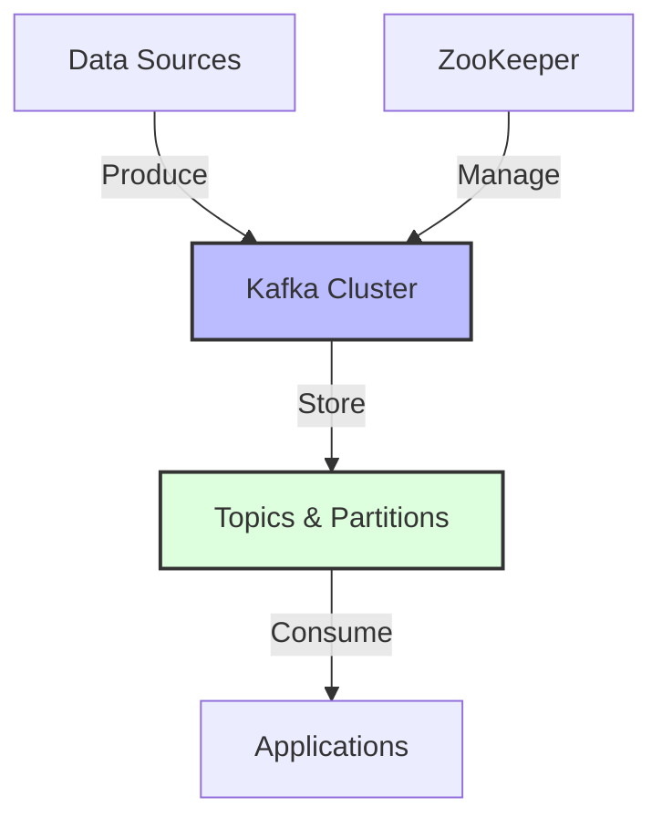
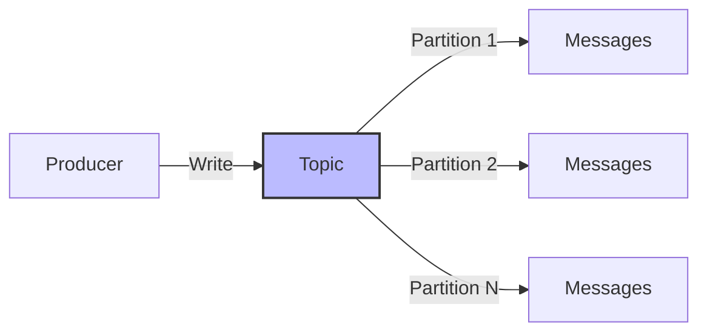
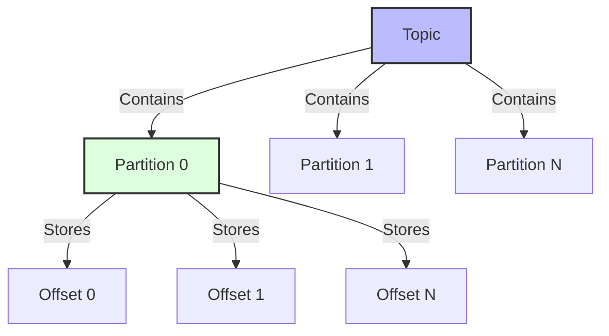
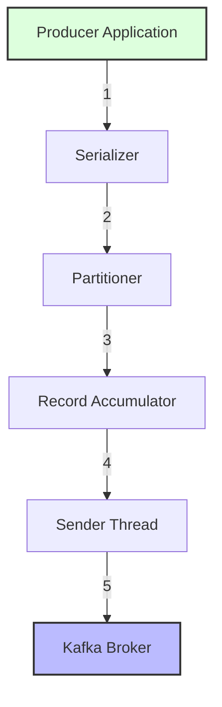
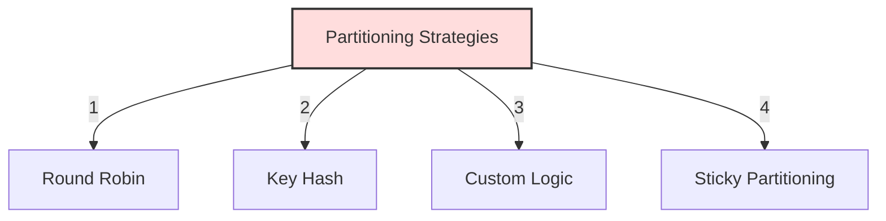
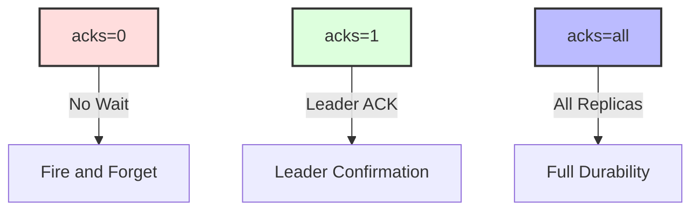
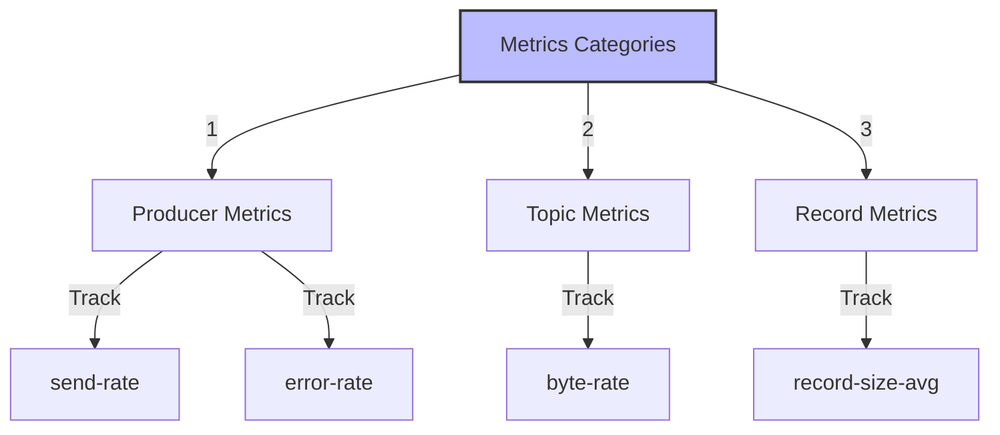
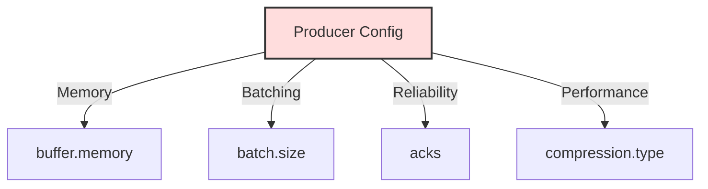

# Apache Kafka: Comprehensive Guide

## 1. Fundamental Concepts
#fundamentals

### What is Kafka?
Apache Kafka is a distributed streaming platform that:
- Publishes and subscribes to streams of records
- Stores streams of records durably and reliably
- Processes streams of records in real-time



### Core Architecture Components
#architecture

#### 1. Topics
**Definition**: Named categories or feed names to which records are published

**Characteristics**:
- Identified by unique names within cluster
- Can have multiple subscribers (consumers)
- Maintain events for configurable retention period
- Immutable sequence of records



**Configuration Options**:
- retention.ms: How long to keep messages
- retention.bytes: Maximum size of topic
- cleanup.policy: Delete or compact
- min.insync.replicas: Minimum replicas for writes

#### 2. Partitions
**Definition**: Physical organization of topics, divided into ordered, immutable sequence of records

**Key Features**:
- Each partition is ordered sequence
- Messages within partition get incremental ID (offset)
- Enables parallel processing
- Determines maximum parallelism



**Partition Management**:
1. Leader/Follower Model
   - One broker is leader for partition
   - Others maintain replicas
   - Automatic leader election on failure

2. Replication Factor
   - Number of copies across cluster
   - Fault tolerance level
   - Trade-off between durability and resources

#### 3. Messages/Records
**Structure**:
```json
{
    "key": "user_123",
    "value": "actual_message_content",
    "timestamp": 1634567890,
    "headers": {
        "source": "web_app",
        "version": "1.0"
    }
}
```

**Characteristics**:
- Immutable once written
- Ordered within partition
- Contains metadata
- Optional key for partitioning

## 2. Producer Deep Dive
#producers

### Producer Architecture


### Component Details

#### 1. Serializer
**Purpose**: Converts objects to byte arrays
**Types**:
- StringSerializer
- JsonSerializer
- AvroSerializer
- Custom Serializers

**Example Configuration**:
```java
properties.put("key.serializer", 
    "org.apache.kafka.common.serialization.StringSerializer");
properties.put("value.serializer", 
    "org.apache.kafka.common.serialization.JsonSerializer");
```

#### 2. Partitioner
**Functions**:
- Determines target partition
- Implements partitioning strategy
- Manages key-based routing

**Strategies**:


**Configuration Options**:
```java
properties.put("partitioner.class", 
    "org.apache.kafka.clients.producer.RoundRobinPartitioner");
```

#### 3. Record Accumulator
**Purpose**:
- Batches records for efficiency
- Manages memory buffers
- Implements batching logic

**Configuration Parameters**:
- batch.size: Maximum batch size in bytes
- linger.ms: Maximum wait time
- buffer.memory: Total memory for buffering


### Producer Guarantees
#reliability

#### 1. Acknowledgment Levels


**Details**:
- acks=0: Maximum throughput, no guarantees
- acks=1: Leader confirmation, possible data loss
- acks=all: Strongest durability, higher latency

#### 2. Retry Mechanism
**Configuration**:
```java
properties.put("retries", 3);
properties.put("retry.backoff.ms", 100);
```

**Retry Scenarios**:
- Network issues
- Leader elections
- Broker unavailability

### Producer Monitoring
#monitoring



#### Key Metrics:
1. Producer Metrics
   - record-send-rate
   - record-error-rate
   - request-latency-avg

2. Topic Metrics
   - byte-rate
   - compression-rate
   - record-send-total

3. Record Metrics
   - record-size-avg
   - record-queue-time-avg
   - records-per-request-avg

### Best Practices
#best-practices

1. Configuration Guidelines


1. Error Handling
```java
producer.send(record, (metadata, exception) -> {
    if (exception != null) {
        // Handle error
        handleError(exception);
    } else {
        // Success tracking
        trackSuccess(metadata);
    }
});
```

1. Resource Management
- Proper producer closing
- Memory management
- Thread safety considerations


## Suggested Related Documents
[[High-Scale Batch Payee Validation System.md]]Kafka Streaming Implementation Example"

This link text connects the documents by showing how the theoretical concepts from the Kafka guide are practically applied in the batch validation system, focusing on their shared distributed streaming architecture.]]
[[Random Service or others.md]]\|"Kafka Alternative Services" - this link text effectively connects the Apache Kafka documentation to the list of alternative services (like Amazon Kinesis) mentioned in the target document, highlighting their related functionality in data streaming and processing.]]
[[AWS Services Deep Dive.md]]"Messaging Systems Comparison"

This link text effectively connects the two documents as they both deal with different messaging systems (Kafka and AWS SNS/SQS) and their architectural approaches to handling data streams and notifications.]]

## Backlinks
- [[Types of DataBases.md]]"Database Systems and Streaming"

This link text captures the relationship between traditional databases discussed in the first document and Kafka's streaming data platform covered in the second document, highlighting the data management connection between them.]]
- [[Random Service or others.md]]\|Related: Apache Kafka- Comprehensive Guide.md]]
- [[AWS Services Deep Dive.md]]"Enterprise Messaging Platforms Comparison"

This link text effectively connects the two documents as they both cover enterprise-scale messaging systems (AWS SNS/SQS and Apache Kafka), making it clear that comparing these platforms is the key relationship between them.]]
- [[High-Scale Batch Payee Validation System.md]]"Kafka streaming architecture implementation"

This link text effectively connects the batch payee validation system, which uses Kafka as a key component, to the comprehensive Kafka guide document, focusing on their shared architectural and streaming aspects.]]
