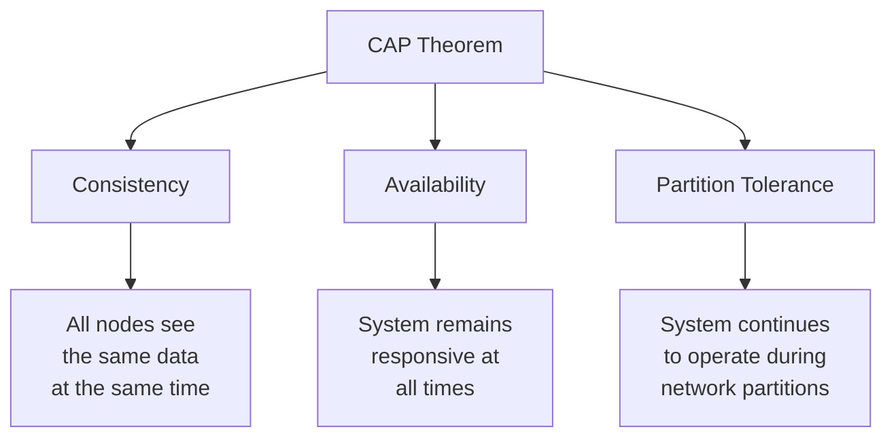
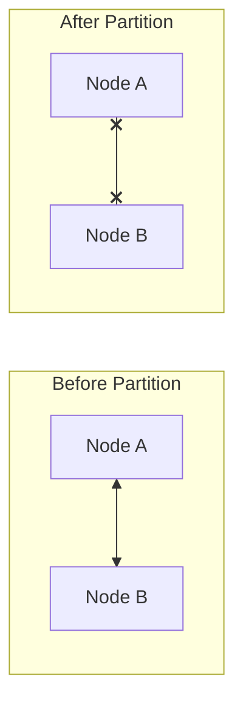
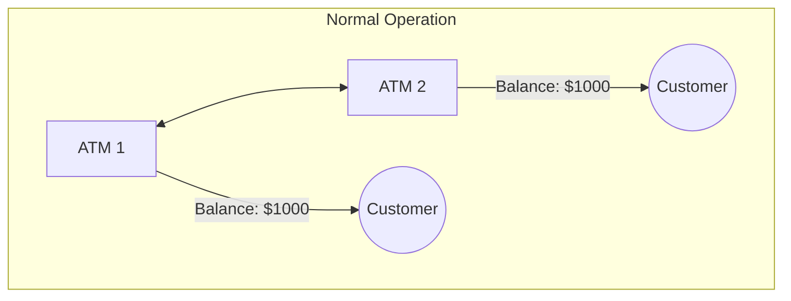
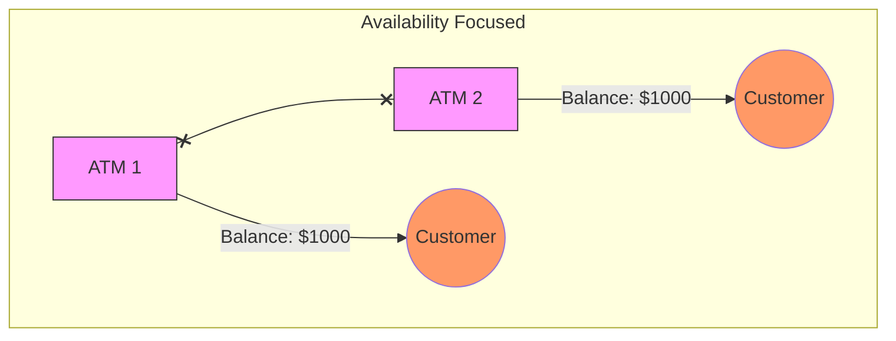

# The CAP Theorem: From Theory to Practice

*A comprehensive guide for modern distributed systems engineers*

## The Fundamental Trade-off

Let's start with the cold, hard truth that every distributed systems engineer eventually faces: you can't have it all. The CAP theorem states that a distributed system can only provide two out of these three guarantees:

- **Consistency**: Every read returns the most recent write
- **Availability**: All requests receive a response
- **Partition Tolerance**: The system functions during network failures

## Deep Dive: The Three Pillars

### Consistency

When we talk about consistency in distributed systems, we're talking about a guarantee that packs a punch:

- Every node in your system sees the exact same data at the same time
- When you write something, every subsequent read will reflect that write
- There's no room for "eventually" - it's all or nothing

### Availability

Availability is your system's promise to keep running:

- Every request gets a response (success or failure)
- Your system stays operational and responsive
- But here's the catch - that response might not have the freshest data

### Partition Tolerance

This is the reality check of distributed systems:

- Networks fail. Period.
- Your system needs to handle nodes that can't talk to each other
- In the real world, this isn't optional - it's mandatory

## When Theory Meets Reality: Network Partitions

Let's see what actually happens when networks fail:

## Real-World Battle Stories

### The Banking ATM Scenario

Picture this: Two ATMs connected over a network handling:

- Deposits
- Withdrawals
- Balance checks

During normal operations, everything's smooth:

But when the network splits, you have to choose:

#### The Consistency Champion

#### The Availability Advocate

### The Social Media Reality

Social platforms make different choices:

- They typically choose availability over strict consistency
- Users can keep posting during network issues
- Some users might temporarily see different versions of reality (and that's okay!)

## Engineering in the Real World

### Modern Engineering Approaches

1. **Bounded Consistency**
   - Define acceptable staleness limits
   - Maybe 5 seconds out of sync is fine, but 5 minutes isn't
   - Set clear SLOs around consistency requirements

2. **Strategic Inconsistency**
   - Different components, different rules
   - Shopping carts? Rock-solid consistency
   - Product recommendations? Eventual consistency is fine

3. **Conflict Resolution**
   - Build in mechanisms to detect conflicts
   - Implement clear resolution strategies
   - Consider CRDTs for automatic conflict resolution

### Practical Considerations

4. **Real-World Implementation**
   - Pure consistency or availability is rare
   - Hybrid approaches dominate the field
   - Business requirements drive the decisions

5. **Limitations and Challenges**
   - CAP is a simplification of reality
   - Latency adds another dimension
   - Normal operations need different strategies

6. **Data Reconciliation**
   - Handle complex data structures
   - Implement robust conflict resolution
   - Learn from systems like Google Docs

## The PACELC Evolution

The PACELC theorem extends CAP by acknowledging:

- Normal operations matter too
- Latency is a crucial factor
- Trade-offs exist even without partitions

## The Engineering Takeaway

After years in the trenches, here's what really matters:

7. Accept the inevitable - partitions will happen
8. Make explicit choices about consistency vs. availability
9. Let business needs drive technical decisions
10. Build robust detection and recovery mechanisms
11. Monitor your actual consistency and availability levels

## Conclusion

The CAP theorem isn't just theory - it's a practical guide for making tough architectural decisions. Understanding these trade-offs isn't just academic; it's essential for building resilient distributed systems.

Remember: The next time someone asks for 100% consistency AND availability, you'll know exactly how to have that conversation. Because in distributed systems, understanding your trade-offs isn't just important - it's everything.

# The CAP Theorem: From Theory to Practice

*A comprehensive guide for engineers, with interview preparation insights*

## Quick Interview Summary

*Start with this section for rapid interview prep*

### Key Points to Remember

1. CAP stands for Consistency, Availability, and Partition Tolerance
2. You can only guarantee two out of three properties
3. In distributed systems, partition tolerance isn't optional - you're really choosing between consistency and availability
4. Different services require different trade-offs (e.g., banking vs social media)
5. Modern systems often use hybrid approaches with different guarantees for different operations

### Common Interview Questions & Answers

**Q: Why can't we have all three CAP properties?**
A: During a network partition, you must choose: either cancel the operation (losing availability) or proceed with the risk of inconsistency. You can't do both. If two nodes can't communicate, you either respond with potentially stale data (choosing availability) or wait for synchronization (choosing consistency).

**Q: How would you choose between consistency and availability?**
A: It depends on business requirements:

- Choose consistency when incorrect data is unacceptable (financial transactions)
- Choose availability when temporary inconsistency is tolerable (social media likes)
- Consider hybrid approaches for different operations within the same system

## The Deep Dive: Understanding CAP

### The Fundamental Trade-off

Think of CAP like a triangle where you can only connect two corners:

### Breaking Down Each Component

#### 1. Consistency (C)

*Think of this as "all readers see the latest write"*

- Every read sees the most recent write
- All nodes have the same data at the same time
- Example: Your bank balance should be the same whether you check mobile app or ATM

**Interview Tip:** Mention that there are different levels of consistency (strong, eventual, casual). This shows deeper understanding.

#### 2. Availability (A)

*Think of this as "every request gets a response"*

- System remains operational 100% of the time
- All clients can read and write
- Responses might not have the most recent data

**Interview Tip:** Discuss how availability is measured in nines (99.99% vs 99.999%) and what that means in practice.

#### 3. Partition Tolerance (P)

*Think of this as "the system works despite network failures"*

- System continues functioning when network fails
- Messages between nodes can be lost/delayed
- Required for any distributed system

**Interview Tip:** Explain why partition tolerance isn't optional in distributed systems - network failures are inevitable.

## Real-World Examples

### Example 1: Banking System

*Perfect for interview discussions*

Before partition:

During partition with consistency priority:

**Key Interview Point:** Banks choose consistency over availability because:
6. Financial regulations require it
7. Double-spending must be prevented
8. Temporary unavailability is better than incorrect balances

### Example 2: Social Media Feed

*Shows practical trade-offs*

- Chooses availability over consistency
- Users might temporarily see different versions of likes/comments
- Eventually consistent model is acceptable

**Interview Discussion Point:** Explain how different operations might have different CAP trade-offs even within the same system.

## Modern System Design Approaches

### 1. Hybrid Consistency Models

*Essential for system design interviews*

Instead of one-size-fits-all, modern systems use:

- Strong consistency for critical operations (payments)
- Eventual consistency for less critical features (likes)
- Session consistency for user-specific flows

### 2. PACELC Theorem Extension

*Shows deeper understanding in interviews*

When partition (P):

- Choose between availability (A) and consistency (C)
Else (E):
- Choose between latency (L) and consistency (C)

### 3. Practical Solutions

*Great for system design discussions*

9. **Conflict Resolution Strategies**
   - Version vectors
   - Merkle trees
   - CRDTs (Conflict-free Replicated Data Types)

10. **Monitoring and Detection**

- Consistency measurements
- Partition detection
- Health checks

## Interview Strategy Tips

### 1. Discussion Framework

When discussing CAP in interviews:
11. Start with basic definition
12. Explain why all three aren't possible
13. Give a real-world example
14. Discuss trade-offs
15. Mention modern approaches

### 2. System Design Considerations

When designing systems:
16. Identify consistency requirements for each operation
17. Plan for network partitions
18. Choose appropriate data replication strategies
19. Implement monitoring and recovery mechanisms

## The Engineering Reality

### Real-World Lessons

20. Network partitions are inevitable
21. Perfect consistency at scale is extremely expensive
22. Most systems need different guarantees for different operations
23. Monitoring and measuring consistency is crucial

### Best Practices

24. Make trade-offs explicit
25. Document consistency guarantees
26. Plan for failure recovery
27. Test partition scenarios

## Conclusion

The CAP theorem isn't just theoretical - it's a practical tool for:

- Making architectural decisions
- Understanding system limitations
- Planning for failures
- Designing resilient systems

Remember: In both interviews and real systems, understanding CAP trade-offs is fundamental to distributed system design. Focus on practical implications rather than theoretical perfection.

**Interview Final Tip:** Always relate CAP theorem discussions to real-world scenarios and business requirements. This shows you understand both the theory and its practical applications.

## Suggested Related Documents
[[Consistency in Distributed Systems.md]]|"CAP Theorem Consistency Principles"

This link text effectively connects the documents by:
1. Referencing the main topic of the source (CAP Theorem)
2. Highlighting the target's focus (Consistency)
3. Indicating the theoretical nature of both documents (Principles)]]
[[Distributed Consistency with Paxos Protocol.md]]|"Distributed Consistency Mechanisms"

This link text captures the core connection between the CAP Theorem and Paxos Protocol documents, as both deal with consistency approaches in distributed systems.]]

## Backlinks
- [[Consistency in Distributed Systems.md]]|"CAP Theorem Consistency Relationship"

This link text effectively connects the two documents by highlighting their shared focus on consistency within the context of the CAP theorem in distributed systems.]]
- [[Distributed Consistency with Paxos Protocol.md]]|"Distributed Consistency Principles"

This link text effectively connects the two documents since:
1. Both deal with consistency in distributed systems
2. Paxos Protocol and CAP Theorem are fundamental principles
3. It's concise yet descriptive of their shared focus]]

## Suggested Related Documents
[[Distributed Rate Limiting System Design.md]]]|"Distributed Systems Architecture Fundamentals"

This link text connects the two documents well since both discuss core architectural concepts in distributed systems - CAP theorem in the first and rate limiting in the second, making it a logical bridge between these related topics.]]

## Backlinks
- [[Distributed Rate Limiting System Design.md]]]|"Distributed Systems Design Principles"

This link text effectively connects the two documents by highlighting their shared focus on fundamental distributed systems concepts, with the source covering rate limiting patterns and the target exploring CAP theorem principles.]]
