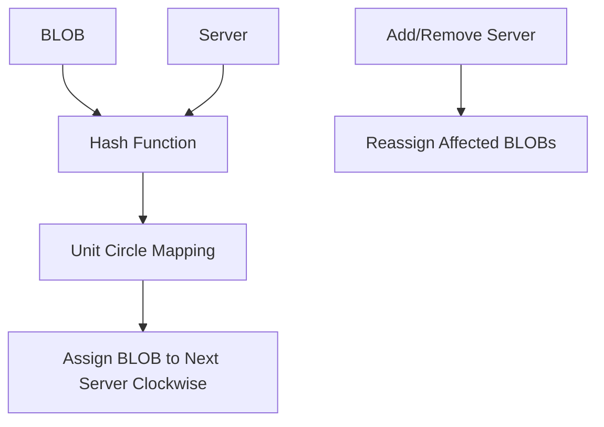

## Introduction

Consistent hashing is a special hashing technique used in computer science, particularly in distributed systems. It's designed to minimize the number of keys that need to be remapped when a hash table is resized.

## Key Features

- When a hash table is resized, only K/n keys need to be remapped on average (K: number of keys, n: number of slots)
- Evenly distributes cache keys across shards
- Maintains distribution even if some shards crash or become unavailable

## History

- Introduced by David Karger et al. at MIT in 1997
- Originally designed for distributed caching, particularly for the web
- Later applied to peer-to-peer networks and distributed hash tables
- Used by Akamai Technologies in their content delivery network

## Basic Technique

1. Use a hash function that maps both the data (BLOB) and servers to a unit circle (0 to 2π radians)
2. Assign each BLOB to the next server that appears on the circle in clockwise order
3. When a server is added or removed, only the BLOBs mapped to that server need to be reassigned

![[Screenshot 2025-02-15 at 11.43.59 AM.png]] 
## Virtual Points (Virtual Nodes)

To ensure a more even distribution of objects across servers, each physical server is represented by multiple points on the ring. These are called virtual nodes or virtual points.
![[Screenshot 2025-02-15 at 11.45.03 AM.png]]
1. **Purpose**: 
   - Improve load balancing
   - Reduce the impact of adding or removing servers
2. **Implementation**: 
   - Instead of a single point per server, use multiple hash values (e.g., "ServerA-1", "ServerA-2", etc.)
   - The number of virtual nodes per server is called its "weight"
![[Screenshot 2025-02-15 at 11.45.46 AM.png]]
## Advantages of Consistent Hashing
1. **Minimized Rehashing**: When adding or removing servers, only a small fraction of keys need to be remapped. Cache Warmup is removed.
2. **Scalability**: Servers can be added or removed with minimal disruption.
3. **Load Balancing**: Virtual nodes help distribute load more evenly.
## Implementation

### Key Operations

4. Inserting a BLOB into the cluster
5. Deleting a BLOB from the cluster
6. Inserting a server into the cluster
7. Deleting a server from the cluster

### Data Structures

- Binary Search Tree (BST) to maintain server IDs within the cluster
- Hash functions for BLOBs and server identifiers

## Variance Reduction

To avoid skewness and ensure uniform distribution:
- Use multiple labels for each server (virtual nodes)
- The number of virtual nodes per server is called its "weight"

## Practical Extensions

8. Multiple hash locations per server to distribute load on server failure
9. Handling "hot" BLOBs by assigning to multiple contiguous servers
10. Using different hash functions for BLOBs to avoid collisions

## Complexity Analysis

| Operation       | Classic Hash Table | Consistent Hashing      |
|-----------------|---------------------|--------------------------|
| Add a node      | O(K)                | O(K/N + log N)           |
| Remove a node   | O(K)                | O(K/N + log N)           |
| Lookup a key    | O(1)                | O(log N)                 |
| Add a key       | O(1)                | O(log N)                 |
| Remove a key    | O(1)                | O(log N)                 |

Where:
- K: number of keys
- N: number of nodes (or slots)

## Real-world Applications

- Couchbase automated data partitioning
- OpenStack's Object Storage Service Swift
- Amazon's Dynamo storage system
- Apache Cassandra data partitioning
- Akka's consistent hashing router
- Riak distributed key-value database
- Akamai content delivery network
- Discord chat application
- MinIO object storage system

## Advantages

11. Minimizes data movement when scaling or during node failures
12. Improves system stability and performance in distributed environments
13. Enables efficient load balancing in large-scale systems

## Limitations and Considerations

14. Slightly more complex implementation compared to traditional hashing
15. May require additional measures to ensure perfect balance in some scenarios
16. Trade-off between lookup performance and node addition/removal efficiency

## Conclusion

Consistent hashing is a powerful technique for managing data distribution in distributed systems. Its ability to minimize data movement during scaling operations makes it invaluable for large-scale, dynamic environments like content delivery networks, distributed databases, and cloud storage systems.

## Suggested Related Documents
[[Consistency in Distributed Systems.md]]\|"Distributed System Consistency Patterns"

This link text connects the two documents by highlighting how consistent hashing is one of the key patterns used to achieve consistency in distributed systems, bridging the technical relationship between these related concepts.]]
[[Caching Mechanisms in System Design.md]]\|"Distributed caching implementation strategies" - this link text connects the two documents by highlighting how consistent hashing is a key strategy used in implementing distributed caching systems.]]
[[Load Balancer.md]]\|"Load Distribution Strategy"

This link text effectively connects the two documents by:
1. Capturing how consistent hashing is used for load balancing
2. Reflecting both documents' focus on distributed systems
3. Maintaining brevity while being descriptive]]

## Backlinks
- [[Caching Mechanisms in System Design.md]]\|"Distributed Cache Implementation Strategy"

This link text effectively connects the two documents by bridging caching mechanisms with consistent hashing, which is a key strategy for implementing distributed caching systems.]]
- [[Consistency in Distributed Systems.md]]\|"Distributed System Hashing Concepts"

This link text effectively connects the two documents by:
1. Acknowledging the distributed systems context they share
2. Referencing the hashing focus of the target document
3. Keeping it general enough to bridge consistency and hashing concepts]]
- [[Load Balancer.md]]\|"Load balancing implementation technique" - this link text effectively connects the two documents by showing that consistent hashing is a specific technical method used within load balancing systems, while being concise and descriptive.]]
- [[Senior Software Engineer Interview Preparation.md]]\|"Consistent Hashing Load Balancing"

This link text effectively connects the load balancing discussion in the source document with the detailed explanation of consistent hashing in the target document, highlighting their related technical concepts in distributed systems.]]
