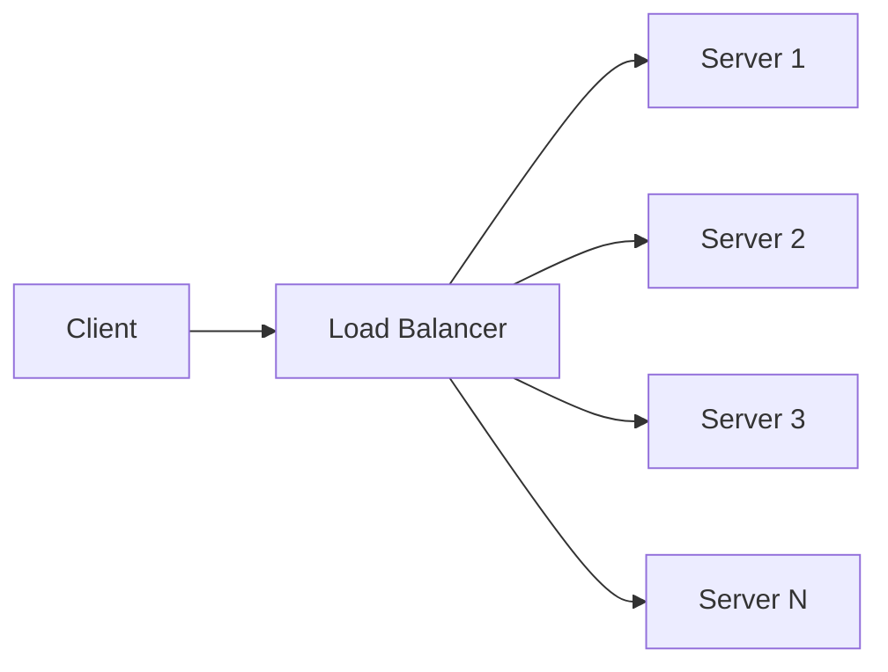
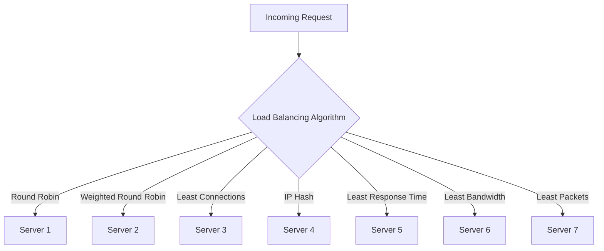
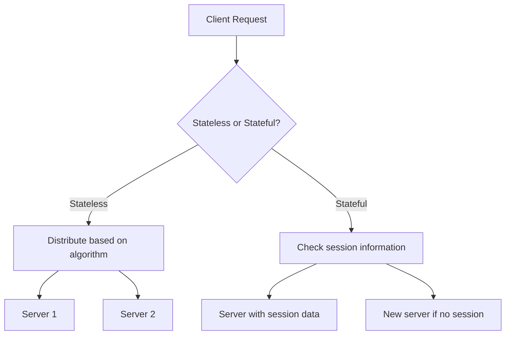
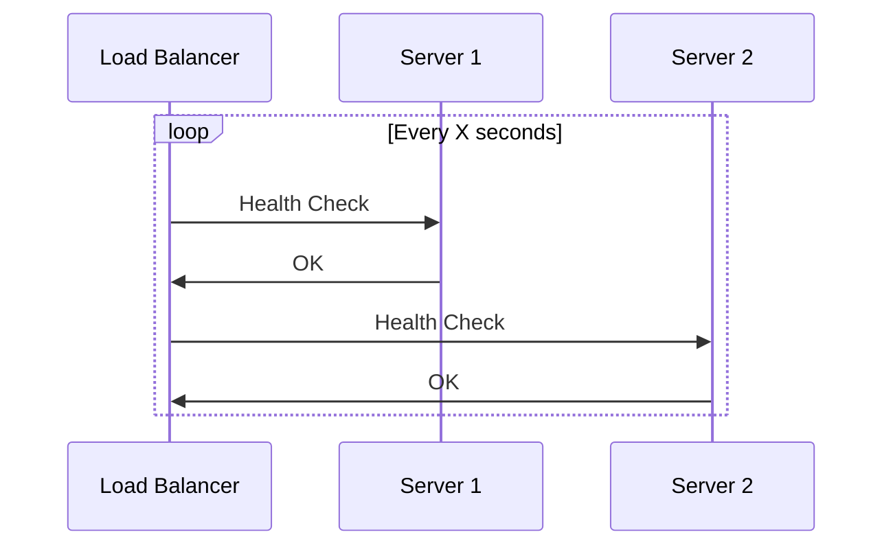
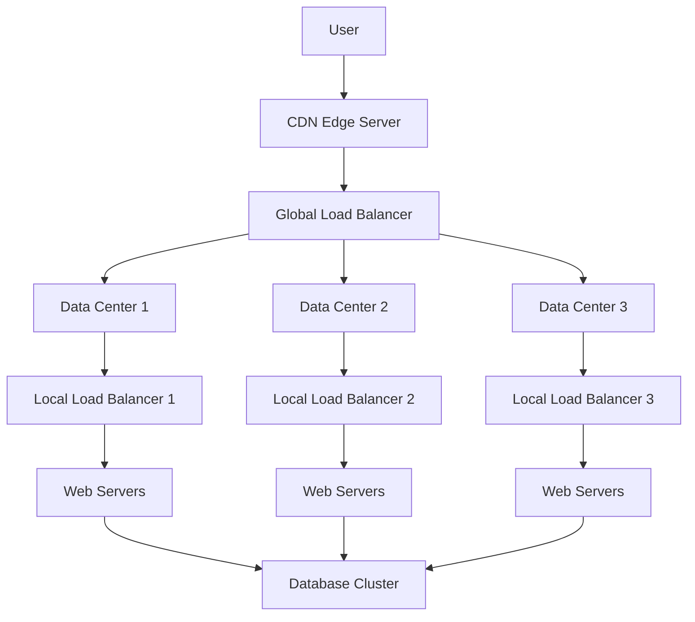

## Table of Contents
1. [What is Load Balancing?](#what-is-load-balancing)
2. [Types of Load Balancers](#types-of-load-balancers)
3. [Load Balancing Algorithms](#load-balancing-algorithms)
4. [Stateless vs. Stateful Load Balancing](#stateless-vs-stateful-load-balancing)
5. [Technical Implementation](#technical-implementation)
6. [Benefits of Load Balancing](#benefits-of-load-balancing)
7. [Challenges and Considerations](#challenges-and-considerations)
8. [Real-world Examples](#real-world-examples)
9. [Advanced Load Balancing Techniques](#advanced-load-balancing-techniques)
10. [Conclusion](#conclusion)

## What is Load Balancing?

Load balancing is the process of distributing network traffic across multiple servers to ensure no single server bears too much demand. This practice aims to optimize resource use, maximize throughput, minimize response time, and avoid overload of any single resource.

## Types of Load Balancers

11. **Hardware Load Balancers**: 
   - Physical devices optimized for handling high traffic volumes.
   - Pros: High performance, purpose-built hardware.
   - Cons: Expensive, less flexible for scaling.

12. **Software Load Balancers**: 
   - Applications running on commodity hardware.
   - Pros: More flexible, cost-effective, easier to scale.
   - Cons: May have lower performance compared to hardware solutions.

13. **Layer 4 Load Balancers**: 
   - Operate at the transport layer (TCP/UDP).
   - Pros: Fast, simple, efficient for network-level distribution.
   - Cons: Limited application-level insight.

14. **Layer 7 Load Balancers**: 
   - Operate at the application layer (HTTP/HTTPS).
   - Pros: More intelligent routing, content-based distribution.
   - Cons: Higher resource usage, more complex configuration.

15. **Global Server Load Balancing (GSLB)**:
   - Distributes traffic across multiple data centers.
   - Pros: Improves global availability and performance.
   - Cons: Complex setup, higher latency for some users.

## Load Balancing Algorithms

16. **Round Robin**
   - Description: Requests are distributed sequentially to each server.
   - Benefits: Simple to implement, works well for servers with similar capabilities.
   - Drawbacks: Doesn't account for server load or capacity differences.

17. **Weighted Round Robin**
   - Description: Servers with higher capacities receive more requests.
   - Benefits: Accounts for different server capabilities.
   - Drawbacks: Static weights may not reflect real-time server conditions.

18. **Least Connections**
   - Description: New requests are sent to the server with the fewest active connections.
   - Benefits: Balances load based on current server activity.
   - Drawbacks: Doesn't account for the complexity of requests.

19. **Weighted Least Connections**
   - Description: Combines weighted distribution with least connections method.
   - Benefits: Accounts for both server capacity and current load.
   - Drawbacks: Requires more complex configuration and monitoring.

20. **IP Hash**
   - Description: The client's IP address is used to determine which server receives the request.
   - Benefits: Ensures session persistence for stateful applications.
   - Drawbacks: Uneven distribution if IP ranges are not diverse.

21. **Least Response Time**
   - Description: Directs traffic to the server with the fastest response time.
   - Benefits: Optimizes for user experience and server performance.
   - Drawbacks: Requires continuous monitoring and can be sensitive to network fluctuations.

22. **Least Bandwidth Method**
   - Description: Sends requests to the server currently serving the least amount of traffic (measured in Mbps).
   - Benefits: Prevents bandwidth bottlenecks.
   - Drawbacks: May not correlate directly with server load or capacity.

23. **Least Packets Method**
   - Description: Distributes based on the server handling the lowest number of packets.
   - Benefits: Can be effective for UDP traffic.
   - Drawbacks: Packet count may not accurately represent server load.

## Stateless vs. Stateful Load Balancing

### Stateless Load Balancing
- Description: Does not store information about past requests or sessions.
- Implementation: Often uses algorithms like Round Robin or IP Hash.
- Benefits:
  - Simpler to implement and scale
  - Lower resource overhead
  - Easier to add or remove servers
- Drawbacks:
  - Not suitable for applications requiring session persistence
  - May lead to uneven distribution in some scenarios

### Stateful Load Balancing
- Description: Maintains information about user sessions and past requests.
- Implementation: Often uses cookie-based or server-side session storage.
- Benefits:
  - Ensures session persistence
  - Can provide more consistent user experience for certain applications
- Drawbacks:
  - More complex to implement and scale
  - Higher resource overhead
  - Challenges in handling server failures

## Technical Implementation

### Step 1: Set Up Multiple Server Instances
- Deploy identical server instances capable of handling client requests.
- Ensure all instances have the same application code and configurations.

### Step 2: Configure Load Balancer
- Install and configure a load balancer (e.g., Nginx, HAProxy, or cloud-based solutions).
- Define backend server pool and load balancing algorithm.

### Step 3: Define Health Checks
- Implement health checks to ensure the load balancer only routes traffic to healthy servers.
- Configure check intervals, timeout periods, and failure thresholds.

### Step 4: Implement Session Persistence (if needed)
- For stateful applications, configure session persistence.
- Options include cookie-based persistence, IP-based persistence, or server-side session storage.

### Step 5: SSL Termination (for HTTPS)
- Configure SSL termination at the load balancer level.
- Manage SSL certificates and implement secure communication between load balancer and backend servers.

### Step 6: Monitoring and Logging
- Set up monitoring for load balancer and backend servers.
- Implement logging for traffic patterns, server health, and performance metrics.

## Benefits of Load Balancing

24. **High Availability**: Ensures system uptime even if individual servers fail.
25. **Scalability**: Easily add or remove servers to handle changing traffic demands.
26. **Improved Performance**: Distribute load to prevent any single server from becoming a bottleneck.
27. **Flexibility**: Perform maintenance on servers without downtime.
28. **Global Server Distribution**: Ability to route users to geographically closer servers.
29. **DDoS Mitigation**: Can help absorb and distribute attack traffic.

## Challenges and Considerations

30. **Complexity**: Adds an additional layer to the infrastructure.
31. **Single Point of Failure**: The load balancer itself needs redundancy.
32. **Session Management**: Maintaining user sessions across multiple servers can be challenging.
33. **SSL Offloading**: Requires careful security considerations.
34. **Cost**: Additional hardware or software licenses may be required.
35. **Configuration Complexity**: Proper setup and tuning can be intricate.

## Real-world Examples

36. **Content Delivery Networks (CDNs)**: Use load balancing to distribute content requests across multiple geographic locations.
37. **Microservices Architectures**: Employ load balancing to distribute requests across service instances.
38. **Cloud Platforms**: Offer built-in load balancing services (e.g., AWS ELB, Google Cloud Load Balancing).
39. **E-commerce Platforms**: Handle traffic spikes during sales events.
40. **Social Media Platforms**: Manage millions of concurrent user connections.

## Advanced Load Balancing Techniques

41. **Dynamic Load Balancing**: Adjusts distribution based on real-time server performance metrics.
42. **Predictive Analytics**: Uses AI/ML to anticipate traffic patterns and pre-emptively scale resources.
43. **Multi-layer Load Balancing**: Combines L4 and L7 balancing for optimized traffic management.
44. **Container-native Load Balancing**: Specialized for containerized environments like Kubernetes.
45. **Anycast Load Balancing**: Uses routing protocols to direct traffic to the nearest data center.

## Conclusion

Load balancing is a cornerstone technology in building scalable, reliable, and high-performance applications. As systems continue to grow in complexity and scale, the importance of effective load balancing strategies will only increase. By understanding the various types, algorithms, and implementation strategies of load balancing, organizations can ensure their applications remain responsive, available, and capable of handling the demands of modern digital ecosystems.

## Suggested Related Documents
[[Content Delivery Networks (CDN) and Network Routing.md]]\|"Load Balancing in CDNs"

This link text effectively connects the two documents by highlighting how load balancing is a key component of CDN architecture and operation, while being concise and descriptive.]]
[[Too much Requests.md]]\|"Request Load Management"

This link text effectively connects the load balancing concepts from the source document with the high request volume handling strategies in the target document, capturing their shared focus on managing and distributing traffic load.]]
[[system-design/Concepts/Senior Software Engineer Interview Preparation]]\|"Load Balancing System Design"

This link text effectively connects the two documents by referencing load balancing in the context of system design, which is a key topic in both the source document about load balancing concepts and the target document's interview preparation section.]]

## Backlinks
- [[Distributed Rate Limiting System Design.md]]\|"Request Management Components"

This link text effectively connects the two documents by highlighting their shared focus on managing incoming requests in distributed systems, with rate limiting controlling request volume and load balancing distributing requests across resources.]]
- [[Content Delivery Networks (CDN) and Network Routing.md]]\|"CDN Load Distribution Mechanisms"

This link text captures the key relationship between CDNs and load balancers, highlighting how CDNs use load balancing as a core mechanism for distributing content across their networks.]]
- [[Too much Requests.md]]\|"Request Distribution Strategies"

This link text effectively connects the source document about handling high request volumes with the target document about load balancing, capturing their shared focus on managing and distributing incoming traffic loads.]]
- [[system-design/Concepts/Senior Software Engineer Interview Preparation]]\|"Load Balancer Implementation Details"

This link text effectively connects the high-level mention of load balancing in the interview prep document to the detailed technical document about load balancing concepts and implementation.]]
- [[Consistent Hashing.md]]\|"Load Distribution Strategy"

This link text effectively connects the two documents by:
1. Capturing how consistent hashing is used for load balancing
2. Reflecting both documents' focus on distributed systems
3. Maintaining brevity while being descriptive]]
