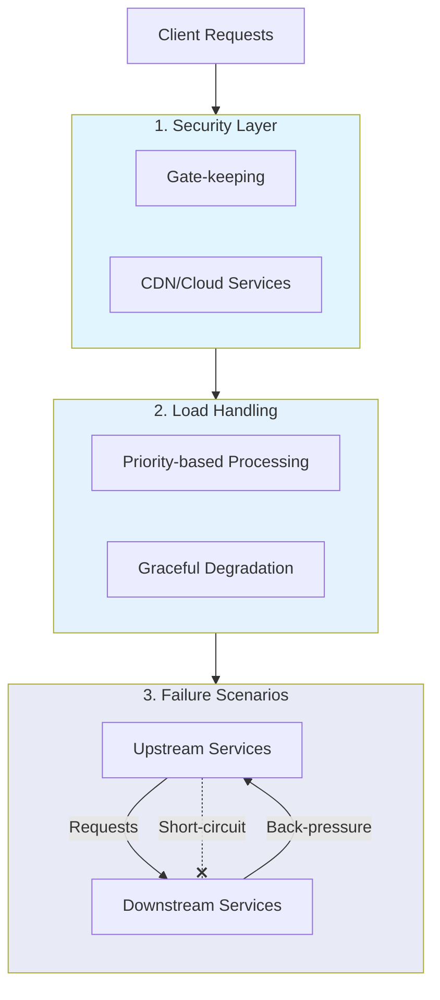
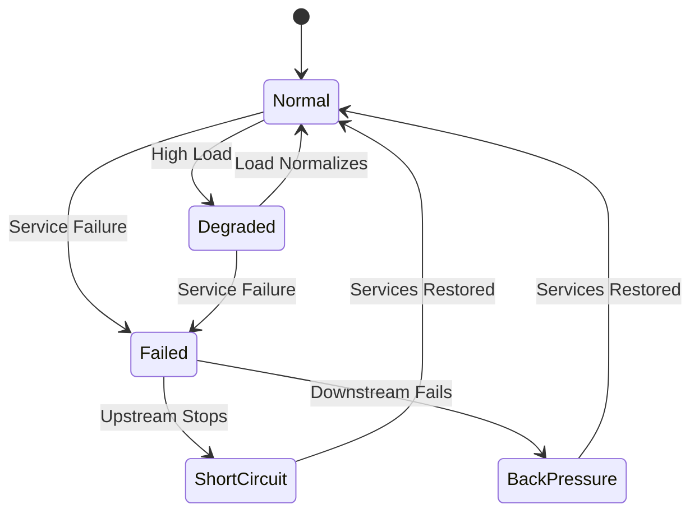
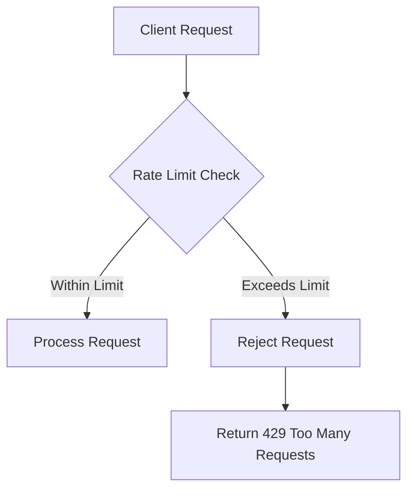
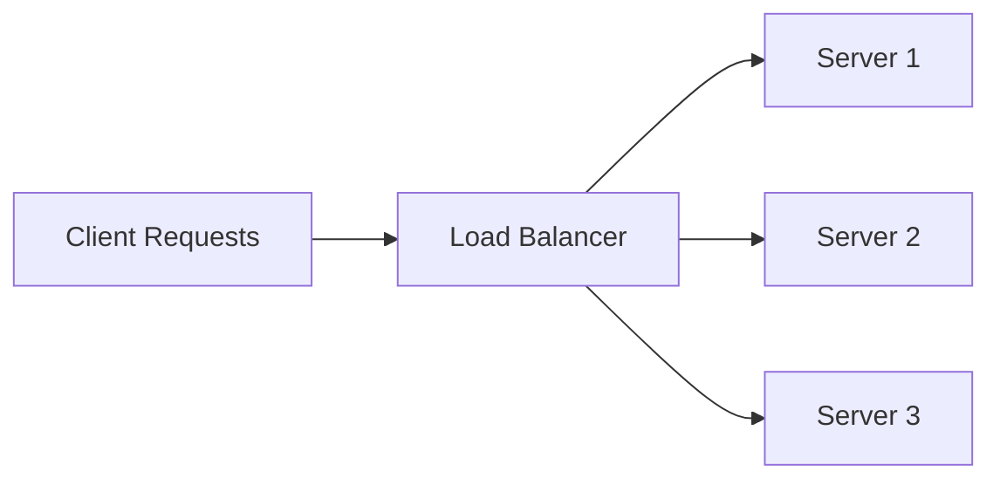
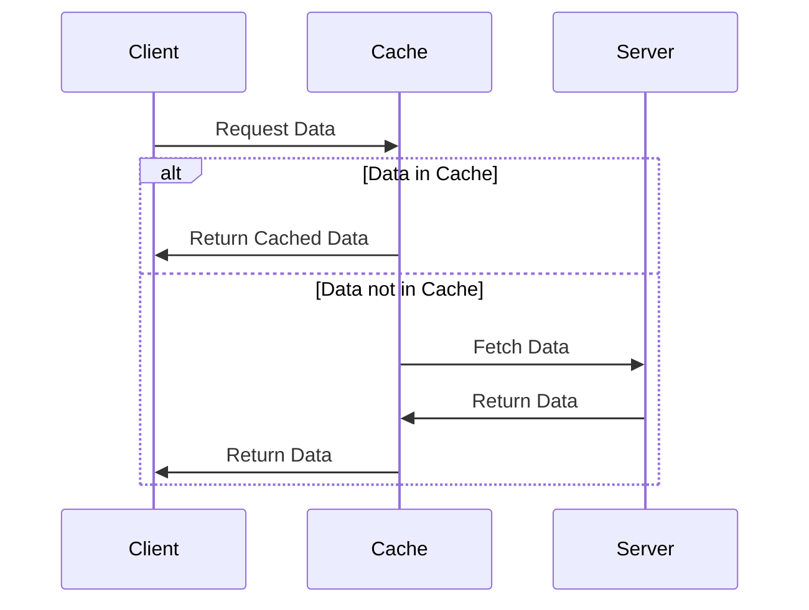
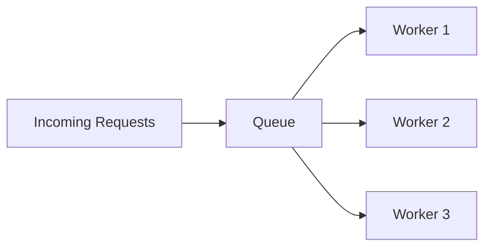
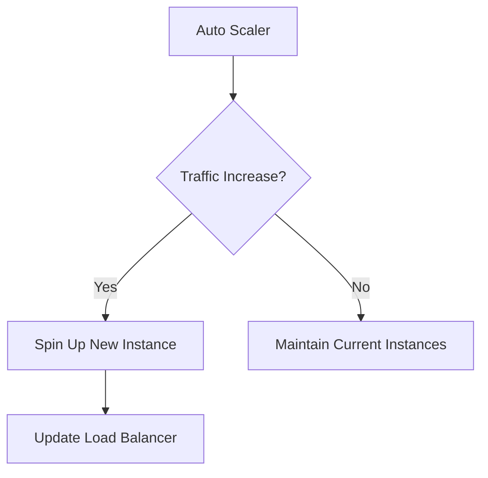

#request-handling #architecture #system-design #high-availability #load-balancing

#high-availability #request-handling #load-balancing #architecture #system-design

# Handling High Request Volumes: Strategies for System Stability

## Introduction

In the world of web services and APIs, dealing with a high volume of requests is a common challenge. This document outlines several strategies to manage and mitigate issues arising from excessive concurrent requests.
### Generic Strategy
1. Gate-keeping to avoid malicious attacks
    - Cloud service providers and CDNs offer solution for these
2. Graceful degradation incase of over-loaded requests
    - Respond to requests based on priorities
3. Discarding requests altogether if needed
    - Useful incase any downstream or upstream service fails or is re-starting
    - Short-circuit: When the upstream services stop sending requests to the downstream services
    - Back-pressure: When the downstream services start failing requests from the upstream services

> A flowchart showing the overall architecture and how the three main components (security, load handling, and failure handling) interact

> A state diagram showing how the system transitions between different states based on load and failure conditions.

## Key Strategies

### 1. Rate Limiting

Rate limiting is a technique used to control the rate of incoming requests from a client within a specified time frame.

#### Implementation:
- Use token bucket or leaky bucket algorithms
- Set limits based on API key, IP address, or user account
- Return appropriate HTTP status codes (e.g., 429 Too Many Requests)

### 2. Load Balancing

Load balancing distributes incoming requests across multiple server instances to prevent any single server from becoming overwhelmed.

#### Types of Load Balancing:
- Round Robin
- Least Connections
- IP Hash
- Weighted Round Robin

### 3. Caching

Caching stores frequently requested data to reduce the load on backend services and databases.

#### Caching Strategies:
- In-memory caching (e.g., Redis, Memcached)
- Content Delivery Networks (CDNs)
- Browser caching

### 4. Queueing

Queueing systems can help manage and process requests asynchronously, preventing system overload.

#### Benefits:
- Smooths out spikes in traffic
- Allows for better resource allocation
- Improves system reliability

### 5. Horizontal Scaling

Increase the number of server instances to handle higher loads.

#### Considerations:
- Use containerization (e.g., Docker) for easy scaling
- Implement auto-scaling based on metrics like CPU usage or request count

## Conclusion

Implementing a combination of these strategies can significantly improve your system's ability to handle high volumes of requests. The choice of techniques depends on your specific use case, infrastructure, and performance requirements.

## Further Reading
- [Rate Limiting Algorithms](https://www.example.com/rate-limiting)
- [Load Balancing Best Practices](https://www.example.com/load-balancing)
- [Caching Strategies for High-Performance Applications](https://www.example.com/caching)
- [Message Queues in Distributed Systems](https://www.example.com/message-queues)
- [Scaling Web Applications](https://www.example.com/scaling)

This Obsidian markdown document provides an overview of strategies for handling high request volumes, including rate limiting, load balancing, caching, queueing, and horizontal scaling. Each section includes a Mermaid diagram to visualize the concept, making it easier to understand the more complex ideas.

The document is structured with headers, subheaders, and bullet points for easy navigation in Obsidian. The Mermaid diagrams are included using the appropriate markdown syntax, which Obsidian supports natively.

You can copy this markdown and paste it directly into an Obsidian note. The Mermaid diagrams will render automatically in Obsidian's preview mode.

## Suggested Related Documents
[[Load Balancer.md]]\|"Request Distribution Strategies"

This link text effectively connects the source document about handling high request volumes with the target document about load balancing, capturing their shared focus on managing and distributing incoming traffic loads.]]
[[Distributed Rate Limiting System Design.md]]\|Related: Distributed Rate Limiting System Design.md]]
[[Content Delivery Networks (CDN) and Network Routing.md]]\|"CDN Request Management Strategies"

This link text effectively bridges the documents by connecting the high request volume handling from the first document with the CDN infrastructure discussed in the second document, highlighting their complementary relationship in managing web traffic.]]

## Backlinks
- [[Distributed Rate Limiting System Design.md]]\|Related: Too much Requests.md]]
- [[Head-of-Line Blocking(The Evolution From HTTP-1.1 to HTTP-3).md]]\|"Web Performance Bottlenecks"

Rationale: This link text connects the performance challenges of Head-of-Line blocking from the first document with the high request volume handling from the second document, focusing on their shared theme of web performance limitations.]]
- [[Content Delivery Networks (CDN) and Network Routing.md]]\|"CDN Traffic Management Solutions"

This link text effectively connects the CDN architecture document to the high request handling strategies document, emphasizing their shared focus on managing network traffic and request volumes.]]
- [[Load Balancer.md]]\|"Request Load Management"

This link text effectively connects the load balancing concepts from the source document with the high request volume handling strategies in the target document, capturing their shared focus on managing and distributing traffic load.]]
