## Overview

Transaction isolation determines how transaction integrity is visible to other users and systems.

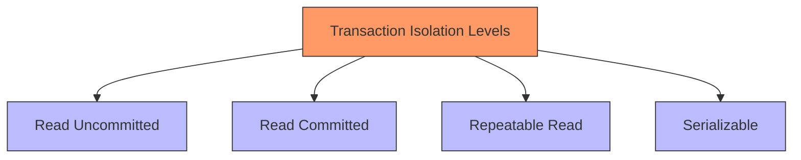

## Isolation Phenomena

### Dirty Read
- Reading uncommitted changes from another transaction
- Can lead to inconsistent data views

### Non-Repeatable Read
- Getting different results when reading same row twice
- Occurs when another transaction modifies data between reads

### Phantom Read
- Getting different results in range queries
- Occurs when other transactions insert new rows matching the condition

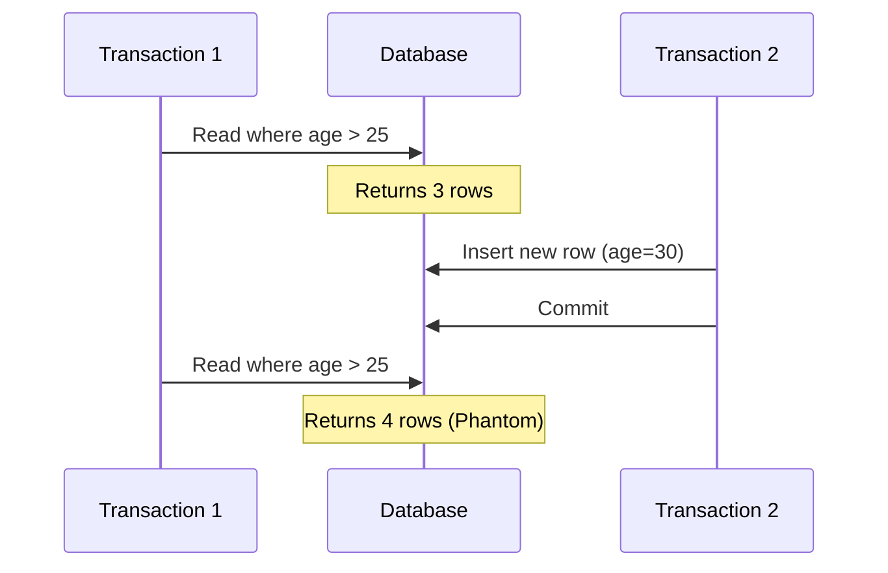

## Isolation Levels in Detail #isolation-levels 

### Read Uncommitted
- Lowest isolation level
- No protection against any consistency phenomena
- Highest performance

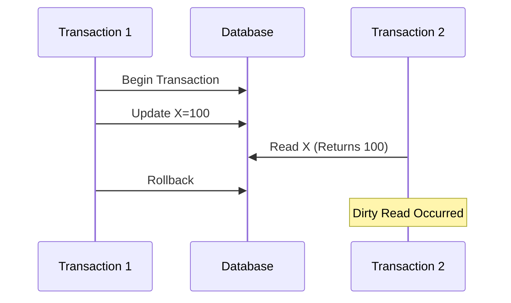

### Read Committed
- Prevents dirty reads
- Each query sees only committed data
- Default in many databases

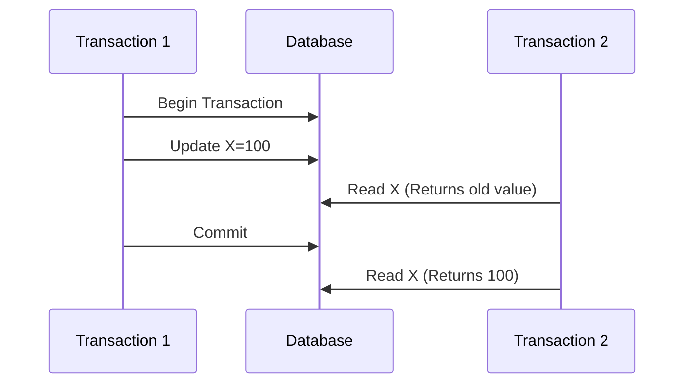

### Repeatable Read
- Prevents dirty and non-repeatable reads
- Locks read data until transaction ends
- May allow phantom reads

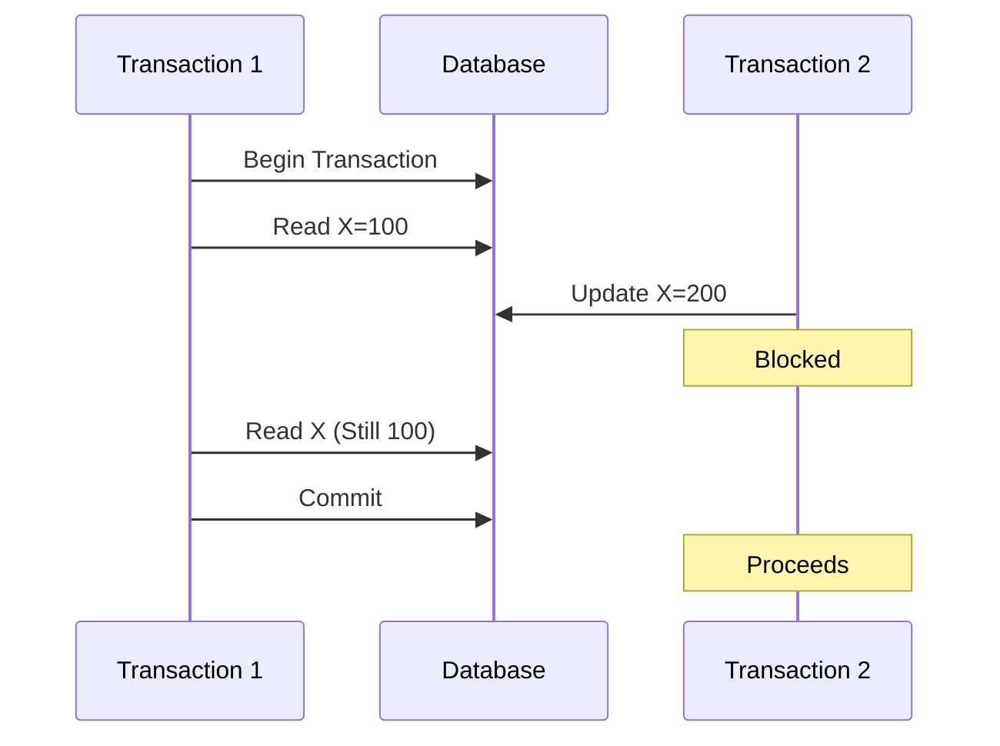

### Serializable
- Highest isolation level
- Prevents all consistency phenomena
- Lowest concurrency

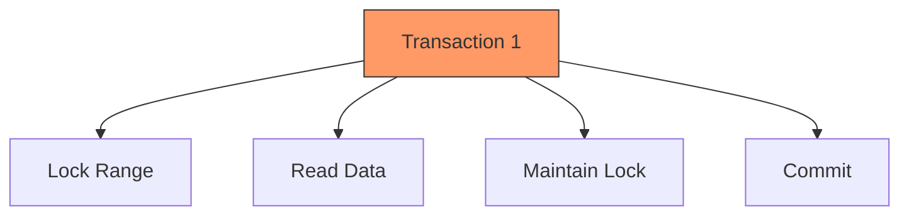


# Transaction Isolation Level: Serializable

## Overview
Serializable is the highest isolation level in database transactions, providing the strongest guarantees for data consistency and integrity. It ensures that concurrent transactions execute as if they were processed in a serial order.

## Key Characteristics
- Prevents all phenomena: Dirty Reads, Non-repeatable Reads, and Phantom Reads
- Highest level of isolation
- Most resource-intensive
- May lead to reduced concurrency

## Visual Representation

```mermaid
graph TD
    A[Transaction Isolation Levels] --> B[Read Uncommitted]
    A --> C[Read Committed]
    A --> D[Repeatable Read]
    A --> E[Serializable]
    
    E -->|Prevents| F[Dirty Reads]
    E -->|Prevents| G[Non-repeatable Reads]
    E -->|Prevents| H[Phantom Reads]
    
    style E fill:#98FB98,stroke:#006400
````

## How Serializable Works

```mermaid
sequenceDiagram
    participant T1 as Transaction 1
    participant DB as Database
    participant T2 as Transaction 2
    
    T1->>DB: Begin Transaction
    Note over T1,DB: Sets isolation level to SERIALIZABLE
    T1->>DB: Read Account A
    T2->>DB: Begin Transaction
    T2--xDB: Try to modify Account A
    Note over T2,DB: Blocked until T1 commits
    T1->>DB: Commit
    T2->>DB: Modify Account A
    T2->>DB: Commit
```

## Common Use Cases

1. Financial transactions
2. Inventory management
3. Booking systems
4. Critical data modifications

## Implementation Example

```sql
BEGIN TRANSACTION
SET TRANSACTION ISOLATION LEVEL SERIALIZABLE;
-- Your transaction operations here
COMMIT;
```

## Advantages and Disadvantages

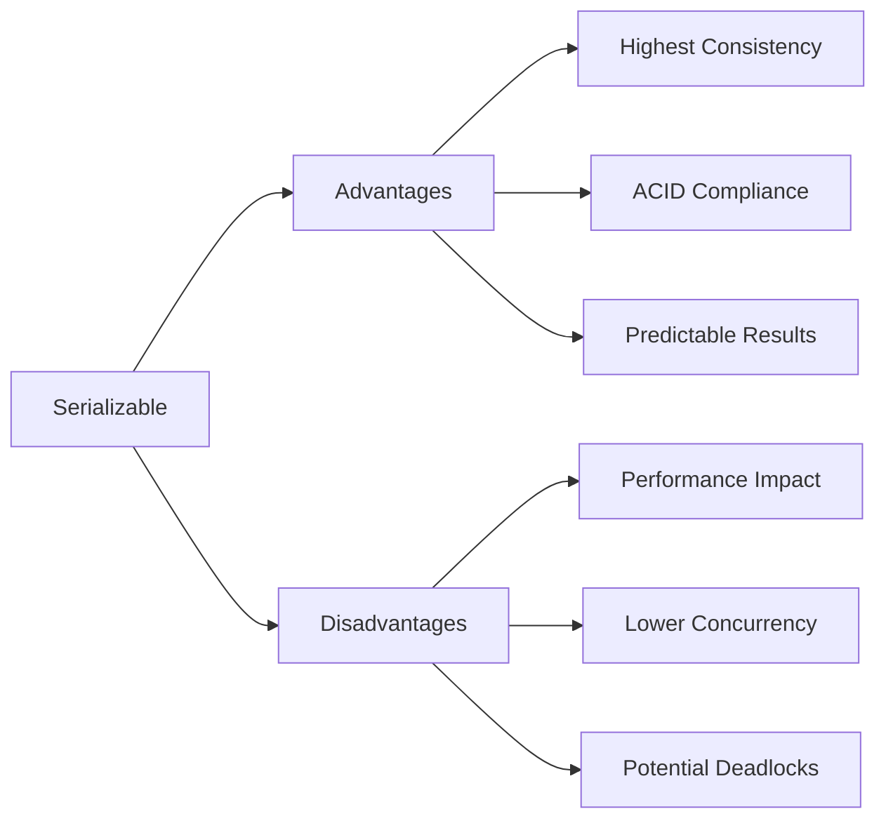

## Related Concepts

- [[ACID Properties]]
- [[Transaction Isolation Levels]]
- [[Concurrency Control]]
- [[Database Locks]]

## Notes

- Use serializable when data consistency is critical
- Consider performance implications
- Monitor deadlock situations
- May need optimization for high-concurrent systems

## References

1. Database System Concepts (Textbook)
2. Oracle Documentation
3. PostgreSQL Manual

---

#database-theory #transaction-management #isolation-levels

## Implementation Techniques

### Locking Mechanisms
1. Shared Locks (Read)
2. Exclusive Locks (Write)
3. Range Locks
4. Predicate Locks

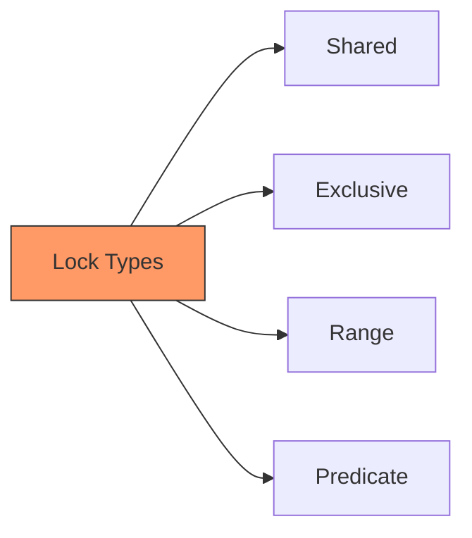

### Multi-Version Concurrency Control (MVCC)
- Maintains multiple versions of data
- Readers don't block writers
- Used in PostgreSQL, Oracle

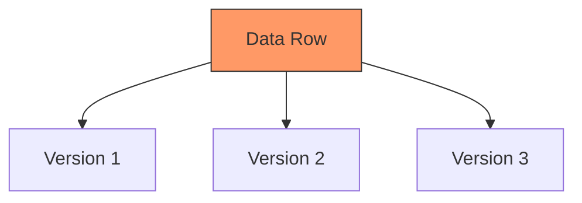

## Isolation Level Comparison

| Isolation Level | Dirty Read | Non-Repeatable Read | Phantom Read |
|----------------|------------|---------------------|--------------|
| Read Uncommitted| Yes        | Yes                 | Yes          |
| Read Committed  | No         | Yes                 | Yes          |
| Repeatable Read| No         | No                  | Yes          |
| Serializable   | No         | No                  | No           |

## Best Practices

### Choosing Isolation Levels
1. Analyze application requirements
2. Consider performance impact
3. Evaluate concurrency needs
4. Balance consistency vs. performance

### Performance Considerations
- Higher isolation = Lower concurrency
- Monitor lock contention
- Optimize transaction duration
- Consider using MVCC where appropriate

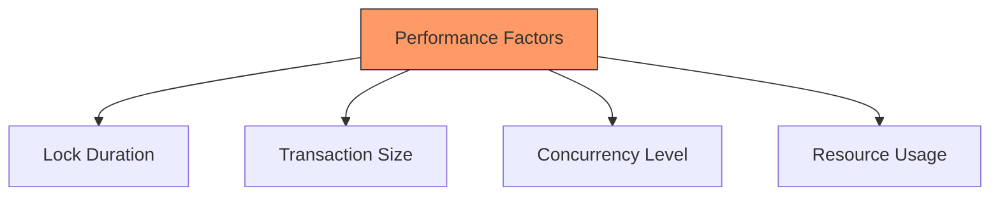

## Monitoring and Troubleshooting

### Key Metrics
1. Lock wait times
2. Deadlock frequency
3. Transaction throughput
4. Rollback rate

### Common Issues
1. Deadlocks
2. Lock contention
3. Long-running transactions
4. Resource exhaustion

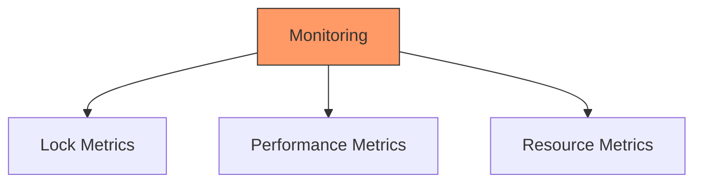

## Database-Specific Implementations

### PostgreSQL
- MVCC-based implementation
- Snapshot isolation
- True serializable isolation available

### MySQL/InnoDB
- Lock-based implementation
- Gap locks for phantom prevention
- Next-key locking

### Oracle
- MVCC implementation
- Read consistency model
- Snapshot isolation

This document provides a comprehensive overview of transaction isolation levels. For specific database implementations, consult the respective documentation.

#databases #transactions #isolation-levels #concurrency


## References
- [[Database Systems]]
- [[Concurrency Control]]
- [[ACID Properties]]
- [[Transaction Management]]

## See also
- [[Database Locking]]
- [[MVCC]]
- [[Deadlock Prevention]]
- [[Database Performance Tuning]]

## Notes
- Last reviewed: 2024-01-20
- Review frequency: Quarterly
- Priority: High
- Complexity: Advanced
- 
A comprehensive guide to understanding database transaction isolation levels, their characteristics, and implementation details.


## Suggested Related Documents
[[Distributed Consistency with Paxos Protocol.md]]\|"Database Consistency Mechanisms"

This link text effectively connects the transaction isolation levels document with the Paxos protocol document, as both deal with maintaining consistency in database systems, albeit at different scales (local vs. distributed).]]

## Backlinks
- [[Distributed Consistency with Paxos Protocol.md]]\|"Distributed Consistency Mechanisms" - this link text effectively connects the two documents by highlighting how Paxos protocol and transaction isolation levels are both mechanisms for maintaining consistency across distributed or concurrent operations in database systems.]]
