#database #migration #devops #engineering

## Overview
This document outlines two approaches to database migration: the Brute Force Approach and the Optimized Approach.
#overview #strategy

## Brute Force Approach
#bruteforce #downtime

The brute force approach involves planned downtime and is simpler but riskier.

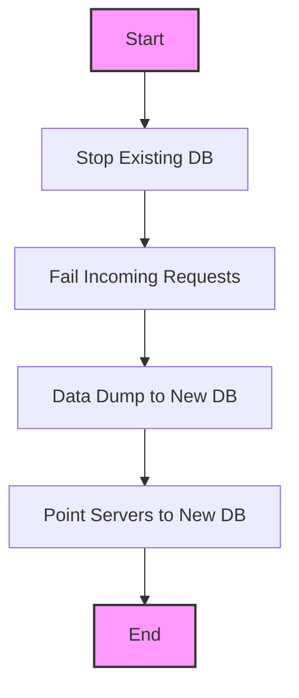

### Steps:
1. Stop the existing database
2. Handle failed requests (with prior user communication)
3. Migrate data dump to new database
4. Redeploy/restart servers with new DB configuration

### Considerations
- Requires planned downtime
- Simple approach
- Higher risk
- Requires user communication
#considerations #risk

# Optimized Database Migration Strategy
#database #migration #zerodowntime #optimization

## Overview
The optimized migration strategy enables database migration with zero downtime, ensuring continuous service availability while maintaining data consistency.
#overview #strategy

## Architecture Overview
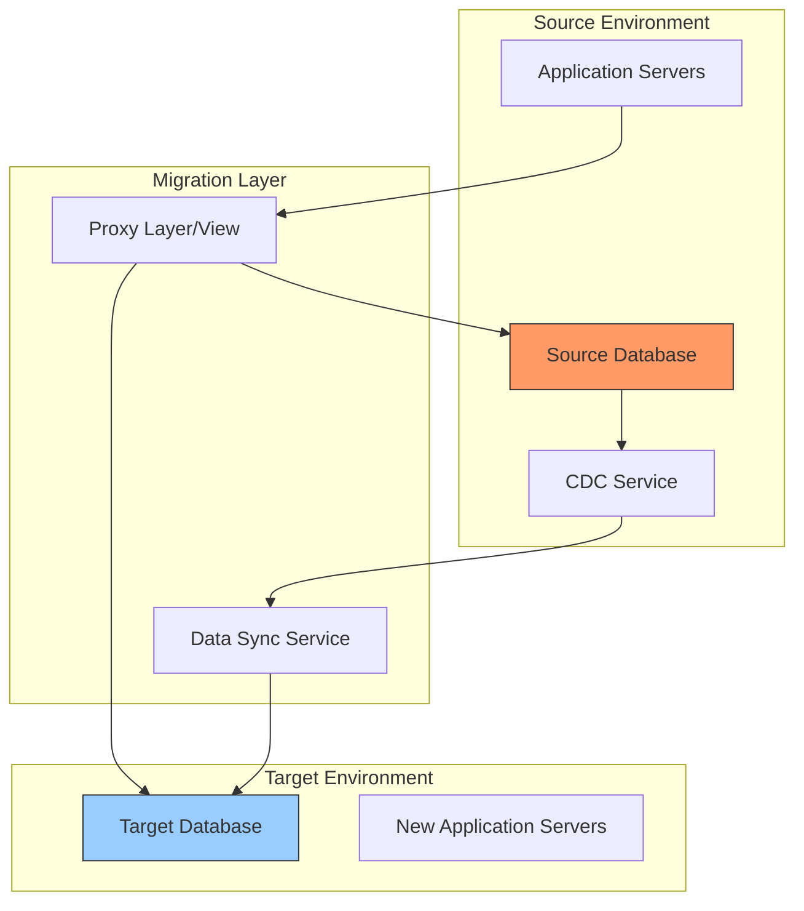

## Detailed Phase Breakdown
#implementation #phases

### Phase 1: Preparation & Setup
#setup #planning

#### Technical Requirements
- Change Data Capture (CDC) mechanism
- Database proxy/view layer
- Monitoring tools
- Data validation scripts
- Rollback procedures

#### Pre-Migration Checklist
- [ ] Database schema compatibility verification
- [ ] Network latency assessment
- [ ] Storage capacity confirmation
- [ ] Backup verification
- [ ] Access permissions audit

### Phase 2: Implementation Process
#process #implementation

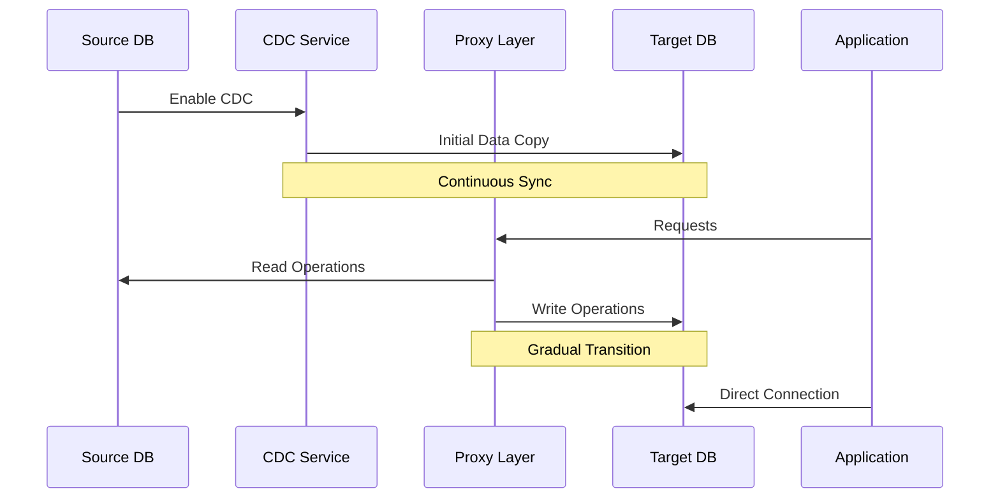

#### Step-by-Step Implementation
1. **CDC Setup** `#cdc`
   - Install and configure CDC tools
   - Define capture tables and columns
   - Set up change tracking mechanisms
   - Implement error handling
   
2. **Initial Data Copy** `#datacopy`
   - Create consistent snapshot of source DB
   - Implement chunked data transfer
   - Verify data integrity
   - Monitor transfer performance

3. **Proxy Layer Implementation** `#proxy`
   ```mermaid
   graph LR
       A[Client] --> B[Proxy Layer]
       B --> C[Source DB]
       B --> D[Target DB]
       B --> E[Error Handler]
   ```
   - Deploy proxy service
   - Configure routing rules
   - Implement error handling
   - Set up monitoring

4. **Traffic Management** `#traffic`
   - Gradual traffic shifting
   - Read/Write split configuration
   - Performance monitoring
   - Latency tracking

### Phase 3: Validation & Verification
#validation #quality

#### Data Consistency Checks
- Real-time comparison scripts
- Checksum verification
- Data reconciliation reports
- Transaction consistency validation

#### Performance Metrics
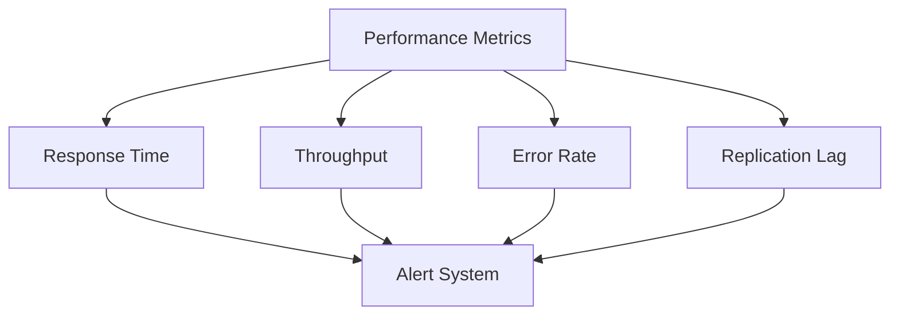

### Phase 4: Cutover Strategy
#cutover #deployment

#### Gradual Transition Plan
1. **Read Operations**
   - Start: 10% traffic to new DB
   - Increment: 20% every 2 hours
   - Monitor: Performance metrics
   - Threshold: Error rate < 0.1%

2. **Write Operations**
   - Begin after successful read transition
   - Direct all writes through proxy
   - Verify data consistency
   - Monitor replication lag

#### Rollback Plan
#rollback #contingency

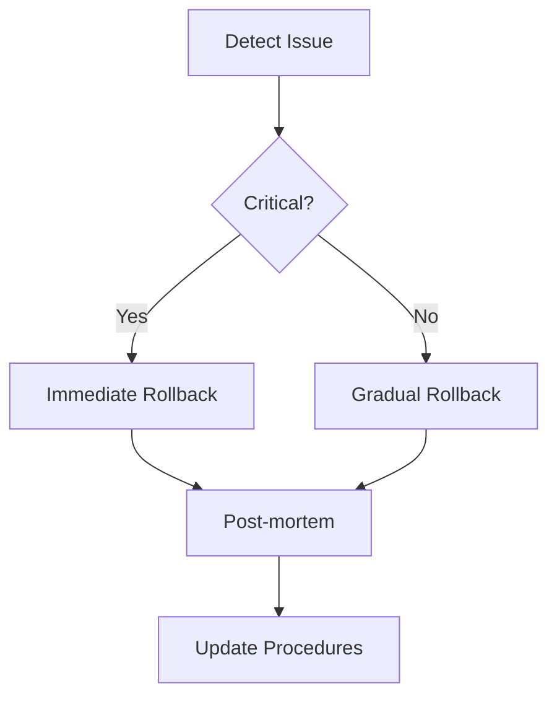

## Monitoring & Alerting
#monitoring #alerting

### Key Metrics
- Replication lag
- Query performance
- Error rates
- System resources
- Network latency

### Alert Thresholds
| Metric | Warning | Critical |
|--------|----------|----------|
| Replication Lag | > 30s | > 120s |
| Query Latency | > 100ms | > 500ms |
| Error Rate | > 0.1% | > 1% |
| CPU Usage | > 70% | > 90% |

## Best Practices
#bestpractices

1. **Communication**
   - Regular stakeholder updates
   - Clear escalation paths
   - Documentation of all changes
   - Post-migration support plan

2. **Testing**
   - Full dress rehearsal
   - Performance testing
   - Failure scenario testing
   - Data consistency validation

3. **Documentation**
   - Step-by-step procedures
   - Configuration changes
   - Script inventory
   - Contact information

## Common Challenges & Solutions
#troubleshooting

1. **Performance Issues**
   - Implement connection pooling
   - Optimize query patterns
   - Configure appropriate timeouts
   - Use caching where appropriate

2. **Data Consistency**
   - Regular consistency checks
   - Automated reconciliation
   - Version control for schema
   - Audit logging

3. **Resource Constraints**
   - Efficient resource allocation
   - Scheduled maintenance windows
   - Capacity planning
   - Load balancing
---

# Change Data Capture (CDC) Deep Dive
#cdc #replication #data-sync #realtime

## Overview of CDC
CDC (Change Data Capture) is a design pattern that tracks and captures changes made to a database, enabling continuous data synchronization between source and target systems.
#overview

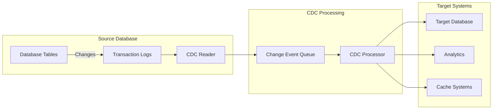

## CDC Implementation Methods
#implementation #methods

### 1. Log-Based CDC
#logs #transaction-logs

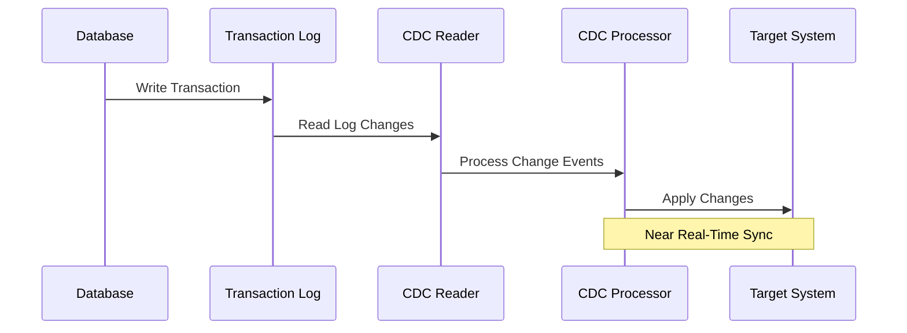

#### Advantages
- Minimal impact on source database
- Captures all changes in order
- No additional database load
- Real-time capture capability

#### Implementation Steps
1. Configure transaction log retention
2. Set up log reader permissions
3. Define log reading position
4. Configure change event filtering

### 2. Trigger-Based CDC
#triggers #database-triggers

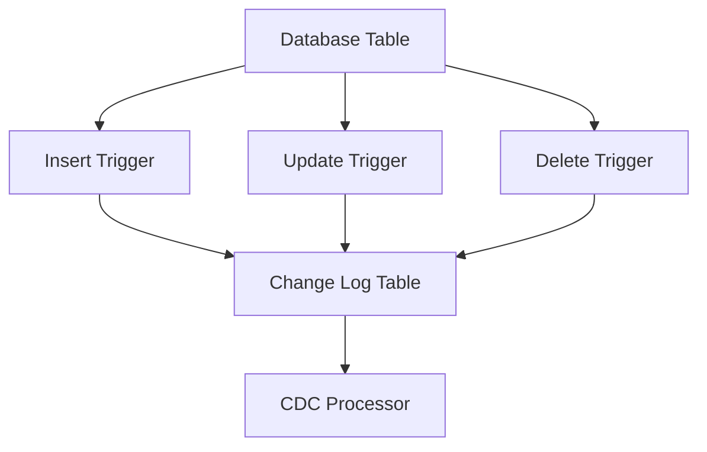

#### Components
- Database triggers
- Change log tables
- Processing mechanisms
- Clean-up procedures

### 3. Timestamp-Based CDC
#timestamp #polling

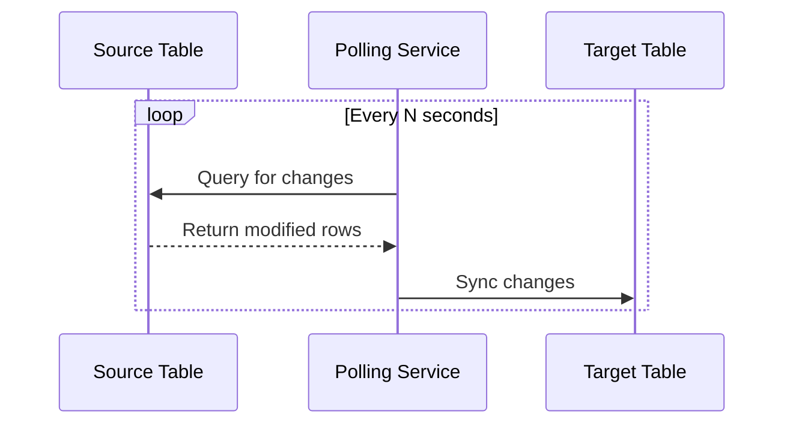

## CDC Data Structure
#data-structure

### Change Event Format
```json
{
  "change_id": "uuid",
  "operation": "INSERT|UPDATE|DELETE",
  "table": "table_name",
  "timestamp": "2023-01-01T00:00:00Z",
  "before": {
    "field1": "old_value",
    "field2": "old_value"
  },
  "after": {
    "field1": "new_value",
    "field2": "new_value"
  },
  "metadata": {
    "transaction_id": "tx123",
    "user": "system"
  }
}
```

## CDC Configuration Best Practices
#best-practices #configuration

### 1. Performance Optimization
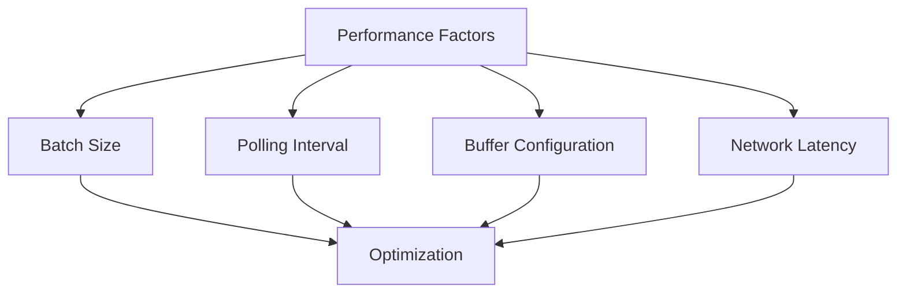

#### Configuration Parameters
| Parameter | Recommended | Description |
|-----------|-------------|-------------|
| Batch Size | 1000-5000 | Number of events processed together |
| Poll Interval | 1-5 seconds | Time between change checks |
| Buffer Size | 10000 | Maximum events in memory |
| Retention | 24-48 hours | Log retention period |

### 2. Error Handling
#error-handling

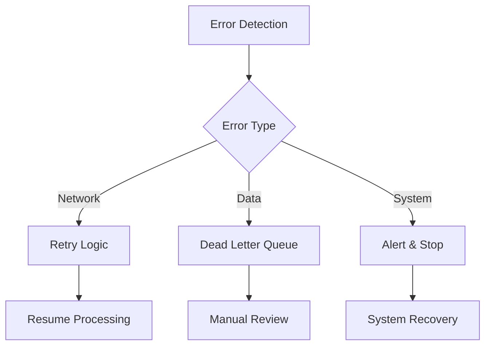

#### Error Handling Strategy
1. **Retriable Errors**
   - Network timeouts
   - Connection issues
   - Resource constraints

2. **Non-Retriable Errors**
   - Data corruption
   - Schema mismatches
   - Business rule violations

## Monitoring CDC
#monitoring #observability

### Key Metrics
1. **Latency Metrics**
   - Capture latency
   - Processing latency
   - Apply latency

2. **Performance Metrics**
   - Events per second
   - Batch processing time
   - Resource utilization

3. **Quality Metrics**
   - Error rate
   - Data loss events
   - Consistency checks

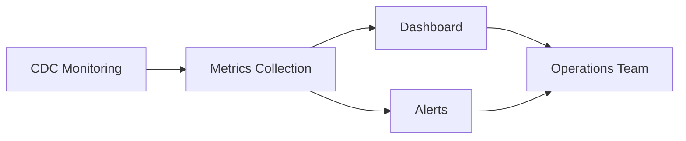

## CDC Security Considerations
#security #compliance

### Security Measures
1. **Authentication**
   - Service accounts
   - Role-based access
   - Encryption keys

2. **Data Protection**
   - In-transit encryption
   - At-rest encryption
   - Data masking

3. **Audit Trail**
   - Change tracking
   - Access logs
   - System events

## Troubleshooting Guide
#troubleshooting

### Common Issues and Solutions

1. **High Latency**
   - Check network connectivity
   - Optimize batch sizes
   - Review resource allocation
   - Monitor system load

2. **Data Loss**
   - Verify log retention
   - Check connectivity
   - Review error logs
   - Validate configurations

3. **Inconsistency**
   - Compare checksums
   - Review transaction boundaries
   - Check for schema changes
   - Validate transformation rules

## CDC Testing Strategy
#testing #quality-assurance

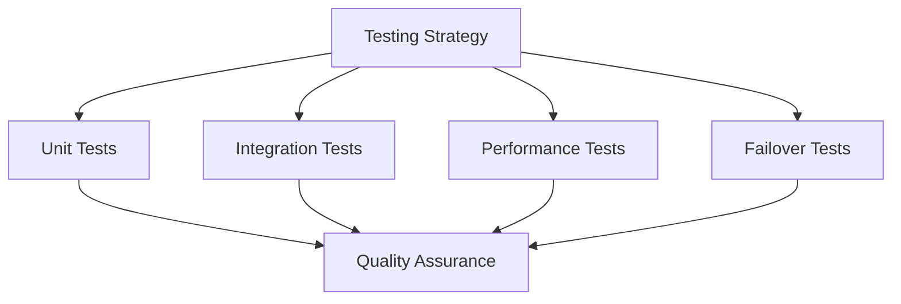

### Test Scenarios
1. **Basic Operations**
   - Insert/Update/Delete tracking
   - Large transaction handling
   - Concurrent operations

2. **Edge Cases**
   - Network failures
   - System restarts
   - Schema changes
   - Data type variations
---
# Service Migration Strategy with Database Views
#service-migration #database-views #transition

## Overview
This section details how to seamlessly transition services from the old database to the new one using database views, proxies, and staged migration approaches.
#overview

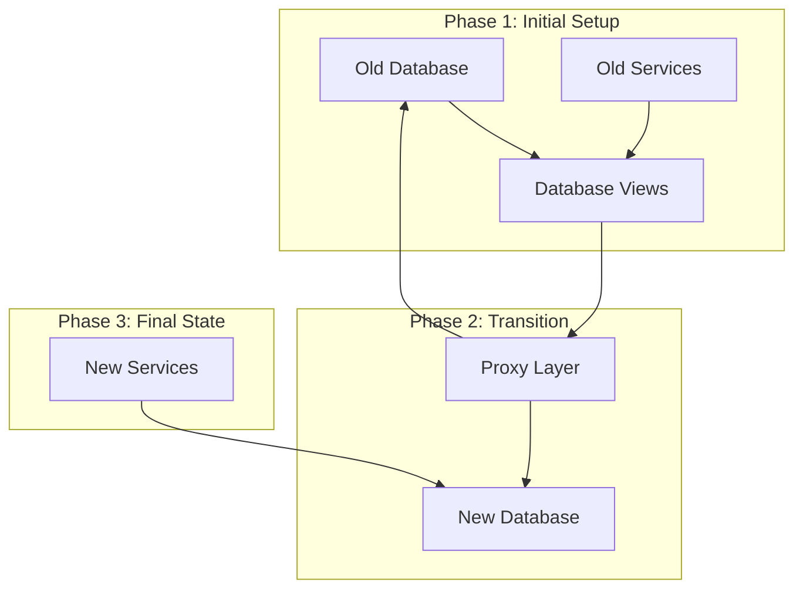

## Database Views Strategy
#database-views #abstraction

### 1. View Layer Architecture

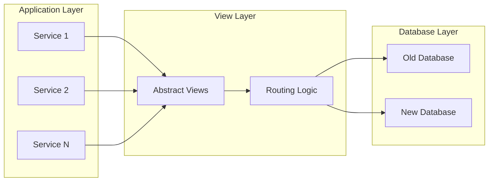

### 2. View Implementation Types
#implementation

#### Database Views
```sql
-- Example of a transitional view
CREATE VIEW customer_view AS
    SELECT * FROM old_db.customers
    UNION ALL
    SELECT * FROM new_db.customers
    WHERE id NOT IN (SELECT id FROM old_db.customers);
```

#### Materialized Views
```sql
-- Example of materialized view with refresh
CREATE MATERIALIZED VIEW customer_mv AS
    SELECT * FROM customer_view
    WITH DATA;

-- Refresh strategy
REFRESH MATERIALIZED VIEW customer_mv;
```

## Service Migration Process
#service-migration #process

### 1. Preparation Phase

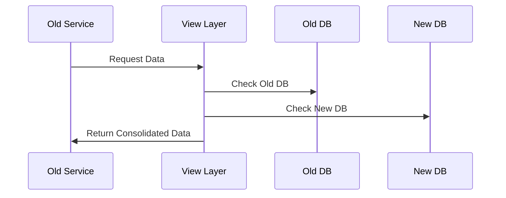

#### View Layer Setup
1. **Create Abstract Views**
   - Map current schema
   - Define view structures
   - Set up routing logic

2. **Configure Access Patterns**
   - Read operations
   - Write operations
   - Transaction handling

### 2. Transition Strategy
#transition #routing

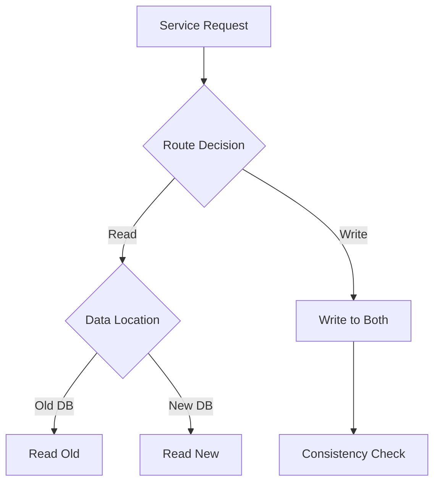

#### Routing Rules
| Operation | Initial Phase | Mid Phase | Final Phase |
|-----------|--------------|-----------|-------------|
| Read | Old DB | Both DBs | New DB |
| Write | Old DB | Both DBs | New DB |
| Updates | Sync Both | New DB Primary | New DB |

### 3. Service Update Process
#service-update

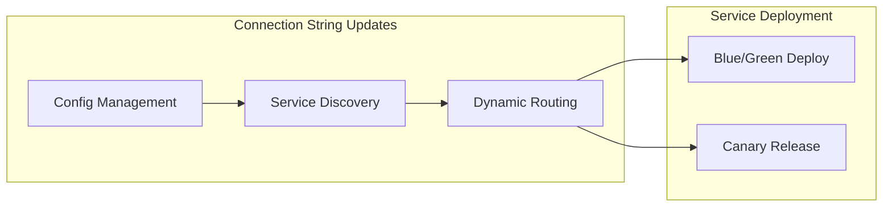

## Implementation Details
#implementation #technical

### 1. View Layer Components

```markdown
- Abstract Data Access Layer
  - Connection Pool Management
  - Query Routing Logic
  - Error Handling
  - Monitoring Points
```

### 2. Connection String Management
#configuration

```yaml
database:
  primary:
    url: ${NEW_DB_URL}
    fallback: ${OLD_DB_URL}
  readonly:
    url: ${READ_REPLICA_URL}
  viewLayer:
    enabled: true
    routing:
      strategy: gradual
      weights:
        oldDb: 0.2
        newDb: 0.8
```

### 3. Proxy Implementation
#proxy

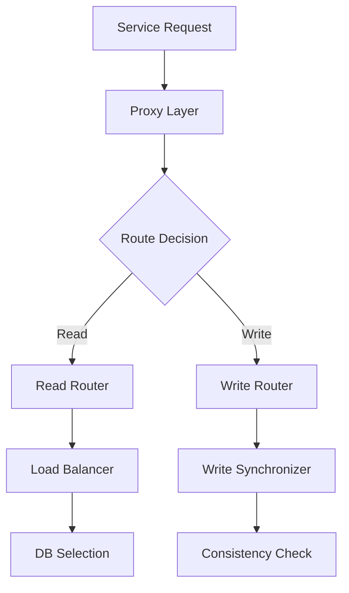

## Migration Phases
#migration-phases

### Phase 1: View Setup
- Create database views
- Implement proxy layer
- Configure monitoring
- Test routing logic

### Phase 2: Service Transition
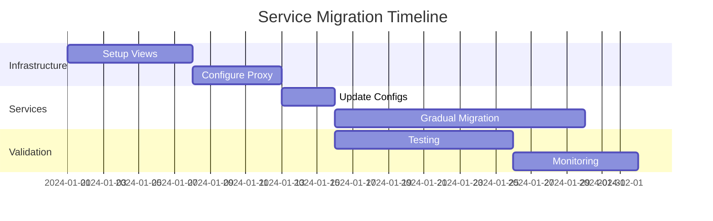

### Phase 3: Verification
#verification

#### Health Checks
- Response times
- Error rates
- Data consistency
- Service availability

#### Monitoring Metrics
| Metric | Warning | Critical |
|--------|---------|----------|
| View Response Time | >100ms | >500ms |
| Routing Errors | >0.1% | >1% |
| Data Sync Delay | >5s | >30s |

## Rollback Strategy
#rollback

```mermaid
flowchart TD
    A[Detect Issue] --> B{Issue Type}
    B -->|Performance| C[Scale Resources]
    B -->|Data| D[Sync Check]
    B -->|Service| E[Route to Old DB]
    C --> F[Monitor]
    D --> G[Fix & Retry]
    E --> H[Investigate]
```

## Best Practices
#best-practices

1. **View Management**
   - Keep views simple
   - Monitor performance
   - Regular maintenance
   - Version control

2. **Service Updates**
   - Gradual rollout
   - Feature flags
   - Circuit breakers
   - Fallback mechanisms

3. **Monitoring**
   - Real-time metrics
   - Alert thresholds
   - Performance tracking
   - Usage patterns

## Troubleshooting Guide
#troubleshooting

### Common Issues
1. **Performance Degradation**
   - View optimization
   - Index management
   - Query tuning
   - Resource scaling

2. **Data Inconsistency**
   - Sync verification
   - Conflict resolution
   - Data reconciliation
   - Audit logging

3. **Service Disruption**
   - Failover procedures
   - Recovery steps
   - Communication plan
   - Incident response


---
# Database Migration Rollover & Rollback Strategy
#rollover #rollback #contingency #disaster-recovery

## Rollover Strategy Overview
#overview

```mermaid
graph TD
    subgraph "Pre-Rollover State"
        A[Old DB Active] --> B[Prepare Rollover]
    end
    
    subgraph "Rollover Process"
        B --> C{Health Check}
        C -->|Pass| D[Execute Rollover]
        C -->|Fail| E[Abort & Review]
        D --> F{Validation}
        F -->|Success| G[Complete]
        F -->|Fail| H[Trigger Rollback]
    end
    
    subgraph "Post-Rollover"
        G --> I[Monitor & Stabilize]
        H --> J[Return to Old DB]
    end
```

## Detailed Rollover Plan
#rollover-plan

### Phase 1: Pre-Rollover Preparation
#preparation

```mermaid
gantt
    title Pre-Rollover Timeline
    dateFormat YYYY-MM-DD
    section System Prep
    Backup Verification   :a1, 2024-01-01, 2d
    Performance Baseline  :a2, 2024-01-02, 2d
    Load Testing         :a3, 2024-01-03, 3d
    section Team Prep
    Team Briefing        :b1, 2024-01-01, 1d
    Dry Run             :b2, 2024-01-04, 2d
    section Stakeholders
    Communication       :c1, 2024-01-01, 5d
    Final Approval      :c2, 2024-01-05, 1d
```

#### Checklist
- [ ] Full backup of old database
- [ ] Snapshot of current system state
- [ ] Performance metrics baseline
- [ ] Team roles assigned
- [ ] Communication channels established
- [ ] Monitoring systems configured
- [ ] Rollback scripts tested

### Phase 2: Rollover Execution
#execution

```mermaid
sequenceDiagram
    participant OP as Operations
    participant DB as Database
    participant MON as Monitoring
    participant APP as Applications
    
    OP->>MON: Start Enhanced Monitoring
    OP->>APP: Enable Maintenance Mode
    APP->>DB: Pause Write Operations
    Note over DB: Verify No Active Transactions
    DB->>DB: Create Final Snapshot
    DB->>DB: Switch Connection String
    APP->>DB: Resume Operations
    MON->>OP: Validate System Health
```

#### Critical Decision Points

```mermaid
flowchart TD
    A[Start Rollover] --> B{Connection Test}
    B -->|Success| C{Data Sync Check}
    B -->|Fail| R1[Rollback - Connection]
    C -->|Success| D{Performance Check}
    C -->|Fail| R2[Rollback - Data]
    D -->|Success| E{Application Health}
    D -->|Fail| R3[Rollback - Performance]
    E -->|Success| F[Complete Rollover]
    E -->|Fail| R4[Rollback - Application]
    
    R1 --> RB[Rollback Procedure]
    R2 --> RB
    R3 --> RB
    R4 --> RB
```

## Comprehensive Rollback Plan
#rollback-plan

### 1. Immediate Rollback Triggers
#triggers

| Trigger | Threshold | Response Time |
|---------|-----------|---------------|
| Connection Failures | >1% | Immediate |
| Data Inconsistency | Any | Immediate |
| Response Time | >500ms | 5 minutes |
| Error Rate | >2% | 5 minutes |
| Replication Lag | >30s | 10 minutes |

### 2. Rollback Procedures
#procedures

```mermaid
flowchart LR
    subgraph "Rollback Types"
        A[Full Rollback] --> D[Complete DB Restore]
        B[Partial Rollback] --> E[Component Restore]
        C[Staged Rollback] --> F[Gradual Reversion]
    end
    
    subgraph "Recovery Steps"
        D --> G[System Verification]
        E --> G
        F --> G
        G --> H[Service Restoration]
    end
```

#### Full Rollback Procedure
```markdown
1. **Immediate Actions** (0-5 minutes)
   - Announce rollback initiation
   - Switch to maintenance mode
   - Stop all write operations
   - Enable backup connection string

2. **Database Restoration** (5-15 minutes)
   - Activate old database
   - Verify connection strings
   - Check replication status
   - Validate data integrity

3. **Service Restoration** (15-30 minutes)
   - Restart application services
   - Enable write operations
   - Verify system health
   - Monitor performance

4. **Verification** (30-60 minutes)
   - Run health checks
   - Validate data consistency
   - Check business operations
   - Monitor error rates
```

### 3. Communication Plan
#communication

```mermaid
flowchart TD
    A[Incident Detected] --> B[Alert Team]
    B --> C[Assess Impact]
    C --> D[Notify Stakeholders]
    D --> E[Status Updates]
    E --> F[Resolution Notice]
    F --> G[Post-Mortem]
```

#### Communication Matrix
| Stakeholder | Channel | Timing | Template |
|-------------|---------|---------|----------|
| Tech Team | Slack | Immediate | Technical Alert |
| Operations | Phone/SMS | 5 min | Ops Brief |
| Management | Email/Call | 15 min | Status Report |
| Customers | Status Page | 30 min | Service Update |

### 4. Recovery Validation
#validation

```mermaid
graph TD
    A[Start Validation] --> B[System Checks]
    B --> C[Data Verification]
    C --> D[Performance Tests]
    D --> E[Business Validation]
    
    B --> F[Connection Pool]
    B --> G[Cache Status]
    B --> H[Queue Status]
    
    C --> I[Data Integrity]
    C --> J[Transaction Logs]
    C --> K[Replication Status]
```

#### Validation Checklist
- [ ] Database connectivity
- [ ] Application logs
- [ ] Error rates
- [ ] Response times
- [ ] Data consistency
- [ ] Transaction integrity
- [ ] Cache coherency
- [ ] Queue processing

### 5. Post-Rollback Analysis
#analysis

```mermaid
gantt
    title Post-Rollback Analysis Timeline
    dateFormat YYYY-MM-DD
    section Analysis
    Collect Metrics     :a1, 2024-01-01, 2d
    Review Logs        :a2, after a1, 2d
    Root Cause        :a3, after a2, 3d
    section Report
    Draft Report      :b1, after a3, 2d
    Review           :b2, after b1, 2d
    Finalize         :b3, after b2, 1d
    section Action
    Update Procedures :c1, after b3, 3d
    Team Training    :c2, after c1, 2d
```

### 6. Monitoring Strategy
#monitoring

```mermaid
flowchart LR
    subgraph "Real-time Monitoring"
        A[System Metrics] --> D[Dashboard]
        B[Error Logs] --> D
        C[Performance Data] --> D
    end
    
    subgraph "Alert System"
        D --> E{Alert Rules}
        E --> F[Critical Alerts]
        E --> G[Warning Alerts]
        E --> H[Info Alerts]
    end
```

#### Key Metrics to Monitor
| Metric | Normal | Warning | Critical |
|--------|--------|---------|----------|
| CPU Usage | <70% | 70-85% | >85% |
| Memory | <75% | 75-90% | >90% |
| Latency | <100ms | 100-300ms | >300ms |
| Error Rate | <0.1% | 0.1-1% | >1% |
| Queue Depth | <1000 | 1000-5000 | >5000 |


## Suggested Related Documents
[[SQL vs No-SQL.md]]]|"Database Architecture Comparison"

This link text effectively connects the database migration strategies document with the SQL vs NoSQL comparison guide, focusing on their shared theme of database architecture while being concise and descriptive.]]

## Backlinks
- [[SQL vs No-SQL.md]]]|"Database Selection Strategy"

This link text connects the documents naturally since the first covers SQL/NoSQL selection criteria while the second discusses database migration approaches - both relating to strategic database decisions.]]
