---

## Table of Contents
1. [Introduction](#introduction)
2. [The Indexing Problem & Its Solution](#the-indexing-problem--its-solution)
3. [Index Types and Visualizations](#index-types-and-visualizations)
    - [B-Tree Index](#b-tree-index)
    - [Hash Index](#hash-index)
    - [Geospatial Indexes](#geospatial-indexes)
    - [Inverted Index](#inverted-index)
4. [Indexing Decision Flowchart](#indexing-decision-flowchart)
5. [Additional Considerations](#additional-considerations)
6. [Conclusion](#conclusion)

---

## Introduction

Databases store data in pages (commonly 8 KB each) containing multiple rows. Without indexes, finding a specific record can require scanning many pages sequentially, which is inefficient and slow. Indexes act as maps, guiding the query engine directly to the required data, dramatically reducing lookup times.

---

## The Indexing Problem & Its Solution

- **The Problem Without Indexing:**  
  When a database query is executed without an index, the system loads pages sequentially into memory, scanning each for the target data. For large tables, this can mean reading hundreds of thousands or even millions of pages, resulting in high latency.

- **How Indexes Solve the Problem:**  
  Indexes are specialized data structures stored on disk. They provide a pointer (or a set of pointers) to the disk pages where the actual data resides. This means the system can quickly locate and load only the relevant page(s), bypassing a full table scan.

---

## Index Types and Visualizations

### B-Tree Index

B-Tree indexes are the most common type. They maintain sorted order and support both exact match and range queries efficiently.

#### How It Works:
1. **Load the Root Node:** The system reads the root of the B-Tree.
2. **Traverse Internal Nodes:** The query navigates down the tree based on key comparisons.
3. **Reach the Leaf Node:** The leaf contains pointers to the data pages where the records are stored.

#### B-Tree Structure Diagram

```mermaid
graph TD
    A[B-Tree Root Node]
    B[Internal Node]
    C[Leaf Node with Data Pointers]
    A --> B
    B --> C
````

---

### Hash Index

Hash indexes use a hash function to convert a key into a hash value, which then maps directly to a data page. They provide O(1) lookups for exact matches but do not support range queries well.

#### Hash Index Diagram

```mermaid
graph LR
    A[Input Key]
    B[Hash Function]
    C[Hash Map]
    D[Data Page Pointer]
    A --> B
    B --> C
    C --> D
```

_Note: Hash indexes are commonly used in in-memory data stores rather than on-disk databases._

---

### Geospatial Indexes

Geospatial indexes are optimized for two-dimensional data (e.g., latitude and longitude). The three popular types include:

- **Geohashing:** Converts 2D coordinates into 1D strings while preserving spatial locality.
- **Quad Trees:** Recursively partitions the space into quadrants, splitting cells only where data density is high.
- **R-Trees / Archeries:** A dynamic variant that supports overlapping regions, optimizing spatial queries.

#### Geospatial Indexing Diagram


---

### Inverted Index

Inverted indexes are designed for full-text search. They map each term (or token) to the documents or data pages in which they appear.

#### Inverted Index Diagram

```mermaid
graph TD
    A[Document 1: B-Trees are fast]
    B[Document 2: Hash tables are limited]
    C[Inverted Index: Term → Documents]
    D[Query: fast]
    A --> C
    B --> C
    C --> D

```



---

## Indexing Decision Flowchart

The following flowchart helps determine the appropriate indexing strategy based on the query characteristics and data type.


---

## Additional Considerations

- **Performance:**  
    Indexes reduce disk I/O, leading to faster query responses.
    
- **Trade-Offs:**  
    While indexes speed up data retrieval, they add overhead to write operations (inserts, updates, and deletes).
    
- **Real-World Usage:**
    
    - **B-Trees** are ubiquitous in relational databases for general-purpose indexing.
    - **Geospatial Indexes** are critical for applications involving mapping or location-based searches.
    - **Inverted Indexes** power full-text search engines like Elasticsearch and PostgreSQL's full text search.
    - **Hash Indexes** are mostly reserved for in-memory stores or specific use cases where only exact matches are needed.
- **Interview Insights:**  
    In system design interviews, be prepared to discuss when and why you would choose a particular type of index. Understanding the trade-offs and performance implications is key.
    

---

## Conclusion

Effective database indexing is essential for optimizing query performance and building scalable systems. By understanding the strengths and limitations of each index type, you can make informed decisions on which strategy to implement for a given application scenario.

_For further reading, consider exploring detailed resources on system design and database performance tuning._
