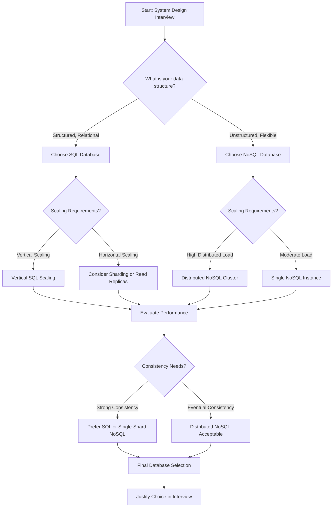

# Choosing Databases in System Design Interviews

## 🎯 Key Points

- **SQL Databases**: Best for structured data, ACID compliance, complex relationships
  - Use when: Financial systems, e-commerce, complex reporting needs
  - Examples: MySQL, PostgreSQL, Oracle
  - Strengths: Data integrity, JOIN operations, transaction support

- **NoSQL Databases**: Best for unstructured data, scalability, flexible schemas
  - Use when: Big data, real-time applications, rapid schema changes
  - Examples: MongoDB, Cassandra, Redis
  - Strengths: Horizontal scaling, high throughput, schema flexibility

- **Decision Factors**:
  - Data structure (structured vs unstructured)
  - Scaling requirements (vertical vs horizontal)
  - Consistency needs (ACID vs BASE)
  - Query complexity (JOINs vs denormalized data)
  - Development speed vs data integrity

## 💼 Database Migration Case Study

### Project Overview

- **Company**: FinTech Payment Processing Platform
- **Timeline**: Q2-Q4 2023 (6 months)
- **Challenge**: Migration from MongoDB to MySQL
- **Team Size**: 8 engineers (3 backend, 2 DBAs, 3 QA)
- **Scale**: Processing 2M+ daily transactions

### Why We Migrated

- Need for ACID compliance and data consistency
- Complex reporting requiring JOIN operations
- Improved transaction management for financial data
- Structured schema enforcement for regulatory compliance
- Better data integrity with foreign key constraints
- Requirement for complex multi-table transactions
- Enhanced support for financial reporting tools
- Standardized data model across the organization

### Migration Strategy

#### 1. **Assessment Phase** (3 weeks)

- **Database Size**: 2TB of MongoDB collections
- **Critical Collections**: Payments, Users, Merchants, Settlements
- **Peak Load**: 3000 TPS during business hours
- **Key Tasks**:
  - Analyzed MongoDB document structures
  - Designed normalized MySQL schema
  - Mapped complex MongoDB queries to SQL
  - Identified embedded document relationships

#### 3. **Execution Phase** (12 weeks)

- **Dual-Write Implementation**: Ensured safe parallel data writes
- **Incremental Migration**: Collection-wise migration approach
  - Historical data migration
  - Real-time data synchronization
  - Relationship data transformation
- **Thorough Testing**:
  - Data integrity validation
  - Transaction consistency checks
  - Performance benchmarking
  - Query optimization
- **Gradual Traffic Migration**: Used feature flags for staged deployment
- **Real-Time Monitoring**: Alerts for performance anomalies

### Technical Challenges Overcome

1. **Data Structure Transformation**
    - Converting nested MongoDB documents to normalized MySQL tables
    - Handling arrays and embedded documents
    - Establishing proper relationships and foreign keys
    - Managing ObjectID to Primary Key conversion

### Migration Results

- Achieved **ACID compliance** for all transactions
- **50% improvement** in complex reporting queries
- Enhanced **data consistency and integrity**
- Reduced **data redundancy by 45%**
- Improved **transaction reliability**
- Simplified **regulatory compliance reporting**
- Achieved **99.99% uptime** during migration
- Reduced **operational complexity**

## 🔍 Database Selection Flowchart

## 🌐 Real-World Database Examples

### SQL Databases

- **MySQL**: OLTP workloads, e-commerce, strong replication
- **PostgreSQL**: Complex queries, advanced data types, extensibility
- **Oracle**: Enterprise applications, high availability, security features

### NoSQL Databases

- **MongoDB**: Document-based, flexible schema, horizontal scaling
- **Cassandra**: Large-scale distributed systems, multi-datacenter replication
- **Redis**: In-memory store, caching, real-time analytics
- **Neo4j**: Graph-based relationships, ACID compliance

## 🔬 Performance Metrics to Consider

### SQL Metrics

- Query complexity, execution time
- JOIN operation efficiency
- Indexing strategies
- Transaction volume & throughput
- Connection pool efficiency

### NoSQL Metrics

- Read/write latency
- Sharding effectiveness
- Replication factor impact
- Query scatter-gather efficiency

## 🚨 Common Pitfalls to Avoid

### SQL Pitfalls

- Over-normalization
- Inefficient indexing
- Poor query optimization

### NoSQL Pitfalls

- Lack of ACID guarantees
- Complex consistency management
- Potential data redundancy

## 💡 Interview Strategies

2. **Understand requirements**
3. **Analyze data characteristics**
4. **Compare database capabilities**
5. **Propose a solution with trade-offs**

## 🔗 Hybrid Approaches

- **Polyglot persistence**: Combining SQL & NoSQL solutions
- **Microservices**: Using different databases for different services
- **Caching layers**: Improving performance with Redis

## 🎯 Final Interview Checklist

- Clearly justify database choice
- Demonstrate deep technical knowledge
- Show awareness of trade-offs
- Propose future optimizations
- Explain monitoring & validation strategies
- Discuss real-world challenges overcome

## 📚 Advanced Resources

- "Designing Data-Intensive Applications" - Martin Kleppmann
- CAP Theorem deep dive
- Database internals & distributed systems
- PostgreSQL vs MySQL comparison guides
- Migration patterns & strategies

## Suggested Related Documents
[[Senior Software Engineer Interview Preparation]]\|"Database Selection Guide" - This link text naturally connects the SQL/NoSQL database comparison document to the system design section of the interview preparation guide, focusing on the technical architecture aspect they share.]]

## Backlinks
- [[Senior Software Engineer Interview Preparation]]\|Related: SQL vs No-SQL.md]]

## Suggested Related Documents
[[Senior Software Engineer Interview Preparation]]]|"Database Design Fundamentals"

This link text effectively connects the SQL/NoSQL database concepts from the source document to the system design section of the interview preparation guide, highlighting the fundamental nature of database selection in system architecture.]]

## Backlinks

## Suggested Related Documents
[[Types of DataBases.md]]]|"Database Types Comparison"

This link text effectively connects the two documents as:
1. The source discusses SQL vs NoSQL comparison
2. The target provides a broader overview of database types
3. Both documents focus on database architecture and classification]]
[[Database Migration Strategies.md]]]|"Database Selection Strategy"

This link text connects the documents naturally since the first covers SQL/NoSQL selection criteria while the second discusses database migration approaches - both relating to strategic database decisions.]]
[[System Design Interview Senior Software Engineer - Harsh Tiwari.md]]]|"Database Selection Guide" - This link text effectively connects the SQL/NoSQL database comparison document to the system design interview preparation content, as database selection is a crucial aspect of system design discussions.]]

## Backlinks
- [[Types of DataBases.md]]]|"Database Types Comparison"

This link text effectively connects the source document about database types to the target document comparing SQL and NoSQL databases, capturing the core relationship between these related technical resources.]]
- [[Database Migration Strategies.md]]]|"Database Architecture Comparison"

This link text effectively connects the database migration strategies document with the SQL vs NoSQL comparison guide, focusing on their shared theme of database architecture while being concise and descriptive.]]
- [[System Design Interview Senior Software Engineer - Harsh Tiwari.md]]]|"Database Systems Architecture"

This link text connects the system design interview context from the first document with the database architecture focus of the second document, bridging their shared technical infrastructure theme.]]
