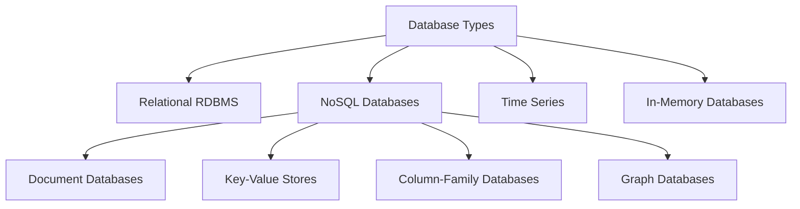
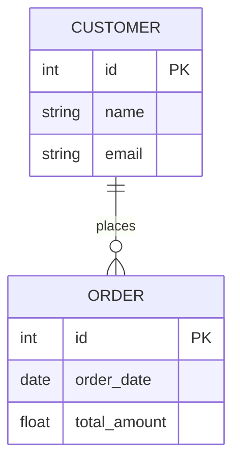
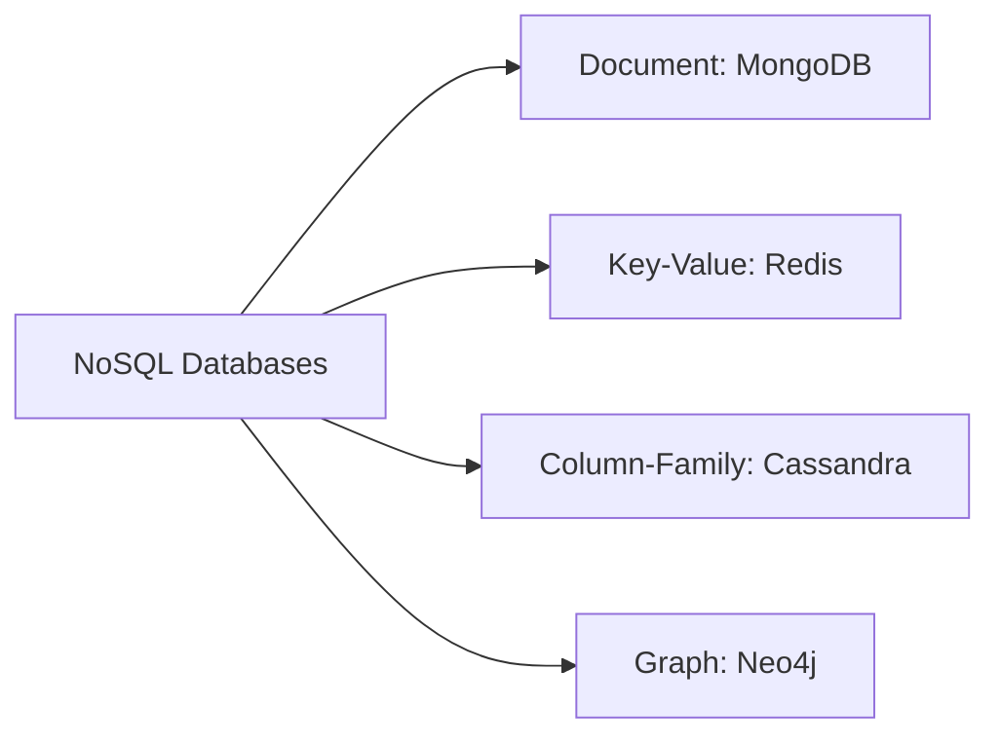

## Overview
Databases are structured collections of data that enable efficient storage, retrieval, and management of information.

## Database Types Relationship

## Relational Database Structure

## NoSQL Database Types

## Detailed Database Characteristics

### 1. Relational Databases (RDBMS)
- Uses structured tables with rows and columns
- Follows SQL (Structured Query Language)
- Examples: MySQL, PostgreSQL, Oracle
- Best for: Structured data with clear relationships

### 2. NoSQL Databases
- Flexible schema
- Horizontal scalability
- Different data models

### 3. Time Series Databases
- Optimized for time-stamped data
- Examples: InfluxDB, Prometheus

### 4. In-Memory Databases
- Data stored directly in RAM
- Extremely fast read/write operations

## Suggested Related Documents
[[High-Scale Batch Payee Validation System.md]]\|"Database System Architecture Implementation"

This link text connects the theoretical database types overview from the first document to the practical implementation of a data processing system in the second document, highlighting how database concepts are applied in a real architectural context.]]
[[Apache Kafka- Comprehensive Guide.md]]\|"Database Systems and Streaming"

This link text captures the relationship between traditional databases discussed in the first document and Kafka's streaming data platform covered in the second document, highlighting the data management connection between them.]]

## Backlinks
- [[Apache Kafka- Comprehensive Guide.md]]\|"Data Storage Systems Comparison"

This link text effectively connects Kafka (a distributed streaming platform for data storage/processing) with the database types document, focusing on their shared context of data storage and management systems.]]
- [[High-Scale Batch Payee Validation System.md]]\|"Database System Architecture" - this link text concisely connects the batch validation system's architectural design with the database types overview, highlighting their shared focus on data management infrastructure.]]

## Suggested Related Documents
[[SQL vs No-SQL.md]]]|"Database Types Comparison"

This link text effectively connects the source document about database types to the target document comparing SQL and NoSQL databases, capturing the core relationship between these related technical resources.]]

## Backlinks
- [[SQL vs No-SQL.md]]]|"Database Types Comparison"

This link text effectively connects the two documents as:
1. The source discusses SQL vs NoSQL comparison
2. The target provides a broader overview of database types
3. Both documents focus on database architecture and classification]]
