#algorithms #scaling #architecture #configuration #performance #concepts #tuning #system-design #internal-systems #distributed-systems #high-availability #rate-limiting #capacity #implementation #optimization

#high-availability #tuning #concepts #architecture #configuration #system-design #scaling #internal-systems #rate-limiting #algorithms #distributed-systems #optimization #performance #capacity #implementation

## Overview
Rate limiting is a critical component in distributed systems that controls the number of requests a system can handle in proportion to its capacity.

### Key Concepts
#concepts
- Rate limiting prevents system overload
- Helps maintain service quality
- Prevents cascading failures
- Essential for system health

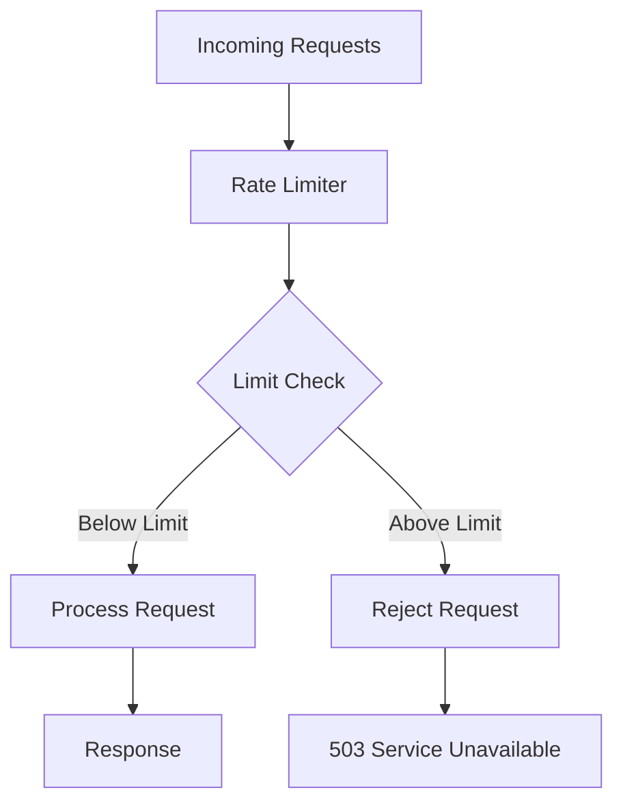

## System Components
#architecture #components

### Core Components
1. **Oracle**
   - Decision maker for request processing
   - Maintains service registry
   - Tracks service capacity

2. **Gateway Service**
   - Routes requests based on Oracle decisions
   - Implements initial rate limiting

3. **Services**
   - Individual microservices
   - Can implement custom rate limiting

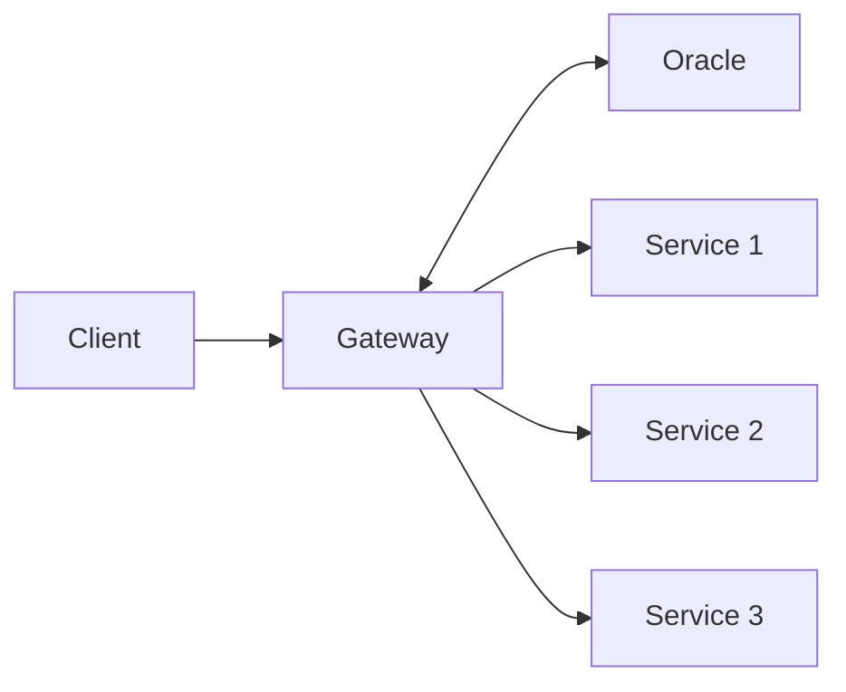

## Rate Limiting Algorithms
#algorithms #implementation

### 1. Sliding Window
Advantages:
- Simple implementation
- Precise control

Disadvantages:
- High memory footprint
- Garbage collection overhead

### 2. Timer Wheel
Features:
- Efficient bucket-based approach
- Configurable timeout
- Better resource utilization

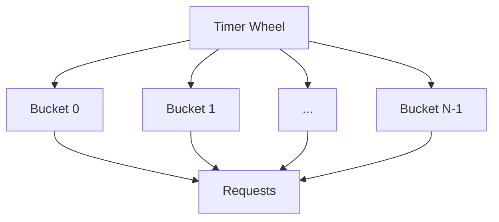

## Internal Rate Limiting
#internal-systems #optimization

### Monitoring Metrics
1. Average Response Time
2. Age of Requests
3. Dead Letter Queue Size

### Queue Partitioning Strategy
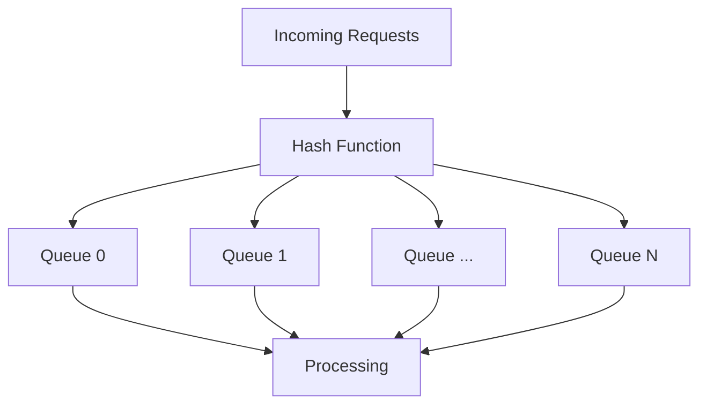

## Optimizations
#optimization #performance

### Request Collapsing
- Cache similar requests
- Combine duplicate requests
- Single server request for multiple clients

### Client-Side Rate Limiting
- Exponential backoff
- Error handling
- Maximum retry limits

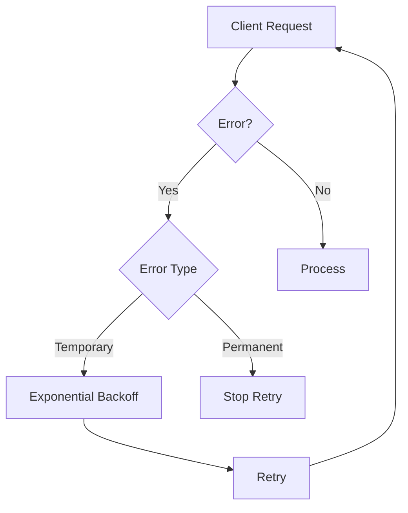

## Capacity Estimation
#capacity #scaling

### Assumptions
- Services: 100
- APIs per service: 30
- Request timeout: 60s
- Request size: 1 KB
- Request rate: 10/s/API

### Calculations
- Oracle memory: ~15 MB
- Queue wait time: 8.8s
- Maximum queue size: 8.8 MB

## The Oracle System
#oracle #architecture #decision-maker

### Oracle Overview
The Oracle serves as the brain of the distributed rate-limiting system, making critical decisions about request processing and system health.

#### Core Responsibilities
1. **Service Registry Management**
   - Maintains active service inventory
   - Tracks service health and capacity
   - Updates service configurations

2. **Decision Making**
   - Request acceptance/rejection
   - Load balancing decisions
   - Capacity allocation

3. **System Monitoring**
   - Service health checks
   - Performance metrics collection
   - Threshold monitoring

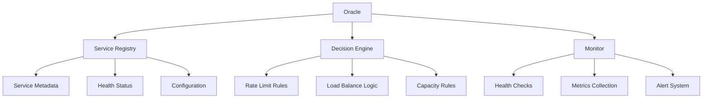

### Oracle Architecture
#architecture #high-availability

#### Components
1. **Leader Election Module**
   - Ensures single source of truth
   - Handles failover
   - Maintains consistency

2. **State Store**
   - Distributed configuration
   - Service state
   - Rate limit counters

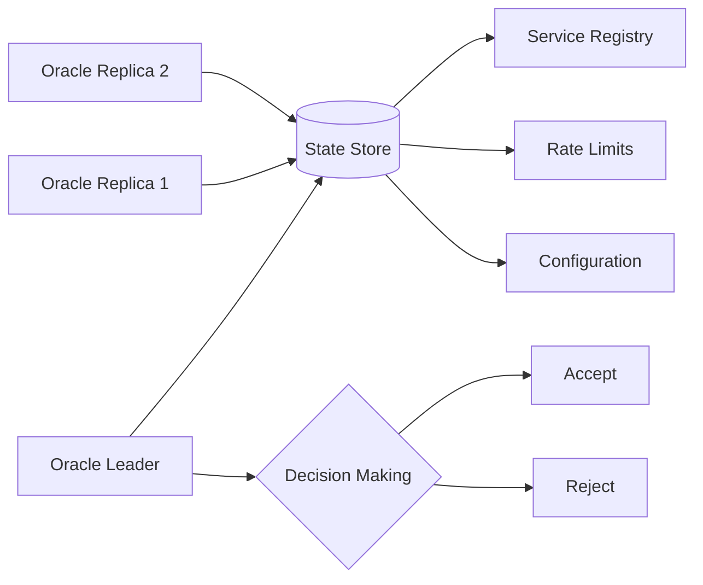

## Timer Wheel Deep Dive
#algorithms #timer-wheel #implementation

### Timer Wheel Structure
A Timer Wheel is an efficient data structure for managing large numbers of timed events with different timeout values.

#### Components
1. **Wheel Structure**
   - Multiple buckets (slots)
   - Each bucket represents a time interval
   - Circular array implementation

2. **Bucket Management**
   - Request timestamp tracking
   - Efficient memory usage
   - O(1) operations

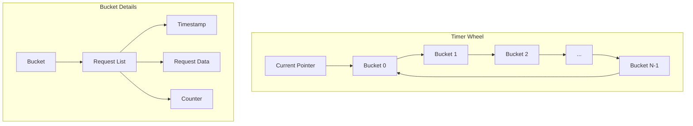

### Implementation Details
#implementation #optimization

#### Time Complexity
- Insertion: O(1)
- Deletion: O(1)
- Search: O(1)

#### Memory Management
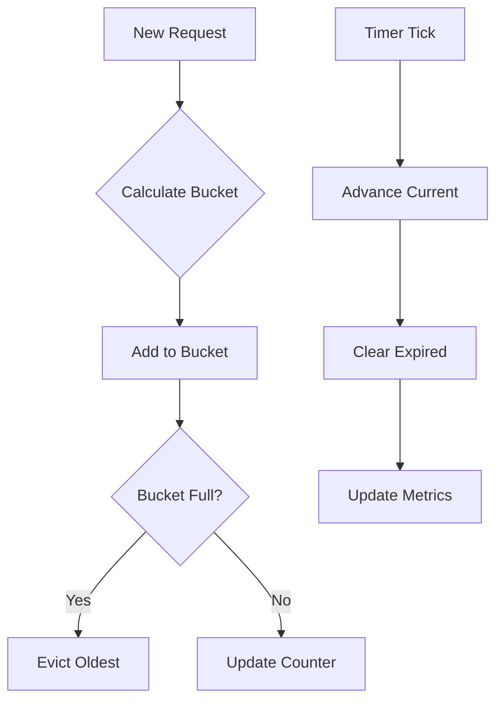

### Timer Wheel vs Traditional Approaches
#comparison #performance

#### Advantages
1. **Efficiency**
   - Constant time operations
   - Lower memory overhead
   - Better cache utilization

2. **Scalability**
   - Handles millions of timers
   - Easy to partition
   - Distributed friendly

#### Use Cases
1. **Request Rate Limiting**
   - Track request counts
   - Enforce time-based limits
   - Handle request expiry

2. **Connection Management**
   - TCP connection timeouts
   - Session management
   - Keep-alive tracking

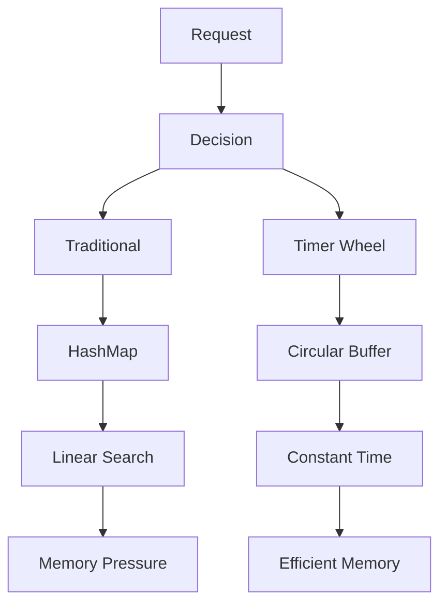

### Configuration Parameters
#configuration #tuning

1. **Wheel Size**
   - Number of buckets
   - Time granularity
   - Memory trade-offs

2. **Bucket Configuration**
   - Request capacity
   - Eviction policy
   - Counter type

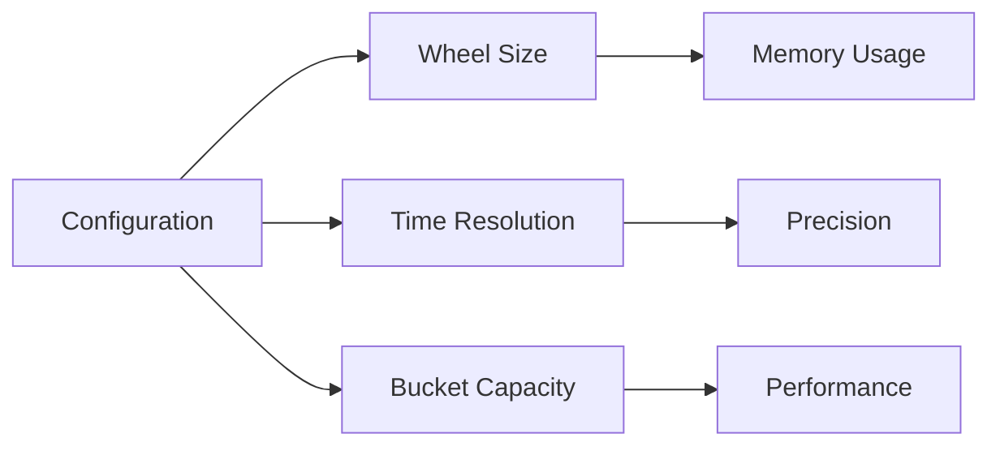

## Integration with Oracle
#integration #system-design

The Timer Wheel is a crucial component that works in conjunction with the Oracle for efficient rate limiting:

1. **Oracle Management**
   - Configures wheel parameters
   - Monitors wheel performance
   - Adjusts limits dynamically

2. **Distributed Coordination**
   - Synchronizes wheel state
   - Handles partitioning
   - Manages failover

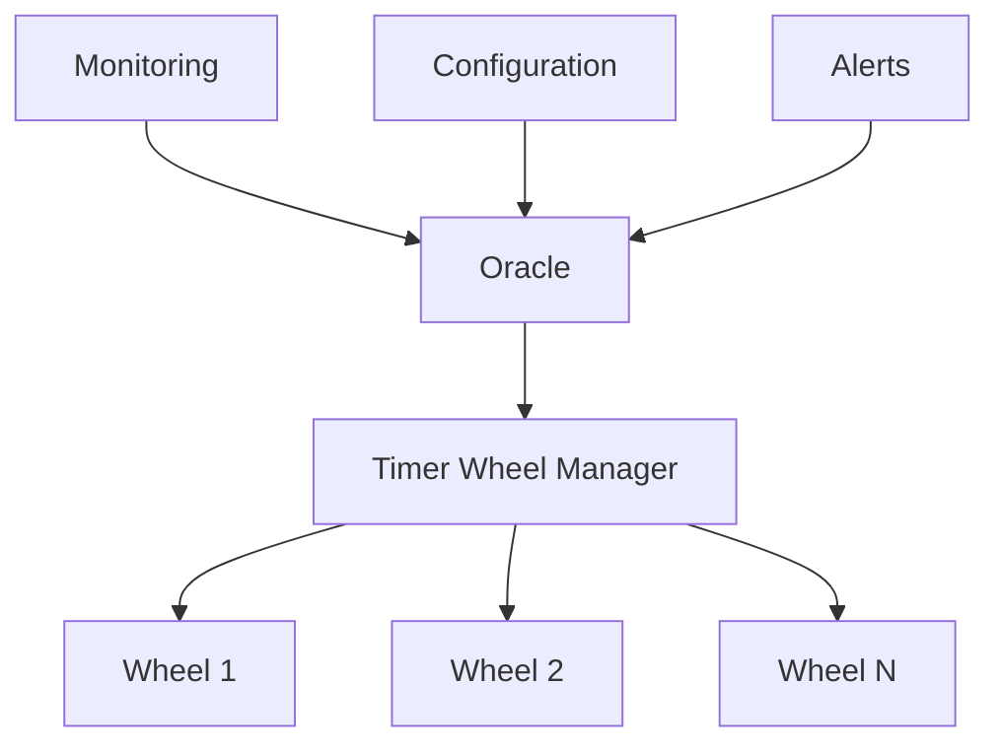

---
*Note: The Timer Wheel implementation provides an efficient solution for rate limiting in distributed systems, while the Oracle ensures proper coordination and management of the entire system.*

## Tags Overview
#system-design #rate-limiting #distributed-systems #architecture #algorithms #optimization #capacity #scaling #performance #implementation #concepts #internal-systems

---
*Note: This document provides a comprehensive overview of distributed rate limiting systems. For implementation details, refer to the specific sections.*

## Suggested Related Documents
[[Too much Requests.md]]\|Related: Too much Requests.md]]
[[Load Balancer.md]]\|"Request Management Components"

This link text effectively connects the two documents by highlighting their shared focus on managing incoming requests in distributed systems, with rate limiting controlling request volume and load balancing distributing requests across resources.]]

## Backlinks
- [[Load Balancer.md]]\|"Load Management Systems"

This link text effectively connects the concepts of load balancing and rate limiting, as both are related to managing and controlling system traffic and resource utilization in distributed systems.]]
- [[Too much Requests.md]]\|Related: Distributed Rate Limiting System Design.md]]

## Suggested Related Documents
[[High-Scale Batch Payee Validation System.md]]]|"Distributed System Performance Patterns"

This link text connects the documents by highlighting their shared focus on distributed systems architecture and performance optimization, while being concise and descriptive.]]
[[CAP Theorem.md]]]|"Distributed Systems Design Principles"

This link text effectively connects the two documents by highlighting their shared focus on fundamental distributed systems concepts, with the source covering rate limiting patterns and the target exploring CAP theorem principles.]]
[[Distributed Consistency with Paxos Protocol.md]]]|"Distributed Systems Architecture Fundamentals"

This link text connects the documents by focusing on their shared core theme of fundamental distributed systems concepts, with both covering critical architectural components (rate limiting and consensus protocols) in distributed environments.]]

## Backlinks
- [[Distributed Consistency with Paxos Protocol.md]]]|"Distributed Systems Architecture Fundamentals"

This link text connects the documents well because:
1. Both deal with core distributed systems concepts
2. Both cover architectural patterns (Paxos and rate limiting)
3. Both are fundamental building blocks for distributed system design]]
- [[CAP Theorem.md]]]|"Distributed Systems Architecture Fundamentals"

This link text connects the two documents well since both discuss core architectural concepts in distributed systems - CAP theorem in the first and rate limiting in the second, making it a logical bridge between these related topics.]]
- [[AWS Services Deep Dive.md]]]|"Cloud Architecture Patterns" - This link text connects the AWS services document with the rate limiting design doc, as both focus on architectural patterns for distributed cloud systems.]]
- [[High-Scale Batch Payee Validation System.md]]]|"Distributed Systems Performance Architecture"

This link text connects the documents through their shared focus on distributed systems architecture and performance optimization, as evidenced by their common tags and technical focus on high-scale processing and system control mechanisms.]]
