## Introduction

Caching is a critical component in system design, used to improve performance, reduce latency, and decrease the load on backend systems. This document explores various caching strategies and their applications, with a focus on how they might be implemented in systems like Obsidian.

## Types of Caches

### 1. In-Memory Cache

In-memory caching stores frequently accessed data in the computer's RAM for quick retrieval.

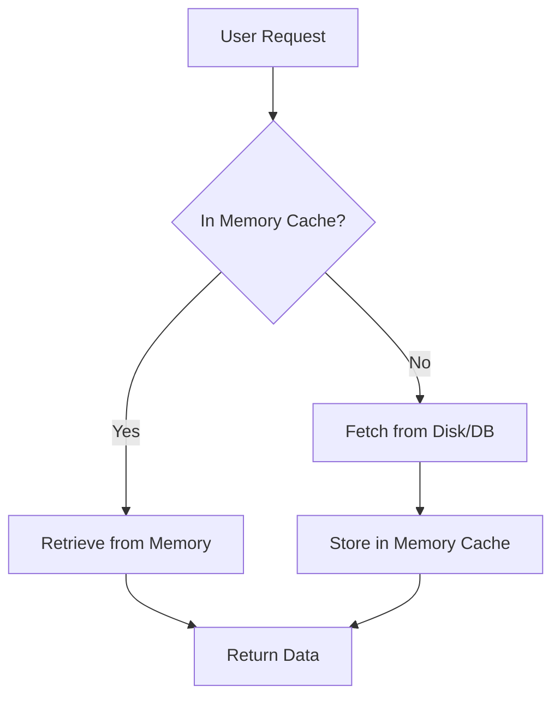

#### Applications in Obsidian:
- Caching recently accessed notes
- Storing search index for quick lookups
- Keeping plugin data in memory for faster access

### 2. Distributed Cache

A distributed cache spreads data across multiple nodes, allowing for horizontal scaling and improved fault tolerance.

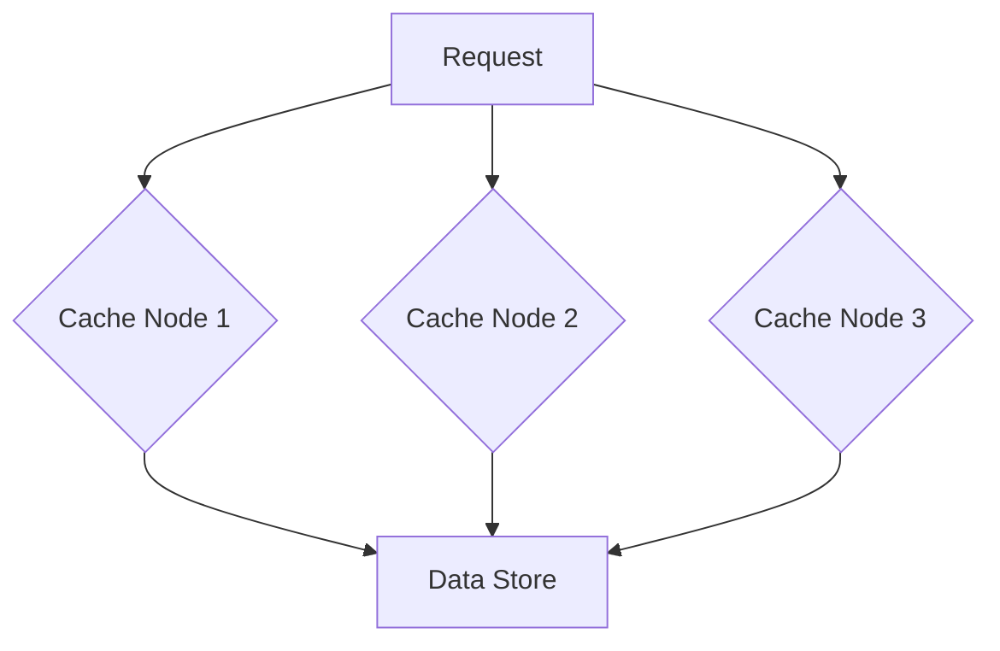

#### Potential Use in Obsidian:
- Caching shared resources in a multi-user Obsidian setup
- Distributing the search index across nodes for large vaults

### 3. Content Delivery Network (CDN)

CDNs cache content at geographically distributed edge locations to reduce latency for users worldwide.

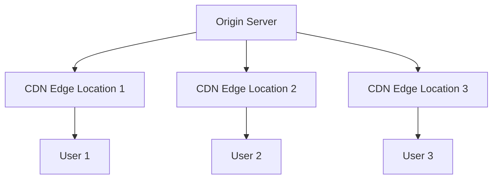

#### Relevance to Obsidian:
- Caching static assets like images or attachments in Obsidian Publish
- Distributing plugin resources for faster access

### 4. Database Cache

Database caching involves storing query results or frequently accessed database records in memory.

#### Obsidian Application:
- Caching metadata about notes, links, and tags
- Storing frequently accessed plugin data

## Caching Strategies

### 1. Write-Through Cache

In this strategy, data is written to both the cache and the underlying storage simultaneously.

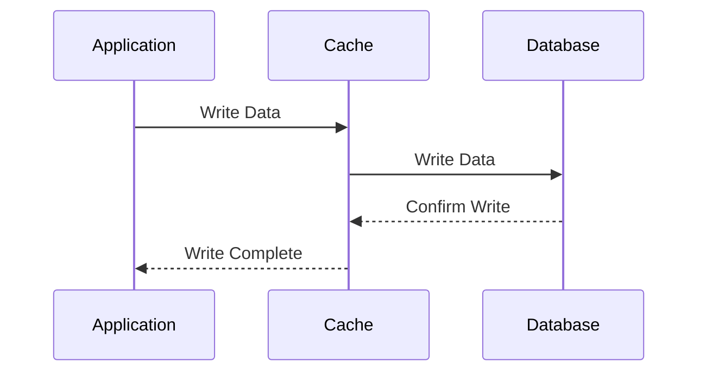

**Pros:**
- Data consistency between cache and storage
- Reduced risk of data loss

**Cons:**
- Higher latency for write operations

### 2. Write-Back (Write-Behind) Cache

Data is written to the cache and only later propagated to the underlying storage.

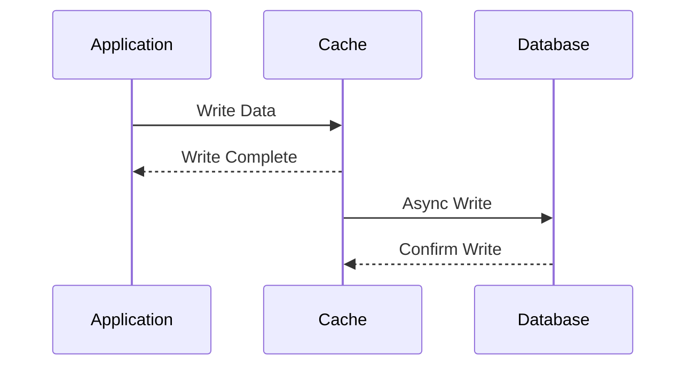

**Pros:**
- Lower write latency
- Reduced load on the underlying storage

**Cons:**
- Risk of data loss if cache fails before writing to storage

### 3. Read-Through Cache

On a cache miss, the cache itself is responsible for loading the data from the underlying storage.

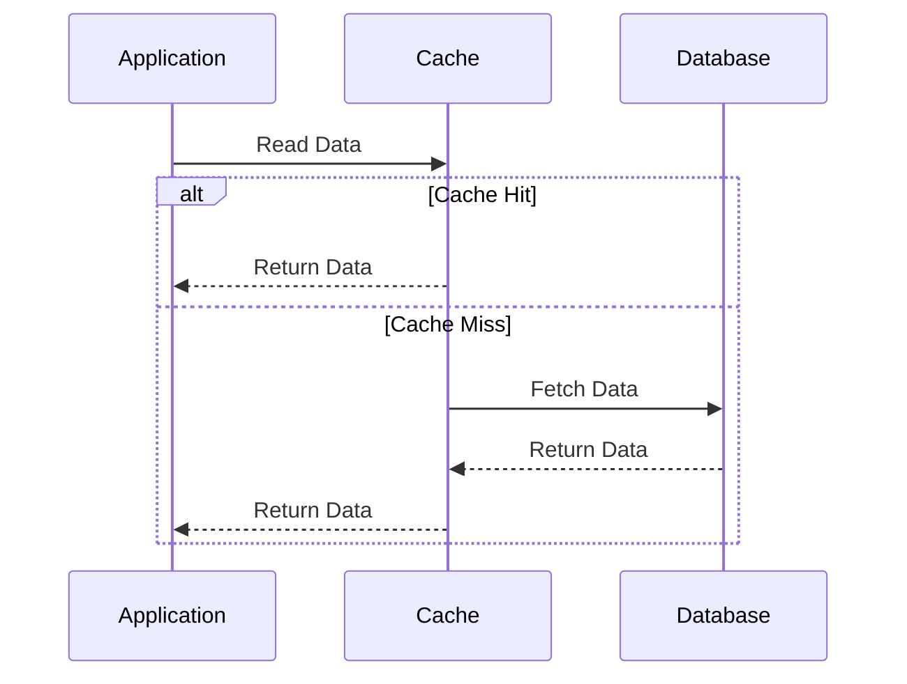

**Pros:**
- Simplified application logic
- Consistent data loading mechanism

**Cons:**
- Initial read for uncached data might be slower

### 4. Cache-Aside (Lazy Loading)

The application is responsible for reading and writing from both the cache and the underlying storage.

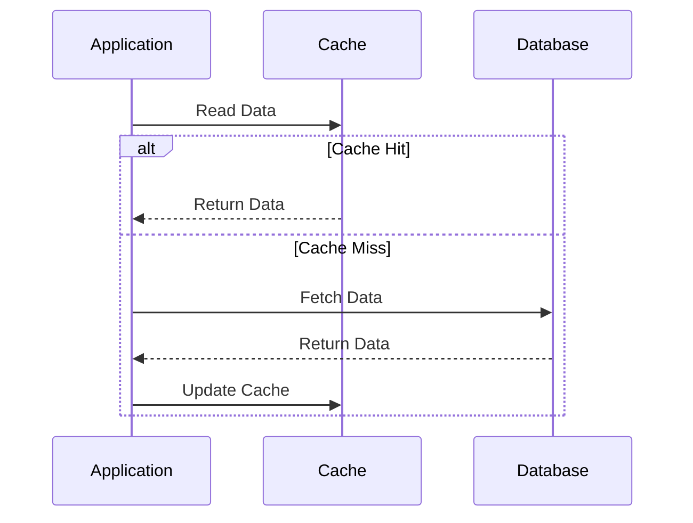

**Pros:**
- Works well for read-heavy workloads
- Application has more control over the caching logic

**Cons:**
- Initial cache misses can be slow
- Potential for stale data if not managed properly

## Cache Eviction Policies

1. **Least Recently Used (LRU)**: Removes the least recently accessed items first.
2. **Least Frequently Used (LFU)**: Evicts the items that are accessed the least often.
3. **First In First Out (FIFO)**: Removes the oldest entries first.
4. **Time To Live (TTL)**: Automatically expires cache entries after a set duration.

## Advanced Caching Concepts

### 1. Intelligent Load Balancing

Use machine learning to predict task complexity and distribute cache load accordingly.

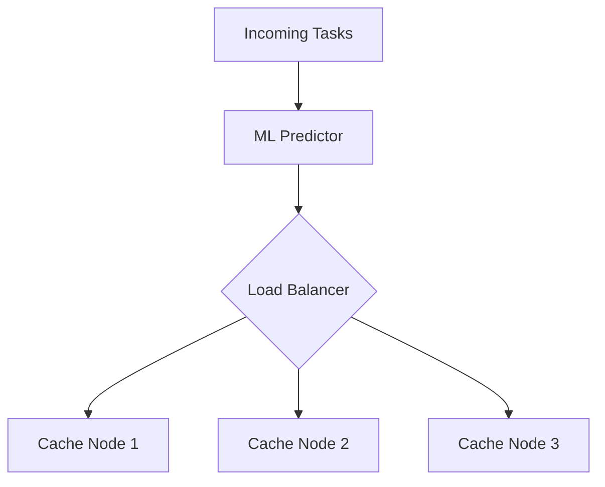

### 2. Multi-Tiered Caching

Implement multiple levels of caching for different types of data or access patterns.

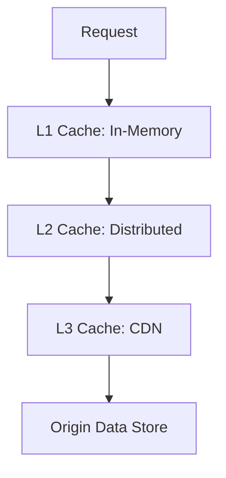

### 3. Cache Warming

Proactively populate the cache with likely-to-be-used data to improve initial performance.

### 4. Cache Consistency Protocols

Implement protocols to ensure consistency across distributed cache nodes:
- MESI (Modified, Exclusive, Shared, Invalid) protocol
- Write-invalidate protocol
- Directory-based protocols

## Hashing in Caching Systems

Hashing plays a crucial role in distributed caching systems, enabling efficient data distribution and retrieval across multiple cache nodes.

### Consistent Hashing

Consistent hashing is a technique used to distribute data across multiple cache nodes while minimizing reorganization when nodes are added or removed.

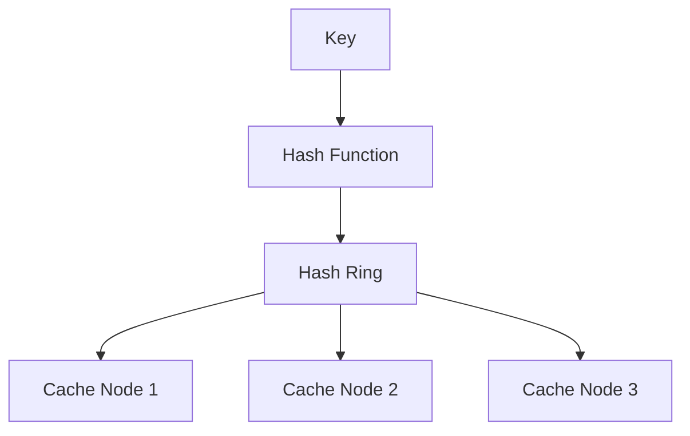

#### Benefits:
- Minimizes keys that need to be remapped when scaling
- Allows for dynamic addition or removal of cache nodes

#### Implementation:
1. Map cache nodes to points on a hash ring
2. Hash the key to a point on the ring
3. Move clockwise to find the first cache node

### Hash Functions in Caching

Common hash functions used in caching systems include:

4. **MD5**: Produces a 128-bit hash value
5. **SHA-1**: Generates a 160-bit hash value
6. **MurmurHash**: Designed for fast hashing of keys
7. **CRC32**: Simple and fast, but with higher collision risk

### Collision Resolution

In case of hash collisions, strategies include:

8. **Chaining**: Store colliding items in a linked list
9. **Open Addressing**: Find the next available slot in the hash table
10. **Double Hashing**: Use a second hash function to resolve collisions

## Sharding in Distributed Caching

Sharding is a database partitioning technique that can be applied to distributed caching systems to improve scalability and performance.

### Sharding Strategies

11. **Range-Based Sharding**: Divide data based on ranges of a key
12. **Hash-Based Sharding**: Use a hash of the key to determine the shard
13. **Directory-Based Sharding**: Maintain a lookup table for shard locations

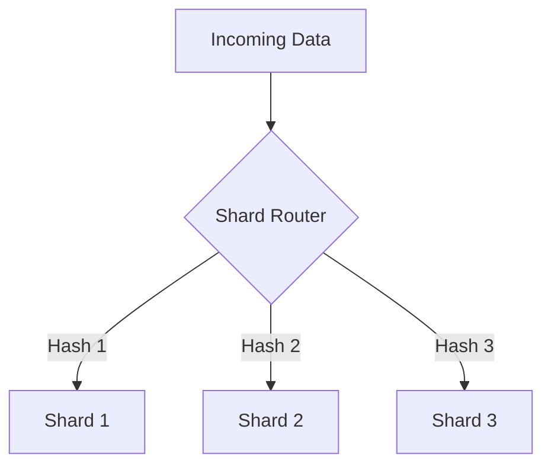

### Benefits of Sharding in Caching

14. **Improved Scalability**: Easily add more shards to handle increased load
15. **Better Performance**: Parallel processing across multiple shards
16. **Increased Availability**: Failure in one shard doesn't affect others

### Challenges and Considerations

17. **Data Rebalancing**: Needed when adding or removing shards
18. **Cross-Shard Operations**: Can be complex and impact performance
19. **Hot Spots**: Uneven data distribution can lead to performance issues

### Implementing Sharding in a Distributed Cache

20. **Determine Shard Key**: Choose a key that evenly distributes data
21. **Select Sharding Strategy**: Based on data characteristics and access patterns
22. **Implement Shard Router**: Direct requests to appropriate shards
23. **Handle Shard Management**: For adding, removing, or rebalancing shards

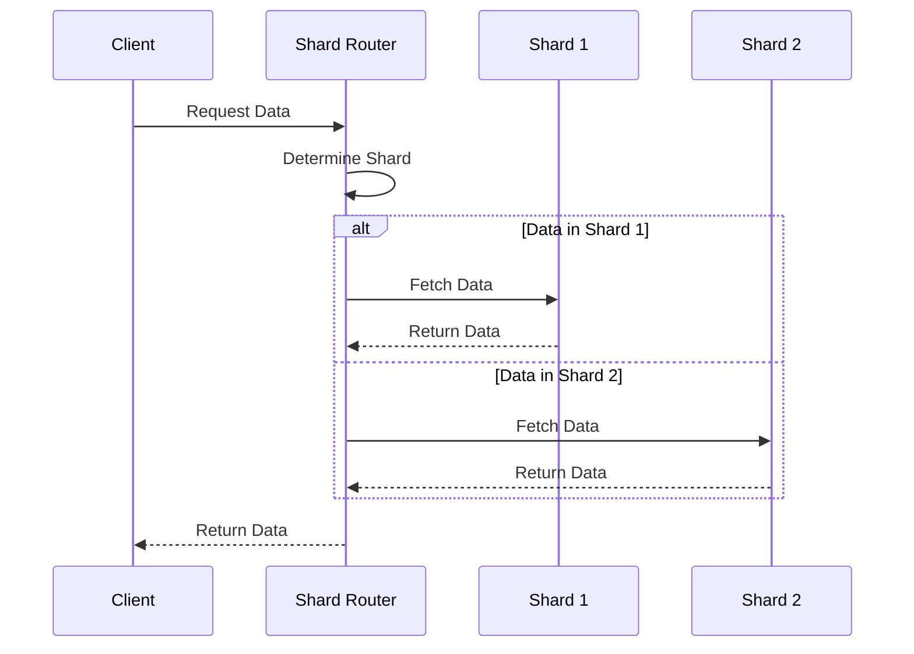

### Sharding in Specific Use Cases

24. **Large-Scale Web Applications**: 
   - Shard cache based on user ID or geographic location
   - Improve response times for geographically distributed users

25. **IoT Data Processing**:
   - Shard based on device ID or data type
   - Enable efficient processing of high-volume sensor data

26. **E-commerce Platforms**:
   - Shard product cache based on category or price range
   - Optimize for fast product searches and updates

27. **Social Media Networks**:
   - Shard user data cache based on user ID or activity level
   - Handle high read/write loads for active users efficiently

## Caching in Specific System Designs

### 1. AI-Powered E2E Testing Platform

- Use distributed caching (e.g., Redis Cluster) to store test results and intermediate data.
- Implement intelligent load balancing for cache access based on test complexity.

### 2. Distributed Task Processing System

- Employ a multi-tiered caching strategy:
  - L1: In-memory cache for very frequent tasks
  - L2: Distributed cache for shared task data
- Use cache-aside strategy for task metadata and results.

### 3. Distributed Batch Processing System

- Implement write-through caching for critical data to ensure consistency.
- Use read-through caching with TTL for semi-static reference data.

### 4. Universal API Testing Framework

- Cache API schemas and test templates using a distributed cache.
- Implement cache warming for frequently used API endpoints and test scenarios.

## Conclusion

Effective caching strategies are crucial for building high-performance, scalable systems. By understanding and applying these caching concepts, developers can significantly improve the efficiency and responsiveness of their applications, including complex systems like Obsidian.

## Suggested Related Documents
[[Consistent Hashing.md]]\|"Distributed Cache Implementation Strategy"

This link text effectively connects the two documents by bridging caching mechanisms with consistent hashing, which is a key strategy for implementing distributed caching systems.]]
[[Senior Software Engineer Interview Preparation]]\|"System Design Performance Concepts"

This link text effectively connects the caching mechanisms document to the interview preparation guide through their shared focus on system design and performance optimization topics.]]

## Backlinks
- [[Senior Software Engineer Interview Preparation]]\|"System Design Caching Strategies"

This link text effectively connects the two documents by:
1. Referencing "System Design" which appears in both documents
2. Focusing on "Caching" from the target document
3. Using "Strategies" to indicate the instructional nature of the content]]
- [[Consistent Hashing.md]]\|"Distributed caching implementation strategies" - this link text connects the two documents by highlighting how consistent hashing is a key strategy used in implementing distributed caching systems.]]
