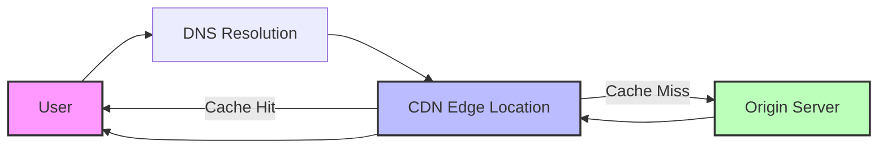
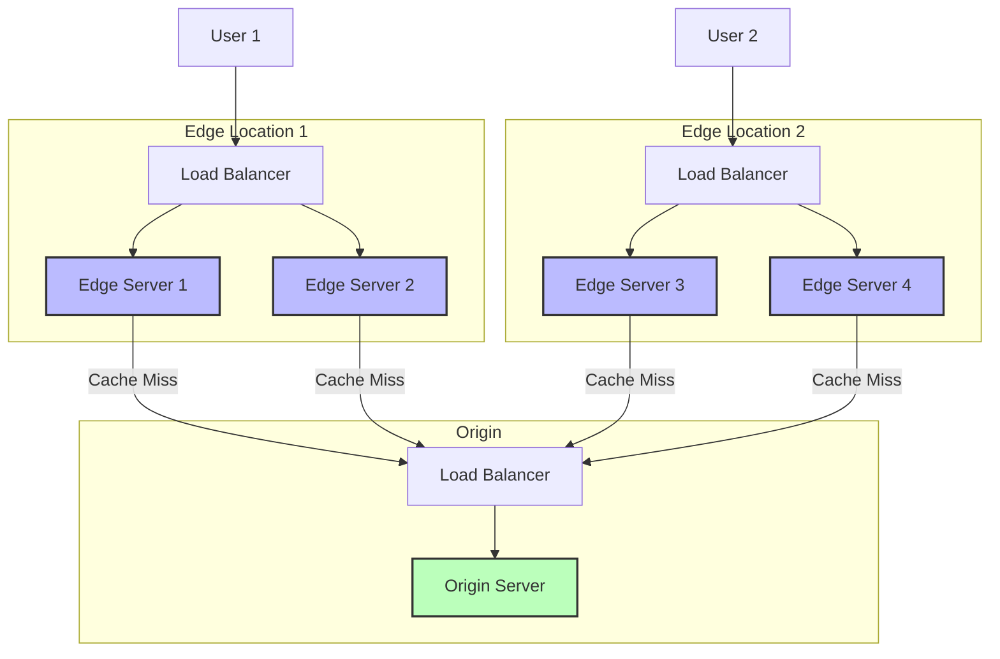
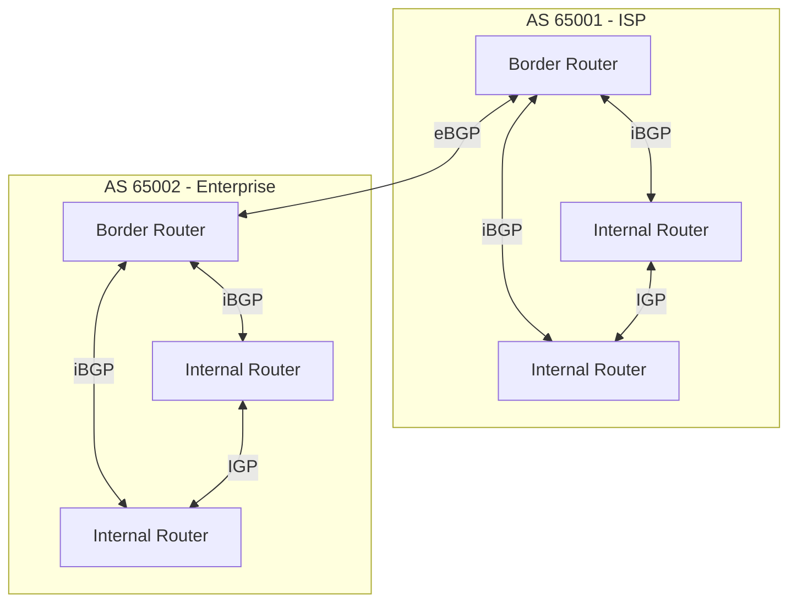
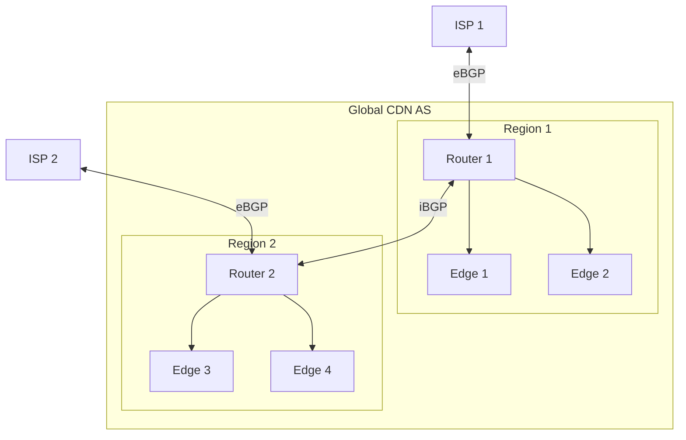
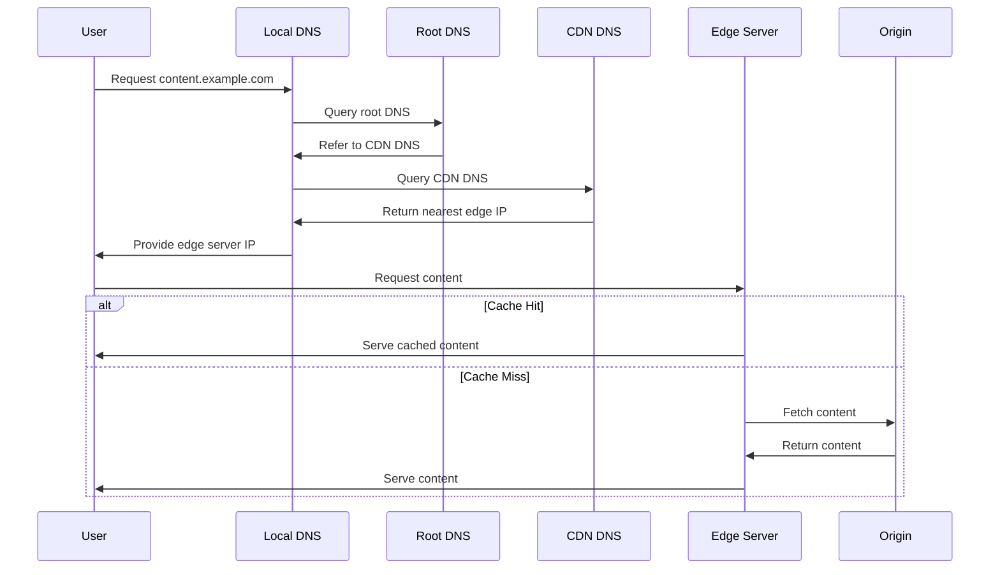
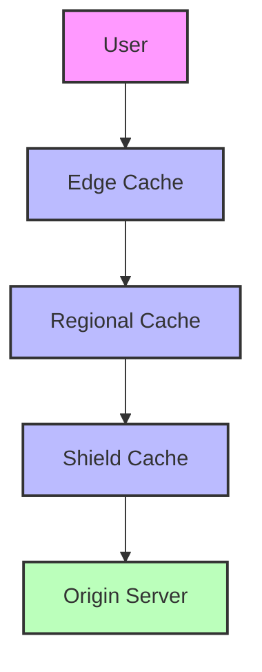

## Introduction
Content Delivery Networks (CDNs) are distributed networks of servers designed to deliver content to users with high availability and performance. This document explores how CDNs work, their architecture, and the underlying networking concepts that make them possible.

### High-Level CDN Flow

mermaid

Copy


### Core Components
### Core Components Architecture


1. Origin Server
   - Houses the original content
   - Serves as the source of truth for all CDN edge servers
   - Typically located in one or more central data centers

2. Edge Servers
   - Distributed globally across multiple locations
   - Cache and serve content closer to end users
   - Reduce latency and bandwidth costs
   - Provide redundancy and fault tolerance

3. Load Balancers
   - Distribute requests across multiple servers
   - Perform health checks on servers
   - Implement failover mechanisms

### Content Distribution Methods

#### Push CDN
- Content is proactively pushed to edge servers
- Suitable for static content that doesn't change frequently
- Provides consistent performance but requires more storage
- Example use cases: static websites, software downloads

#### Pull CDN
- Content is pulled from origin when first requested
- Cached at edge locations based on demand
- More efficient for dynamic content
- Example use cases: news websites, social media

## Network Routing and BGP
# Border Gateway Protocol (BGP) Deep Dive

## Core BGP Concepts

### Autonomous System (AS) Explained
An Autonomous System (AS) is a network or collection of networks under a single administrative domain. Think of it as a "country" in the Internet world, with:

- Unique identification through AS Numbers (ASN)
- Internal routing policies
- External routing relationships
- Range of IP addresses (prefixes) it controls



### Types of BGP Sessions

1. **eBGP (External BGP)**
   - Sessions between different ASes
   - Typically directly connected
   - Changes AS path when advertising routes
   - Primary focus on security and policy enforcement

2. **iBGP (Internal BGP)**
   - Sessions within the same AS
   - Can traverse multiple hops
   - Does not modify AS path
   - Requires full mesh or route reflectors

## BGP Path Selection Process in Detail

### Path Selection Criteria Explained

1. **Weight (Cisco Specific)**
   - Local to the router
   - Higher weight preferred
   - Range: 0-65535
   - Example:
     ```
     router bgp 65001
     neighbor 192.168.1.1 weight 100
     ```

2. **Local Preference**
   - AS-wide metric
   - Higher value preferred
   - Default: 100
   - Example:
     ```
     router bgp 65001
     neighbor 192.168.1.1 route-map SET_LOCAL_PREF in
     route-map SET_LOCAL_PREF permit 10
     set local-preference 200
     ```

3. **AS Path Length**
   ```mermaid
   graph LR
       AS1 -->|Path: 1| AS2
       AS1 -->|Path: 1 2 3| AS2
       
       style AS1 fill:#f96,stroke:#333,stroke-width:2px
       style AS2 fill:#f96,stroke:#333,stroke-width:2px
   ```
   - Shorter path preferred
   - Can be manipulated with AS path prepending
   - Example:
     ```
     router bgp 65001
     neighbor 192.168.1.1 route-map PREPEND out
     route-map PREPEND permit 10
     set as-path prepend 65001 65001
     ```

4. **Origin Type**
   - IGP (i) most preferred
   - EGP (e) second choice
   - Incomplete (?) least preferred

5. **MED (Multi-Exit Discriminator)**
   - Lower value preferred
   - Used for influencing inbound traffic
   - Example:
     ```
     router bgp 65001
     neighbor 192.168.1.1 route-map SET_MED out
     route-map SET_MED permit 10
     set metric 100
     ```

## BGP in CDN Environments

### CDN BGP Routing Strategies



6. **Anycast Routing**
   - Multiple edge locations advertise same IP prefix
   - Traffic automatically routed to nearest edge
   - Example configuration:
     ```
     router bgp 65001
     network 192.0.2.0/24
     neighbor 192.168.1.1 remote-as 65002
     neighbor 192.168.1.1 route-map ANYCAST out
     ```

7. **Route Health Injection (RHI)**
   ```mermaid
   sequenceDiagram
       participant E as Edge Server
       participant R as BGP Router
       participant ISP as Internet
       
       E->>R: Health Check OK
       R->>ISP: Advertise Route
       Note over E,ISP: Normal Operation
       E->>R: Health Check Fail
       R->>ISP: Withdraw Route
       Note over E,ISP: Failover
   ```
   - Dynamic route advertisement based on health
   - Automated failover mechanism
   - Example configuration:
     ```
     router bgp 65001
     neighbor 192.168.1.1 remote-as 65002
     neighbor 192.168.1.1 route-map CHECK_HEALTH out
     ```

### BGP Community Usage in CDNs

Communities are used to:
8. Control route distribution
9. Influence path selection
10. Apply specific policies

Example community configurations:
```
ip community-list 1 permit 65001:100  ! Local routes
ip community-list 2 permit 65001:200  ! Customer routes
ip community-list 3 permit 65001:300  ! Peer routes

route-map SET_COMMUNITY permit 10
 set community 65001:100
```

### BGP Security Considerations

11. **RPKI (Resource Public Key Infrastructure)**
   - Validates route origins
   - Prevents route hijacking
   - Example configuration:
     ```
     router bgp 65001
     bgp rpki server tcp 192.168.1.10 port 3323
     neighbor 192.168.1.1 ebgp-multihop 2
     neighbor 192.168.1.1 prefix-validation
     ```

12. **BGP Authentication**
   ```
   router bgp 65001
   neighbor 192.168.1.1 password secure_password
   ```

13. **Route Filtering**
   ```
   ip prefix-list ALLOWED_PREFIXES seq 10 permit 192.168.0.0/16
   neighbor 192.168.1.1 prefix-list ALLOWED_PREFIXES in
   ```

## Troubleshooting BGP

### Common BGP Issues and Solutions

14. **Neighbor Establishment Issues**
   - Check TCP connectivity
   - Verify AS numbers
   - Confirm authentication
   - Commands:
     ```
     show ip bgp summary
     show ip bgp neighbors
     debug ip bgp
     ```

15. **Route Advertisement Issues**
   - Check route policies
   - Verify network statements
   - Examine route maps
   - Commands:
     ```
     show ip bgp
     show ip bgp neighbors advertised-routes
     show ip bgp neighbors received-routes
     ```

Would you like me to expand on any particular aspect of BGP routing or add more specific examples?
### CDN Load Balancing Mechanisms

16. Layer 4 Load Balancing
    - Based on TCP/UDP ports
    - Fast and efficient
    - Limited application awareness
17. Layer 7 Load Balancing
    - Content-aware distribution
    - SSL termination
    - Advanced routing rules
    - HTTP header manipulation

### Cache Control Headers

```
Cache-Control: public, max-age=3600
Cache-Control: private, no-cache
Cache-Control: no-store
ETag: "33a64df551425fcc55e4d42a148795d9f25f89d4"
Last-Modified: Wed, 21 Oct 2015 07:28:00 GMT
```
### How CDNs Use BGP

#### Anycast Routing
- Multiple edge servers advertise the same IP address
- Requests are automatically routed to the nearest server
- Provides automatic failover and load distribution

#### BGP Route Optimization
18. Path Manipulation
   - CDNs influence routing decisions through BGP attributes
   - AS path prepending to prefer certain routes
   - Community strings for traffic engineering

19. Route Health Injection (RHI)
   - Dynamically advertise or withdraw routes based on server health
   - Enables automatic failover
   - Ensures traffic only flows to healthy servers

## DNS in CDNs

### DNS-Based Load Balancing
20. Global Server Load Balancing (GSLB)
   - Uses DNS to direct users to optimal edge locations
   - Considers factors like:
     - Geographic proximity
     - Server load
     - Network conditions
     - Server health

21. Dynamic DNS Updates
   - Real-time updates based on:
     - Network topology changes
     - Server availability
     - Traffic patterns

### DNS Resolution Process


22. User requests content
23. DNS query to CDN's authoritative nameserver
24. CDN determines optimal edge location
25. Returns IP address of selected edge server
26. User connects directly to edge server

### Cache Hierarchy

****
## Performance Optimization

### Caching Strategies
27. Cache Hierarchies
   - Edge caches
   - Regional caches
   - Origin shield

28. Cache Control
   - TTL (Time To Live)
   - Cache invalidation
   - Purge mechanisms

### Traffic Management
29. Rate Limiting
30. DDoS Protection
31. Traffic Shaping
32. Content Compression

## Monitoring and Analytics

### Key Metrics
33. Cache Hit Ratio
34. Latency
35. Bandwidth Usage
36. Error Rates
37. Origin Offload

### Monitoring Systems
38. Real-time monitoring
39. Historical analytics
40. Alert systems
41. Performance dashboards

## Security Considerations

### Edge Security
42. TLS/SSL Termination
43. WAF (Web Application Firewall)
44. DDoS Mitigation
45. Bot Protection

### Origin Protection
46. Origin Cloaking
47. Access Controls
48. Authentication
49. Token Validation

## Best Practices

### Implementation
50. Use appropriate cache headers
51. Implement proper cache invalidation
52. Configure origin failover
53. Enable compression
54. Use TLS for all connections

### Maintenance
55. Regular performance audits
56. Security updates
57. Configuration reviews
58. Capacity planning

## Troubleshooting

### Common Issues
59. Cache misses
60. Routing problems
61. SSL/TLS issues
62. Origin connectivity
63. Performance degradation

### Debugging Tools
64. DNS lookup tools
65. Traceroute
66. BGP looking glasses
67. HTTP debugging proxies
68. Network analyzers

## References and Further Reading
- BGP RFC 4271
- DNS RFC 1034/1035
- HTTP Caching RFC 7234
- CDN Security Best Practices


## Suggested Related Documents
[[Load Balancer.md]]\|"CDN Load Distribution Mechanisms"

This link text captures the key relationship between CDNs and load balancers, highlighting how CDNs use load balancing as a core mechanism for distributing content across their networks.]]
[[DNS & Internet Connectivity.md]]\|"CDN and DNS infrastructure"

This link text effectively connects the two documents by highlighting their shared focus on core internet infrastructure components (CDNs and DNS) that work together to enable content delivery and network connectivity.]]
[[Too much Requests.md]]\|"CDN Traffic Management Solutions"

This link text effectively connects the CDN architecture document to the high request handling strategies document, emphasizing their shared focus on managing network traffic and request volumes.]]

## Backlinks
- [[DNS & Internet Connectivity.md]]\|"DNS Resolution and CDNs"

This link text effectively connects the DNS resolution process described in the source document with the CDN architecture content in the target document, highlighting their interconnected relationship in web infrastructure.]]
- [[Load Balancer.md]]\|"Load Balancing in CDNs"

This link text effectively connects the two documents by highlighting how load balancing is a key component of CDN architecture and operation, while being concise and descriptive.]]
- [[Too much Requests.md]]\|"CDN Request Management Strategies"

This link text effectively bridges the documents by connecting the high request volume handling from the first document with the CDN infrastructure discussed in the second document, highlighting their complementary relationship in managing web traffic.]]
