# Consistency in Distributed Systems

A measure of how up to date the data is in a distributed system. In distributed systems, consistency refers to how data remains synchronized across multiple nodes or replicas.

## Data Consistency Levels

### 1. Linearizable Consistency
- Most strict consistency level
- Shows all changes in database until current read request
- All changes before read operation are reflected in read query
- Uses single-threaded single server
- Every read and write request strictly ordered

Example:
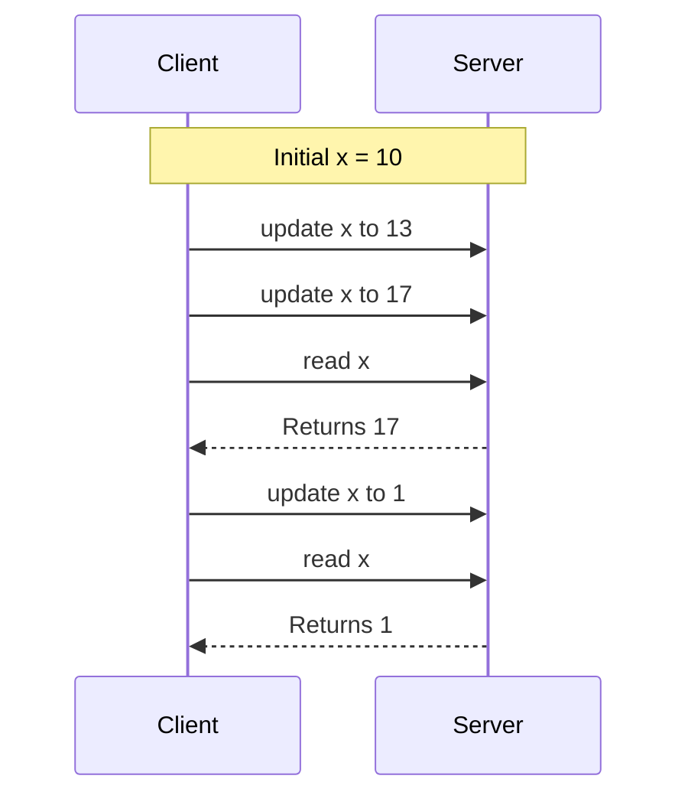

### 2. Eventual Consistency
- Can send stale data for read requests
- Eventually returns latest data (if data isn't updated)
- System becomes consistent after some time
- Can process read and write requests parallelly using multiple servers

Example:
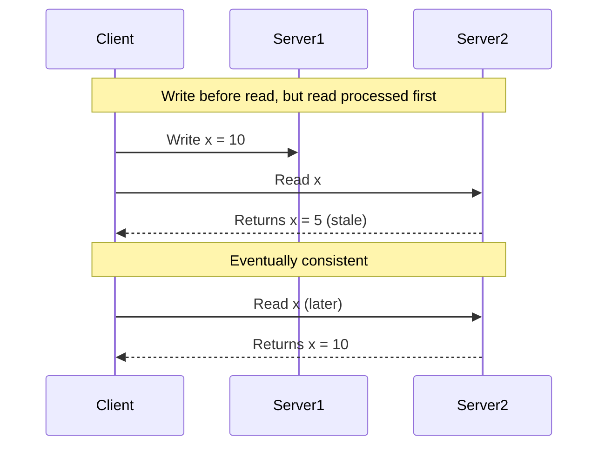

### 3. Causal Consistency
- Orders operations based on dependencies
- Previous related operations must execute first
- Independent operations can execute in any order

Example:
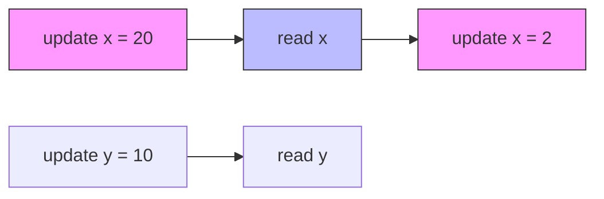
#### Limitations with Aggregation Operations

Causal Consistency fails when performing aggregation operations due to its ID-based ordering nature versus aggregation's need to work across all IDs.

Example Table:
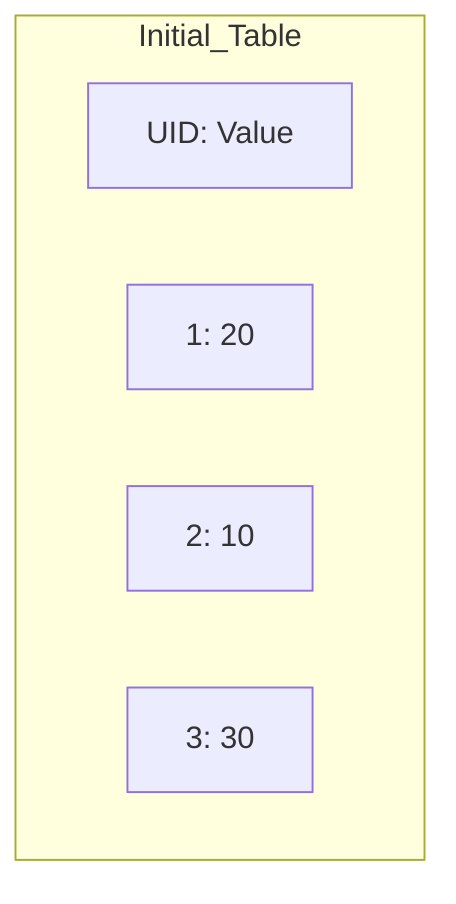

Consider these operations:
1. read sum
2. update 1 to 10
3. read sum
4. update 1 to 5

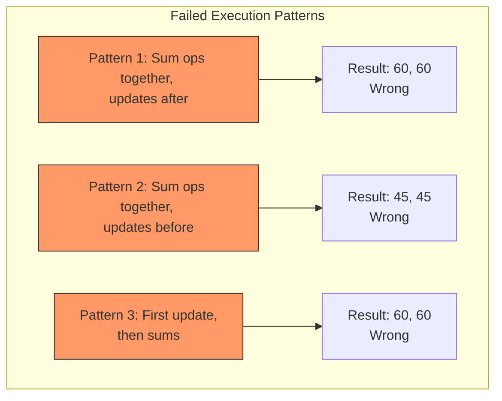

**Why It Fails:**
- Causal consistency orders queries based on individual IDs
- Aggregation operations (like SUM) need to work across all IDs simultaneously
- No permutation of operations can guarantee correct results
- This creates a fundamental conflict between causal ordering and aggregate operations

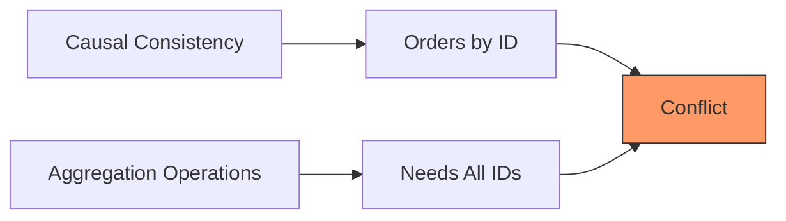

**Example Breakdown:**
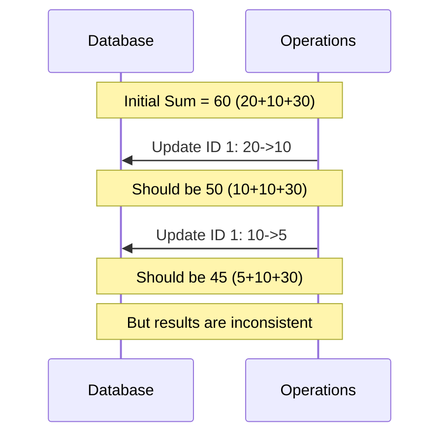

This limitation shows that while causal consistency is effective for operations on individual keys, it's not suitable for operations that need to maintain consistency across multiple keys simultaneously.

-----

### 4. Quorum Consistency
- Multiple replicas may not be in sync
- Read queries fetch from all replicas
- Returns most appropriate values
- Eventually consistent in most cases

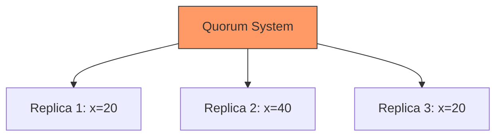

### Trade-off Formula for Quorum:

- R + W > N: Strong consistency
- R + W ≤ N: Eventual consistency Where:
- R = Read replicas
- W = Write replicas
- N = Total replicas

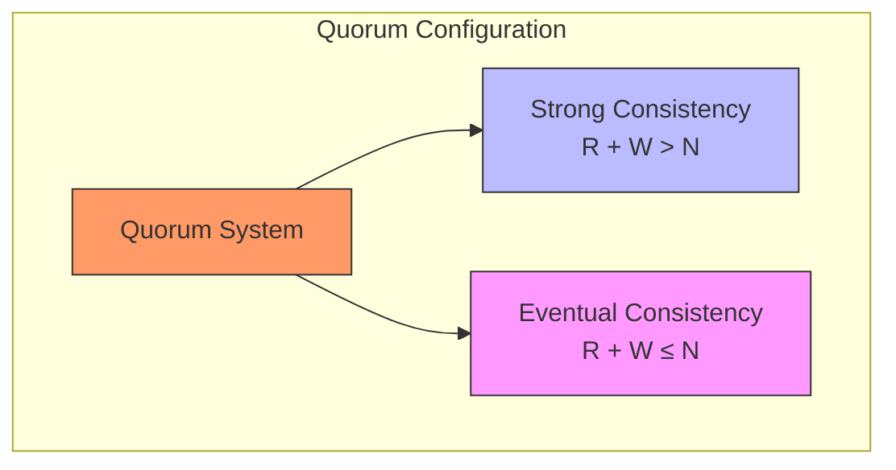

## Consistency Level Comparison

### Comparison Table

| Level | Consistency | Efficiency |
|-------|-------------|------------|
| Linearizable | Highest | Lowest |
| Eventual Consistency | Lowest | Highest |
| Causal Consistency | Higher than Eventual, Lower than Linearizable | Higher than Linearizable, Lower than Eventual |
| Quorum | Configurable | Configurable |

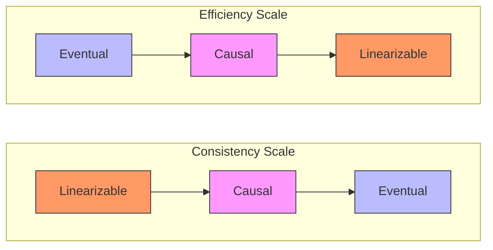

## Transaction Isolation Levels

### Efficiency vs Isolation Trade-off
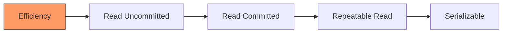

1. Read Uncommitted
   - Overwritten on update operations
   - Lowest isolation, highest efficiency

2. Read Committed
   - Local copy of changed values
   - Old value in DB, new in local copy until commit

3. Repeatable Read
   - Versioning of unchanged values
   - Stores all historical values for keys

4. Serializable
   - Uses queued locks
   - Causal ordering
   - Highest isolation, lowest efficiency

## Implementation Techniques

### Two-Phase Commit (2PC)
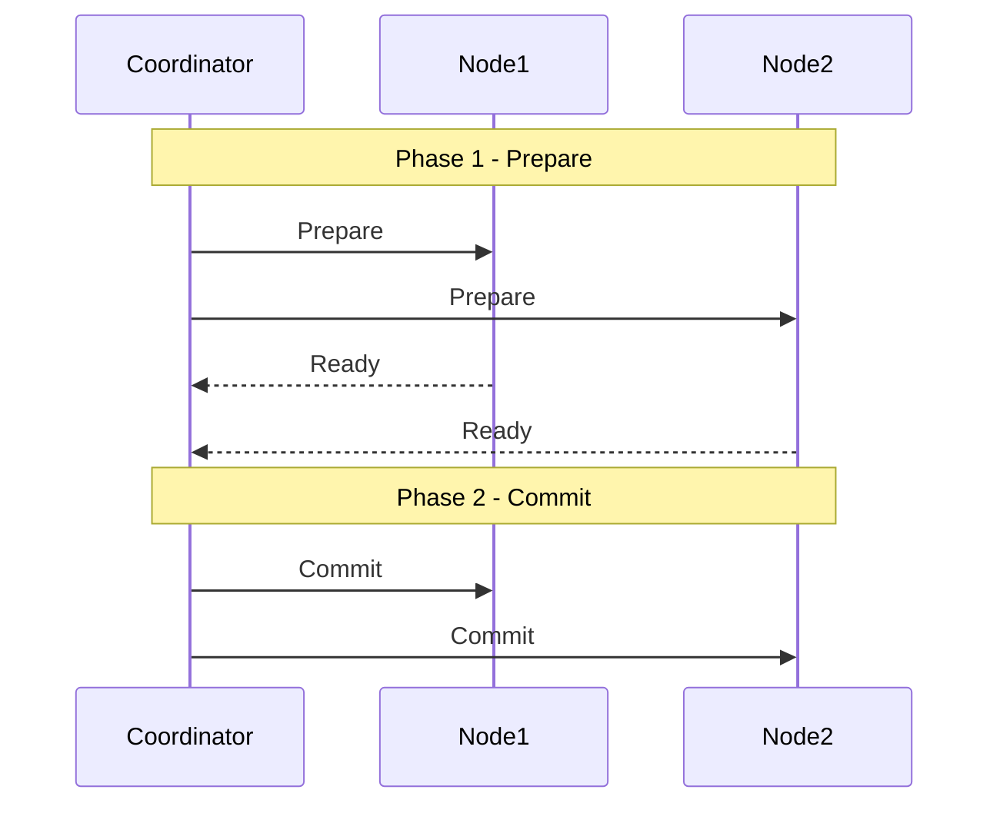

### Quorum-based Implementation
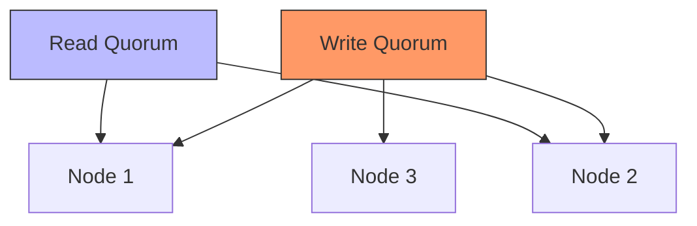

## CAP Theorem Trade-offs
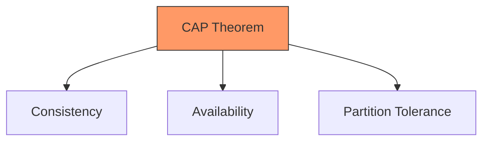

1. CP Systems
   - Banking systems
   - Financial transactions

2. AP Systems
   - Social media
   - Content delivery

## Best Practices

1. Monitoring Metrics
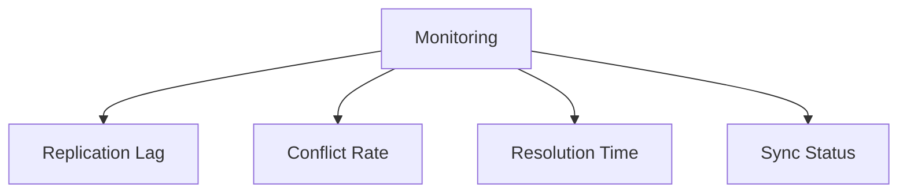

1. Conflict Resolution Strategies
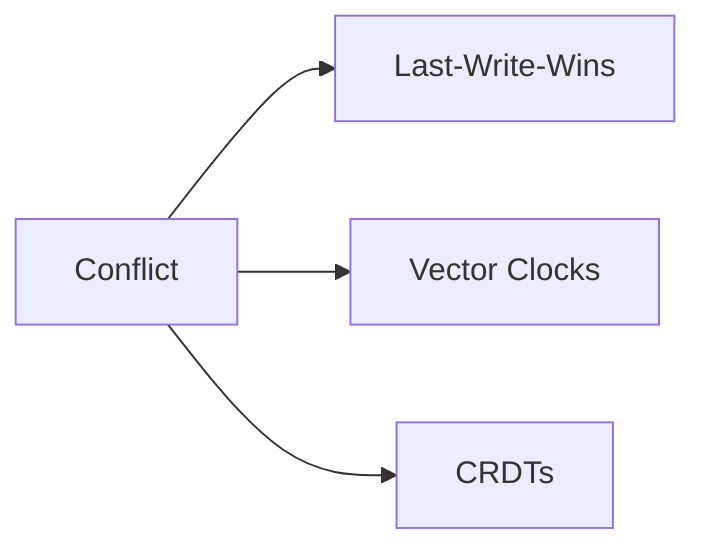

## Performance Considerations

For optimal performance, consider:
1. Read vs Write ratio
2. Consistency requirements
3. Latency tolerance
4. Network partition frequency

#distributed-systems #consistency #cap-theorem #replication

## Suggested Related Documents
[[CAP Theorem.md]]\|"CAP Theorem Consistency Relationship"

This link text effectively connects the two documents by highlighting their shared focus on consistency within the context of the CAP theorem in distributed systems.]]
[[Distributed Consistency with Paxos Protocol.md]]\|"Paxos Consistency Implementation"

This link text effectively connects the general concept of consistency in distributed systems (source) to its specific implementation through the Paxos protocol (target).]]
[[Consistent Hashing.md]]\|"Distributed System Hashing Concepts"

This link text effectively connects the two documents by:
1. Acknowledging the distributed systems context they share
2. Referencing the hashing focus of the target document
3. Keeping it general enough to bridge consistency and hashing concepts]]

## Backlinks
- [[Distributed Consistency with Paxos Protocol.md]]\|"Paxos Consensus Implementation Details"

This link text effectively connects the source document about the Paxos protocol to the broader topic of consistency in distributed systems, highlighting that Paxos is a specific implementation method for achieving distributed consistency.]]
- [[CAP Theorem.md]]\|"CAP Theorem Consistency Principles"

This link text effectively connects the documents by:
1. Referencing the main topic of the source (CAP Theorem)
2. Highlighting the target's focus (Consistency)
3. Indicating the theoretical nature of both documents (Principles)]]
- [[Consistent Hashing.md]]\|"Distributed System Consistency Patterns"

This link text connects the two documents by highlighting how consistent hashing is one of the key patterns used to achieve consistency in distributed systems, bridging the technical relationship between these related concepts.]]
