## Introduction
Paxos is a fundamental consensus protocol designed to achieve consistency in distributed systems. It was first introduced by Leslie Lamport in 1989 and is widely used in distributed databases and state machine replication.

## Basic Concepts

### Key Properties
- Safety: Only a single value is chosen
- Liveness: Eventually some value is chosen
- Fault Tolerance: Continues despite failures

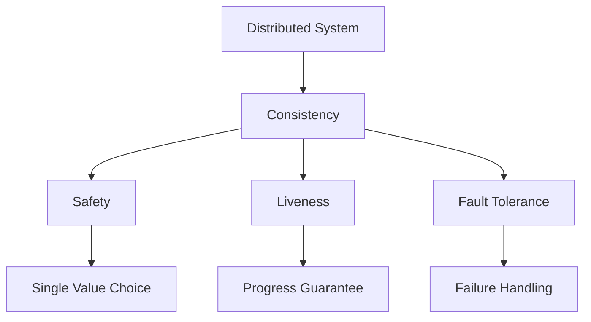

## Paxos Roles

### Core Participants
1. Proposers: Propose values
2. Acceptors: Accept/reject proposals
3. Learners: Learn chosen values


## Protocol Phases

### Phase 1: Prepare
The prepare phase ensures a proposer can safely propose a value.

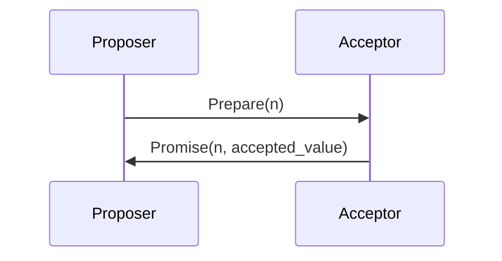

### Phase 2: Accept
The accept phase attempts to get a value accepted by a majority.

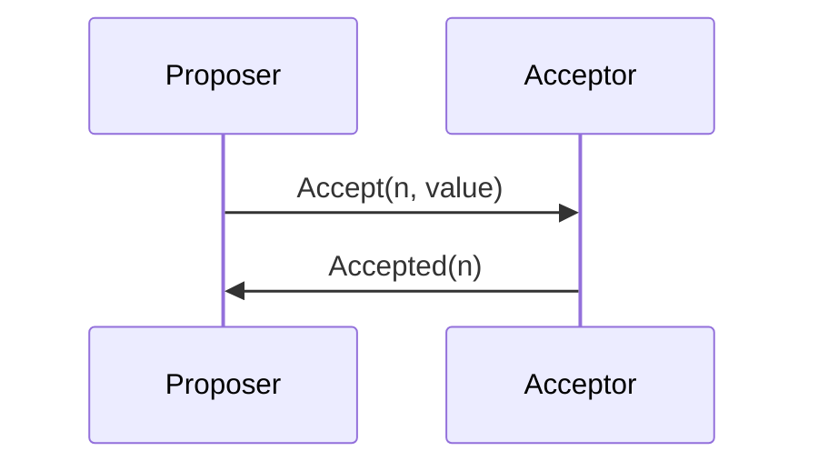

## Failure Scenarios

### Common Failures
1. Network Partitions
2. Message Loss
3. Process Crashes

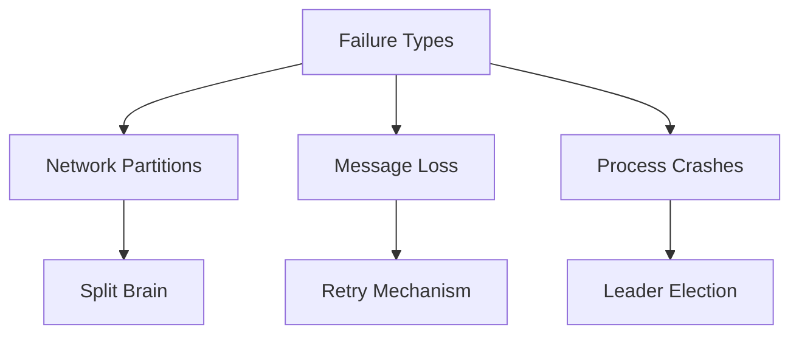

## Implementation Considerations

### Key Aspects
1. Message Format
2. State Storage
3. Timeout Handling

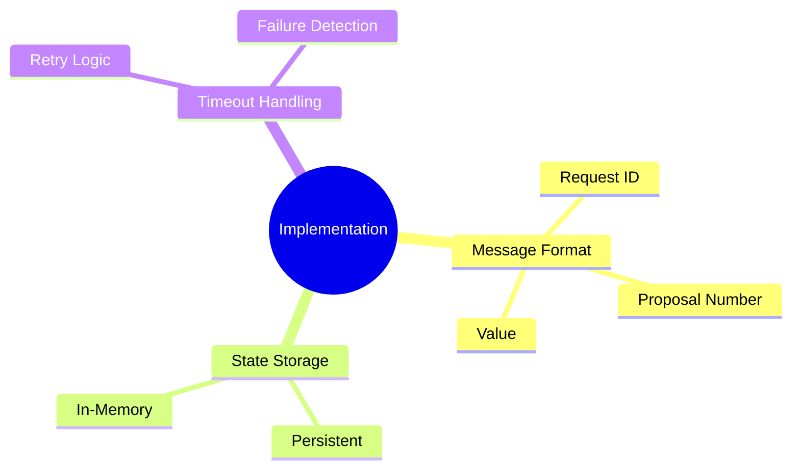

## Real-world Applications

### Use Cases
1. Google Chubby
2. ZooKeeper
3. Etcd

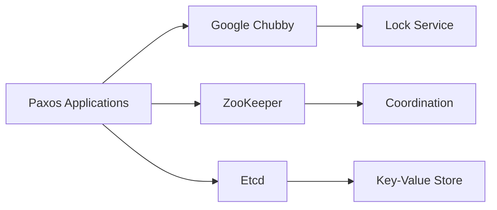

## Advanced Variants

### Extensions
1. Multi-Paxos
2. Fast Paxos
3. Cheap Paxos

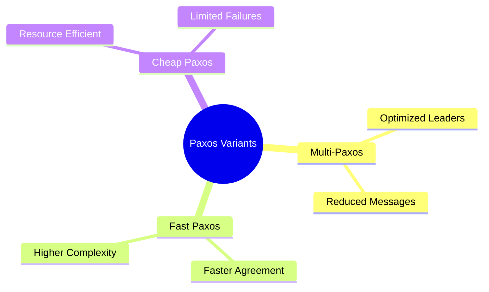

## Related Topics
- [[Distributed Systems]]
- [[Consensus Algorithms]]
- [[CAP Theorem]]
- [[Raft Algorithm]]

## References
1. Lamport, L. (1998). The Part-Time Parliament
2. Lamport, L. (2001). Paxos Made Simple
3. Van Renesse, R., & Altinbuken, D. (2015). Paxos Made Moderately Complex

#distributed-systems #consensus #fault-tolerance #algorithms


# Detailed Paxos Implementation Guide
---

## 1. System Requirements and Prerequisites

### 1.1 Network Requirements
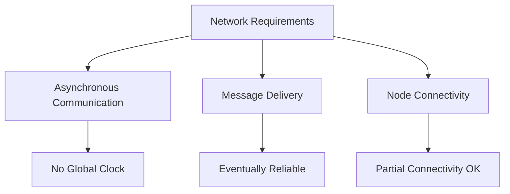

### 1.2 Node Requirements
- Persistent Storage: For recovery after crashes
- Unique Identifier: For each node in the system
- State Management: For tracking proposal numbers and accepted values

## 2. Detailed Protocol Implementation

### 2.1 Message Types
```
message Prepare {
    proposal_number: uint64  // Must be unique and increasing
    proposer_id: string
}

message Promise {
    proposal_number: uint64
    previous_accepted_number: uint64?
    previous_accepted_value: bytes?
    acceptor_id: string
}

message Accept {
    proposal_number: uint64
    value: bytes
    proposer_id: string
}

message Accepted {
    proposal_number: uint64
    value: bytes
    acceptor_id: string
}
```

### 2.2 State Machine - Proposer
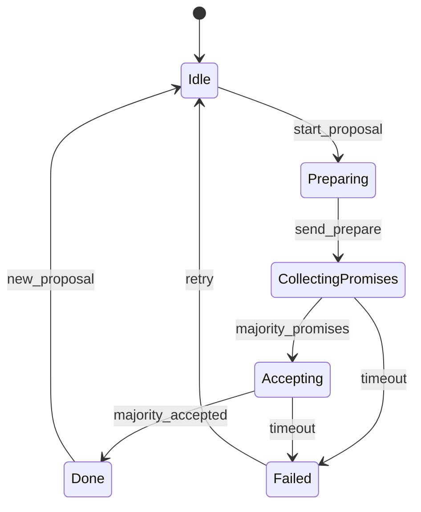

### 2.3 State Machine - Acceptor
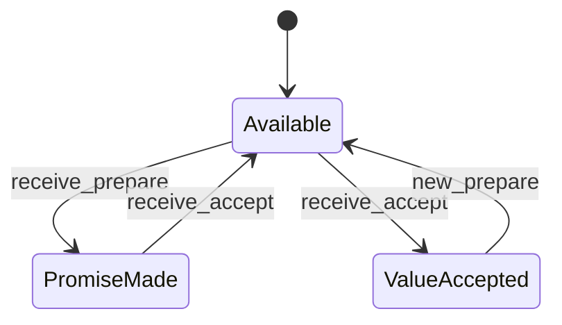

## 3. Detailed Protocol Phases

### 3.1 Phase 1 (Prepare Phase) - Detailed Steps
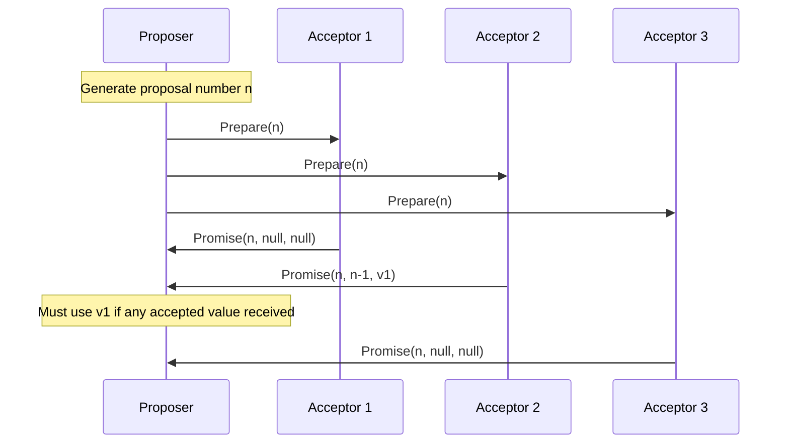

### 3.2 Phase 2 (Accept Phase) - Detailed Steps
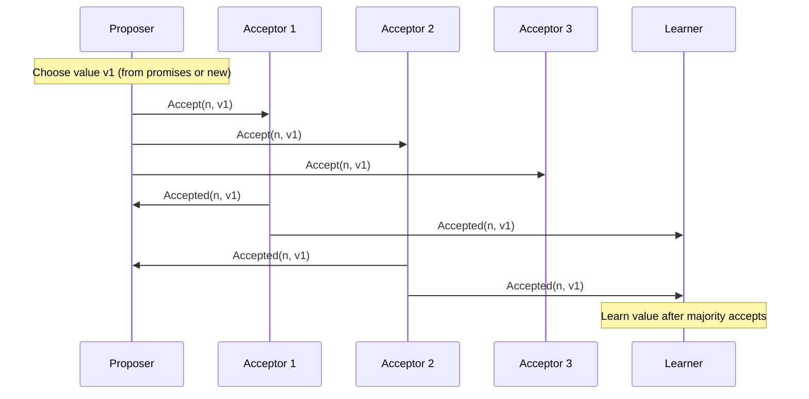

## 4. Implementation Details

### 4.1 Proposal Number Generation
```python
class ProposalNumberGenerator:
    def __init__(self, node_id, total_nodes):
        self.node_id = node_id
        self.total_nodes = total_nodes
        self.round = 0
    
    def next_proposal_number(self):
        self.round += 1
        return (self.round * self.total_nodes) + self.node_id
```

### 4.2 State Management
```python
class AcceptorState:
    def __init__(self):
        self.promised_proposal = 0
        self.accepted_proposal = 0
        self.accepted_value = None
    
    def handle_prepare(self, proposal_number):
        if proposal_number > self.promised_proposal:
            self.promised_proposal = proposal_number
            return Promise(
                proposal_number,
                self.accepted_proposal,
                self.accepted_value
            )
        return None
```

## 5. Key Implementation Considerations

### 5.1 Failure Handling Matrix
| Failure Type | Detection | Recovery Action |
|--------------|-----------|-----------------|
| Node Crash | Timeout | Restart with stored state |
| Message Loss | No response | Retry with backoff |
| Network Partition | Timeout | Continue with majority |
| Split Brain | Quorum check | Require majority quorum |

### 5.2 Performance Optimizations
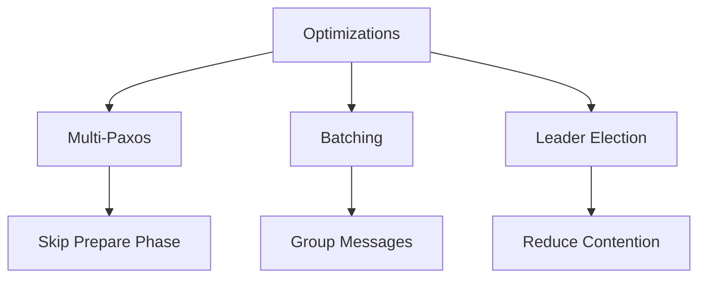

## 6. Critical Sections Implementation

### 6.1 Quorum Management
```python
class QuorumTracker:
    def __init__(self, total_nodes):
        self.total = total_nodes
        self.quorum_size = (total_nodes // 2) + 1
        self.responses = set()
    
    def add_response(self, node_id):
        self.responses.add(node_id)
        return len(self.responses) >= self.quorum_size
```

### 6.2 Safety Guarantees
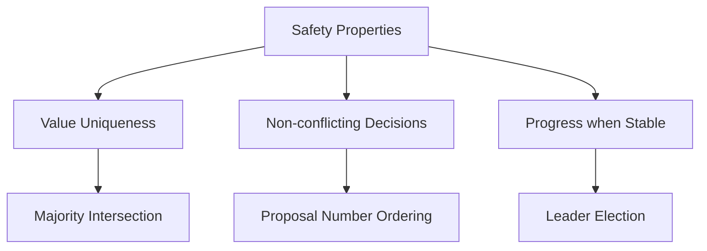

## 7. Advanced Implementation Features

### 7.1 Multi-Paxos Optimization
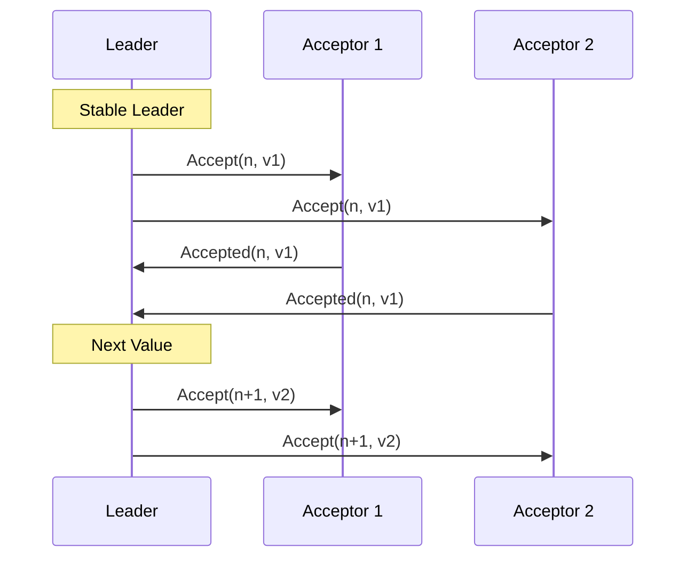

### 7.2 Recovery Mechanism
```python
class RecoveryManager:
    def __init__(self):
        self.log = PersistentLog()
        self.last_promise = None
        self.last_accepted = None
    
    async def recover_state(self):
        stored_state = await self.log.read_last_state()
        if stored_state:
            self.last_promise = stored_state.promise
            self.last_accepted = stored_state.accepted
        return self.last_accepted
```

## 8. Testing and Verification

### 8.1 Test Scenarios
1. Normal Operation
2. Message Loss
3. Node Failures
4. Network Partitions
5. Concurrent Proposals
6. Recovery Scenarios

### 8.2 Safety Properties Verification
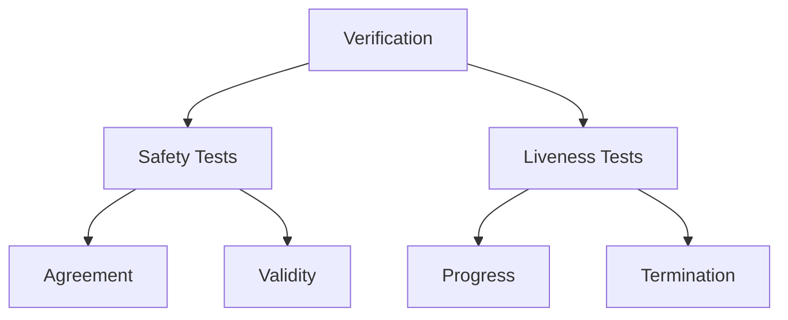

## 9. Production Considerations

### 9.1 Monitoring Metrics
- Proposal Latency
- Accept Rate
- Message Queue Size
- Quorum Formation Time
- Recovery Time
- Leader Election Duration

### 9.2 Operational Parameters
```python
class PaxosConfig:
    def __init__(self):
        self.prepare_timeout = 500  # ms
        self.accept_timeout = 500   # ms
        self.max_retries = 3
        self.backoff_factor = 1.5
        self.batch_size = 100
        self.max_pending_proposals = 1000
```


## 10. Practical Implementation Challenges

### 10.1 Network Considerations
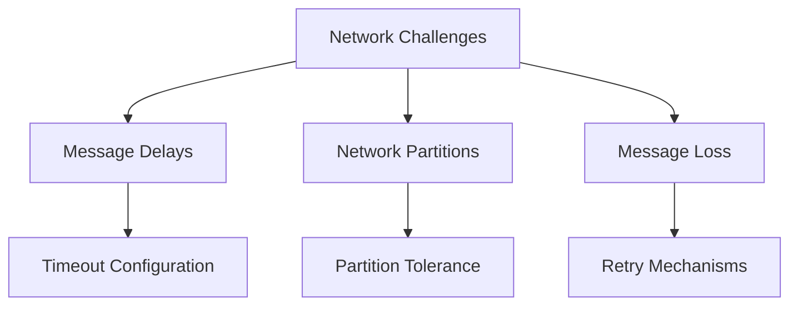

### 10.2 Performance Optimizations
1. Batching Requests
   - Group multiple requests into single Paxos rounds
   - Reduce network overhead
   - Improve throughput

2. Caching
   - Cache accepted values
   - Reduce disk I/O
   - Speed up recovery

3. Pipeline Optimization
```python
class PipelineOptimizer:
    def __init__(self, batch_size=100):
        self.batch_size = batch_size
        self.pending_requests = []
        
    def add_request(self, request):
        self.pending_requests.append(request)
        if len(self.pending_requests) >= self.batch_size:
            self.process_batch()
            
    def process_batch(self):
        # Process multiple requests in a single Paxos round
        pass
```

## 11. Industry Best Practices

### 11.1 Monitoring and Alerting
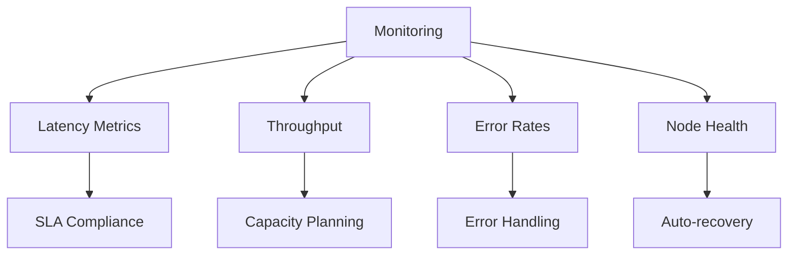

### 11.2 Security Considerations
1. Authentication
   - Node identity verification
   - Message integrity checks
   - Access control

2. Encryption
   - Transport layer security
   - Data at rest encryption
   - Key management

```python
class SecurityManager:
    def __init__(self):
        self.certificates = {}
        self.encryption_keys = {}
        
    def authenticate_node(self, node_id, credentials):
        # Verify node identity
        pass
        
    def encrypt_message(self, message, recipient):
        # Encrypt message for secure transmission
        pass
```

## 12. Real-world Examples

### 12.1 Google Chubby
- Used for distributed locking
- Implements Multi-Paxos
- Handles thousands of requests per second

### 12.2 Amazon DynamoDB
- Uses Paxos variants for consistency
- Global table replication
- Multi-region deployment

### 12.3 Apache ZooKeeper
- Implements ZAB (Paxos-like protocol)
- Configuration management
- Leader election

## 13. Performance Benchmarks

### 13.1 Latency Metrics
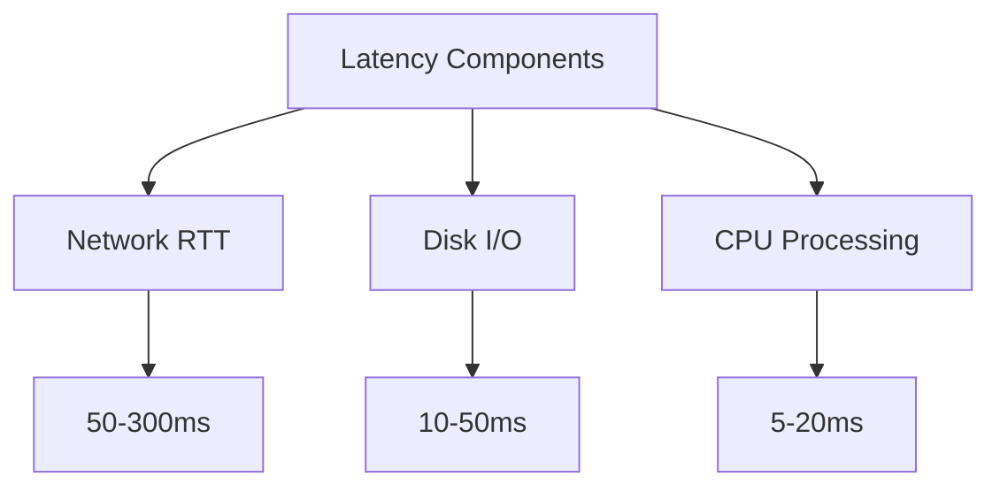

### 13.2 Throughput Characteristics
```python
class PerformanceMetrics:
    def __init__(self):
        self.request_count = 0
        self.latency_samples = []
        
    def record_request(self, latency_ms):
        self.request_count += 1
        self.latency_samples.append(latency_ms)
        
    def calculate_metrics(self):
        avg_latency = sum(self.latency_samples) / len(self.latency_samples)
        throughput = self.request_count / (max(self.latency_samples) - min(self.latency_samples))
        return {
            "average_latency": avg_latency,
            "throughput": throughput
        }
```

## 14. Deployment Strategies

### 14.1 Multi-region Deployment
```mermaid
graph TD
    A[Multi-region] --> B[Region 1]
    A --> C[Region 2]
    A --> D[Region 3]
    B --> E[Quorum 1]
    C --> F[Quorum 2]
    D --> G[Quorum 3]
```

### 14.2 Scaling Considerations
1. Horizontal Scaling
   - Add more nodes
   - Increase fault tolerance
   - Improve availability

2. Vertical Scaling
   - Upgrade hardware
   - Optimize performance
   - Handle larger workloads

```python
class DeploymentManager:
    def __init__(self, regions):
        self.regions = regions
        self.node_count = {}
        
    def scale_region(self, region, node_count):
        self.node_count[region] = node_count
        # Implement scaling logic
        pass
```

## 15. Troubleshooting Guide

### 15.1 Common Issues
1. Split Brain
   - Detection mechanisms
   - Recovery procedures
   - Prevention strategies

2. Performance Degradation
   - Monitoring tools
   - Optimization techniques
   - Capacity planning

### 15.2 Debug Tools
```python
class PaxosDebugger:
    def __init__(self):
        self.logs = []
        self.metrics = {}
        
    def analyze_logs(self):
        # Analyze system logs for issues
        pass
        
    def trace_proposal(self, proposal_id):
        # Trace proposal through system
        pass
```

## 16. Future Developments

### 16.1 Emerging Trends
1. Quantum-resistant consensus
2. Blockchain integration
3. AI-powered optimization

### 16.2 Research Directions
```mermaid
graph TD
    A[Research Areas] --> B[Quantum Computing]
    A --> C[Blockchain]
    A --> D[AI Integration]
    B --> E[Post-quantum Security]
    C --> F[Hybrid Consensus]
    D --> G[Adaptive Optimization]
```

## References
1. Lamport, L. (2001). Paxos Made Simple
2. Van Renesse, R., & Altinbuken, D. (2015). Paxos Made Moderately Complex
3. Howard, H., et al. (2016). Raft: In Search of an Understandable Consensus Algorithm
4. Google. (2012). The Chubby Lock Service for Loosely-Coupled Distributed Systems
5. Amazon. (2022). Amazon DynamoDB - How It Works
6. Apache. (2021). ZooKeeper: Because Coordinating Distributed Systems is a Zoo

#distributed-systems #consensus #fault-tolerance #algorithms #implementation


## Suggested Related Documents
[[Consistency in Distributed Systems.md]]\|"Paxos Consensus Implementation Details"

This link text effectively connects the source document about the Paxos protocol to the broader topic of consistency in distributed systems, highlighting that Paxos is a specific implementation method for achieving distributed consistency.]]
[[CAP Theorem.md]]\|"Distributed Consistency Principles"

This link text effectively connects the two documents since:
1. Both deal with consistency in distributed systems
2. Paxos Protocol and CAP Theorem are fundamental principles
3. It's concise yet descriptive of their shared focus]]
[[Transaction Isolation Levels in Databases.md]]\|"Distributed Consistency Mechanisms" - this link text effectively connects the two documents by highlighting how Paxos protocol and transaction isolation levels are both mechanisms for maintaining consistency across distributed or concurrent operations in database systems.]]

## Backlinks
- [[Consistency in Distributed Systems.md]]\|"Paxos Consistency Implementation"

This link text effectively connects the general concept of consistency in distributed systems (source) to its specific implementation through the Paxos protocol (target).]]
- [[CAP Theorem.md]]\|"Distributed Consistency Mechanisms"

This link text captures the core connection between the CAP Theorem and Paxos Protocol documents, as both deal with consistency approaches in distributed systems.]]
- [[Transaction Isolation Levels in Databases.md]]\|"Database Consistency Mechanisms"

This link text effectively connects the transaction isolation levels document with the Paxos protocol document, as both deal with maintaining consistency in database systems, albeit at different scales (local vs. distributed).]]


## Suggested Related Documents
[[Distributed Rate Limiting System Design.md]]]|"Distributed Systems Architecture Fundamentals"

This link text connects the documents well because:
1. Both deal with core distributed systems concepts
2. Both cover architectural patterns (Paxos and rate limiting)
3. Both are fundamental building blocks for distributed system design]]
[[High-Scale Batch Payee Validation System.md]]]|"Distributed System Consensus Implementation" - this link text connects the Paxos consensus protocol from the source document to the distributed architecture described in the target document, highlighting how theoretical consistency principles are applied in a practical system.]]

## Backlinks
- [[Distributed Rate Limiting System Design.md]]]|"Distributed Systems Architecture Fundamentals"

This link text connects the documents by focusing on their shared core theme of fundamental distributed systems concepts, with both covering critical architectural components (rate limiting and consensus protocols) in distributed environments.]]
- [[High-Scale Batch Payee Validation System.md]]]|"Distributed Systems Architecture Patterns"

This link text connects the documents by highlighting their shared focus on distributed systems design principles, spanning from batch processing architecture to consensus protocols.]]
