## DNS & Internet Connectivity
### DNS Resolution Process
The Domain Name System (DNS) translates human-readable domain names (e.g., `InterviewReady.com`) into machine-readable IP addresses. Here’s a detailed breakdown of the process:

1. **Browser Queries Local DNS Cache**  
   - When you enter a URL, the browser first checks its **local cache** for a recent copy of the DNS record.  
   - **Purpose**: Caching reduces latency and network traffic. For example, if you visited `InterviewReady.com` recently, the IP address is reused.  
   - **TTL (Time-to-Live)**: Each DNS record has a TTL (e.g., 1 hour), after which the cache expires, forcing a fresh lookup.  

2. **Request Sent to ISP’s DNS Server**  
   - If the local cache misses, the request is forwarded to the **ISP’s DNS resolver** (e.g., Google DNS `8.8.8.8` or Cloudflare `1.1.1.1`).  
   - **Recursive Query**: The ISP resolver acts on behalf of the client, recursively querying other servers until it finds the IP.  
   - **ISP Cache**: The resolver also checks its own cache. If the record exists and isn’t expired, it returns the IP immediately.  

3. **Hierarchical Query to Root/TLD Servers**  
   - **Step 1: Root DNS Servers**  
     The ISP resolver contacts one of the 13 global **root servers** (e.g., `a.root-servers.net`). These servers don’t store domain-specific records but direct the resolver to the **Top-Level Domain (TLD)** servers (e.g., `.com`, `.org`).  
   - **Step 2: TLD Servers**  
     The TLD server for `.com` returns the **authoritative name servers** for `InterviewReady.com` (e.g., `ns1.interviewready.com`).  
   - **Step 3: Authoritative Name Servers**  
     The ISP resolver queries the authoritative server, which holds the actual **A-record** (IPv4) or **AAAA-record** (IPv6) mapping `InterviewReady.com` to its IP (e.g., `203.0.113.10`).  

4. **Response Propagation**  
   - The ISP resolver caches the IP and returns it to the client’s router, which forwards it to the browser.  

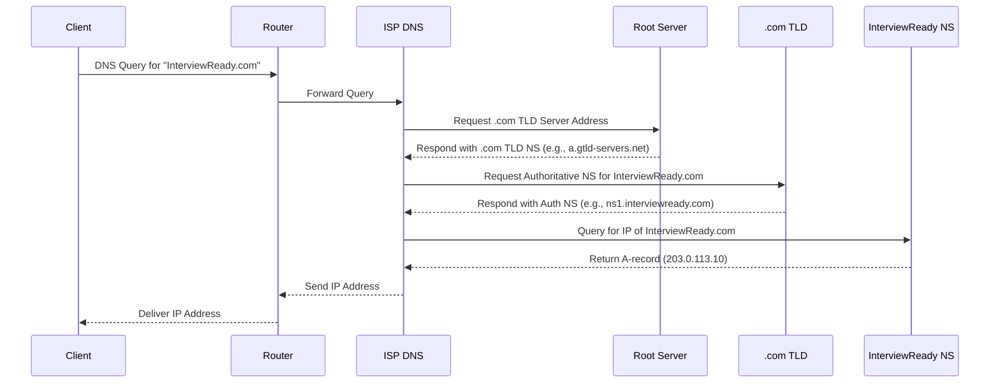
### Key Components in DNS
- **Root Servers**: Manage TLD referrals (e.g., `.com`, `.net`). Operated by organizations like ICANN.
- **TLD Servers**: Store NS records for domains under their extension (e.g., `.com` TLD knows `InterviewReady.com`’s authoritative servers).
- **Authoritative Name Servers**: Hosted by the domain owner or their DNS provider (e.g., AWS Route 53). They hold the final IP mapping.
### Why Routers Are Involved
- The router acts as the **default gateway**, forwarding DNS queries from the local network to the ISP’s resolver.
- In home networks, the router may also run a local DNS cache to reduce external queries.
### Security Considerations
- **DNS Spoofing**: Attackers redirect queries to malicious IPs. Mitigated by **DNSSEC** (DNS Security Extensions), which cryptographically signs records.    
- **Cache Poisoning**: ISPs and resolvers use mechanisms like randomizing query IDs to prevent fake responses.


Here’s the expanded **Content Delivery Network (CDN)** section with deeper technical explanations and an enhanced Mermaid diagram:

---

## Content Delivery Network (CDN)
### Purpose and Challenges
- **Goal**: Reduce latency and bandwidth usage by serving content from geographically distributed caches.
- **Problem with Client-Side Caching**:
  - Clients storing data locally risk outdated content (e.g., stale product prices on e-commerce sites).
  - Manual cache invalidation is impractical for dynamic content.
- **Solution**: CDNs act as **intermediate caches** between clients and origin servers, balancing freshness and speed.

### Mechanism
1. **Edge Servers**:  
   CDNs deploy **edge servers** globally (e.g., AWS CloudFront has 400+ locations). Clients connect to the nearest edge node.
2. **Cache Workflow**:
   - **Cache Hit**: Edge server returns cached content (e.g., images, CSS files) directly to the client.  
   - **Cache Miss**: Edge server fetches fresh data from the origin server, caches it, and responds to the client.  
3. **Cache Invalidation**:
   - **TTL (Time-to-Live)**: Content expires after a set duration (e.g., 24 hours).  
   - **Server Push**: Origin server proactively invalidates CDN caches (e.g., during product updates).  

### Benefits
- **Reduced Bandwidth**: Traffic offloaded from the origin server.  
- **Lower Latency**: Proximity to clients minimizes round-trip time.  
- **Scalability**: Handles traffic spikes (e.g., Black Friday sales).  
- **Efficiency**: Origin server updates CDNs via APIs or purge requests.  

```mermaid
graph TD
  Client -->|Request| CDN_Node[CDN Edge Server]
  CDN_Node -->|Cache Hit| Client
  CDN_Node -->|Cache Miss| Origin[Origin Server]
  Origin -->|Fresh Data| CDN_Node
  CDN_Node -->|Cached Response| Client
  Origin -.->|Cache Invalidation| CDN_Node
  ```

### Example Use Cases
1. **Static Content**: Images, videos, JavaScript files.  
2. **Dynamic Content**: API responses with edge-side logic (e.g., Cloudflare Workers).  
3. **Live Streaming**: CDNs like Akamai optimize video chunk delivery.  

### Key Technologies
- **Anycast Routing**: Directs clients to the nearest edge server.  
- **Load Balancing**: Distributes traffic across CDN nodes.  
- **DSA (Dynamic Site Acceleration)**: Compresses data and optimizes TCP for faster delivery.  
---
Here's the expanded and enhanced section on **Internal Routing (MAC Addresses and NAT)** with technical depth, clarity, and error-free diagrams:

---

## Internal Routing: MAC Addresses and NAT  
When a router receives a response from the internet, it must forward it to the correct device on the local network. This is challenging because multiple devices share the same public IP. Below are the two primary methods to resolve this:

---

### 1. **MAC Address-Based Routing**  
#### Mechanism:  
- The router maintains a **mapping table** of:  
  - **Request ID** (e.g., TCP/UDP port number).  
  - **MAC Address** (unique hardware identifier like `00:1A:2B:3C:4D:5E`).  
- When a device sends a request, the router logs its MAC address and assigns a request ID.  
- Upon receiving a response, the router matches the request ID to the MAC address and forwards the response.  

#### Example Workflow:  
```mermaid
graph LR
  DeviceA[Device A] -->|Request:1<br>MAC=00:1A:2B| Router
  DeviceB[Device B] -->|Request:2<br>MAC=00:2B:3C| Router
  Router -->|Response:1| DeviceA
  Router -->|Response:2| DeviceB
```

#### Security Risks:  
- **MAC Spoofing**: Attackers with router access can change MAC mappings to hijack traffic.  
- **No Isolation**: Relies on physical addresses, which are visible in the local network.  

---

### 2. **Network Address Translation (NAT)**  
#### Mechanism:  
- Devices use **private IP addresses** (e.g., `192.168.1.2`) inside the network.  
- The router replaces the private IP with its **public IP** (e.g., `203.0.113.5`) when sending requests.  
- It maintains a **NAT table** mapping:  
  - **Private IP + Port** → **Public IP + Port**.  

#### Example Workflow:  
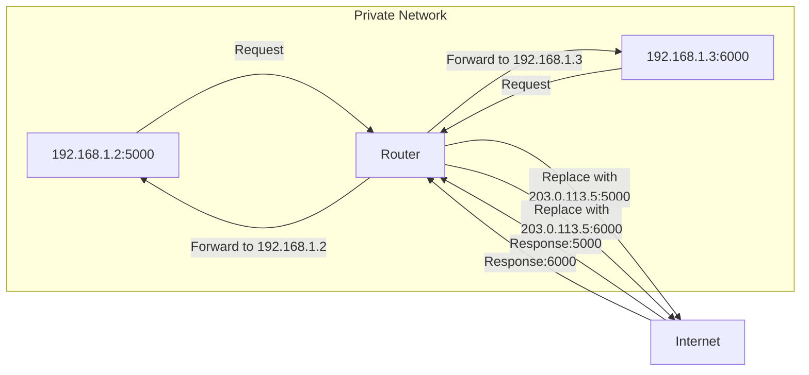
#### Advantages:  
- **Security**: External entities cannot directly access private IPs.  
- **Efficiency**: One public IP serves multiple devices.  
- **Port Tracking**: Uses unique port numbers to map responses.  

---
### Comparison: MAC vs. NAT  
| Feature               | MAC Address-Based Routing       | NAT                          |  
|-----------------------|----------------------------------|------------------------------|  
| **Identifier**         | Hardware (MAC)                  | Logical (Private IP + Port)  |  
| **Security**           | Vulnerable to spoofing          | Isolated private network     |  
| **Scalability**        | Limited to local network        | Supports large networks      |  
| **External Visibility**| MAC exposed internally          | Only public IP visible       |  

---
### Key Takeaways:  
- **NAT Dominance**: Modern networks prefer NAT due to security and scalability.  
- **MAC Filtering**: Rarely used alone; often paired with firewalls for added security.  
- **Stateful Tracking**: Both methods require the router to maintain connection state (NAT tables or MAC mappings).  

---
Here's the expanded and structured section on **Communication Protocols and Standards**, incorporating technical depth, diagrams, and comparisons:

---
## Communication Between Router and Server  
### 1. **HTTP (Hypertext Transfer Protocol)**  
#### Key Characteristics:  
- **Stateless**: Each request is independent (e.g., no inherent session tracking).  
- **Client-Server Model**: Strict roles—client initiates requests, server responds.  
- **HTTP Methods**: GET (retrieve), POST (submit), PUT (update), DELETE (remove).  

#### Workflow:  
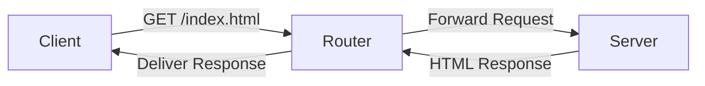
#### Versions:  
- **HTTP/1.1**: Sequential requests (head-of-line blocking).  
- **HTTP/2**: Multiplexing (parallel streams over one connection).  
- **HTTP/3**: Uses QUIC (UDP-based) for reduced latency.  

---

### 2. **WebSockets**  
#### Purpose:  
- **Bidirectional Communication**: Enables real-time, full-duplex messaging (e.g., chat apps, live feeds).  
- **Handshake**: Starts with HTTP, upgrades to WebSocket (`ws://` or `wss://`).  

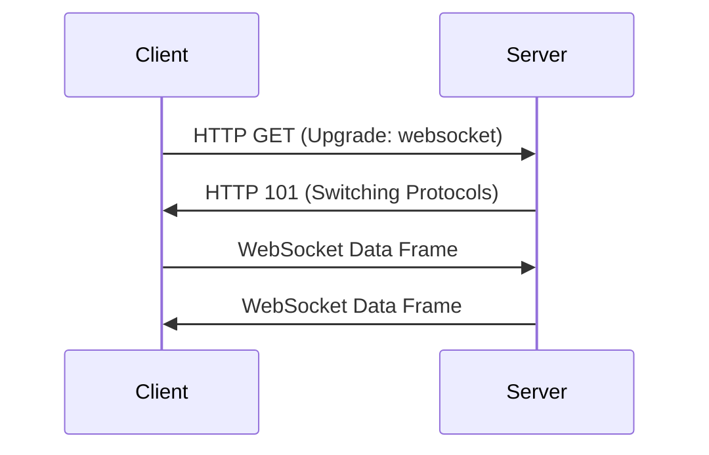

#### Alternatives:  
- **XMPP**: XML-based protocol for messaging and presence (used in Jabber).  
- **MQTT**: Lightweight protocol for IoT (publish-subscribe model).  

---
### 3. **TCP vs. UDP**  
#### TCP (Transmission Control Protocol):  
- **Features**:  
  1. Guaranteed delivery (ACK mechanism).  
  2. Ordered packets.  
  3. Retransmission on failure.  
- **Use Cases**: Web browsing (HTTP), email (SMTP), file transfers.  

#### UDP (User Datagram Protocol):  
- **Features**:  
  1. No guarantees (best-effort delivery).  
  2. Low latency.  
  3. No connection setup.  
- **Use Cases**: Video streaming (e.g., Zoom), DNS queries, gaming.  

#### Comparison Table:  
| Feature         | TCP                 | UDP                  |     |
| --------------- | ------------------- | -------------------- | --- |
| **Reliability** | ✔️ Guaranteed       | ❌ Best-effort        |     |
| **Ordering**    | ✔️ Sequential       | ❌ Unordered          |     |
| **Speed**       | ❌ Slower (overhead) | ✔️ Faster            |     |
| **Use Case**    | Web pages, APIs     | Live streaming, VoIP |     |

---

## Communication Standards for Microservices  
### 1. **REST (Representational State Transfer)**  
- **Principles**:  
  - Stateless: Each request contains all necessary context.  
  - Cacheable: Responses marked as cacheable (e.g., `Cache-Control` headers).  
  - Uniform Interface: Resources identified by URIs (e.g., `/api/users/1`).  

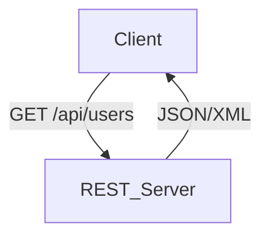

### 2. **GraphQL**  
- **Advantages**:  
  - Clients request **specific fields** (e.g., `{ user { name, email } }`).  
  - Single endpoint (vs. multiple REST endpoints).  
  - Reduced over-fetching/under-fetching.  

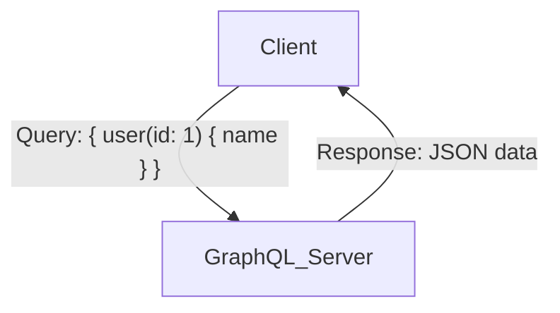

### 3. **gRPC (Google Remote Procedure Call)**  
- **Features**:  
  - Uses **HTTP/2** (multiplexed streams).  
  - **Protocol Buffers** (binary serialization for efficiency).  
  - Bidirectional streaming (e.g., microservices, IoT).  

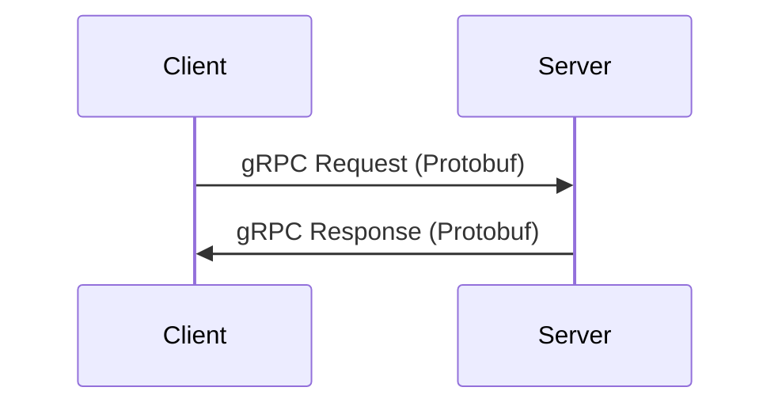

### Protocol Comparison  
| Aspect          | REST            | GraphQL         | gRPC                 |     |
| --------------- | --------------- | --------------- | -------------------- | --- |
| **Transport**   | HTTP/1.1        | HTTP/1.1        | HTTP/2               |     |
| **Data Format** | JSON/XML        | JSON            | Protocol Buffers     |     |
| **Flexibility** | Fixed Endpoints | Dynamic Queries | Strict Contracts     |     |
| **Use Case**    | CRUD APIs       | Complex Queries | Low-latency Services |     |

### Key Takeaways:  
- **HTTP**: Foundation of web communication but limited to client-initiated requests.  
- **WebSockets**: Ideal for real-time apps requiring bidirectional data flow.  
- **gRPC**: High-performance choice for internal microservices.  
- **GraphQL**: Optimizes bandwidth and flexibility in client-server interactions.  

---
## Head-of-Line Blocking

![[Head-of-Line Blocking(The Evolution From HTTP-1.1 to HTTP-3)]]

---

---
## Protocols & Communication
### HTTP/2 vs HTTP/3
- **HTTP/2**: Uses TCP with multiplexing (streams avoid HoL blocking per connection).
- **HTTP/3 (QUIC)**: Uses UDP for independent streams, faster retries.

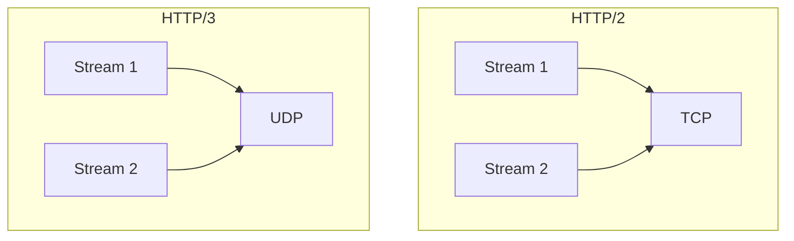

### WebRTC (Peer-to-Peer)
- **Steps**:
  1. Signaling Server exchanges SDP (Session Description Protocol) offers.
  2. ICE (Interactive Connectivity Establishment) for NAT traversal.
  3. Direct audio/video streaming.

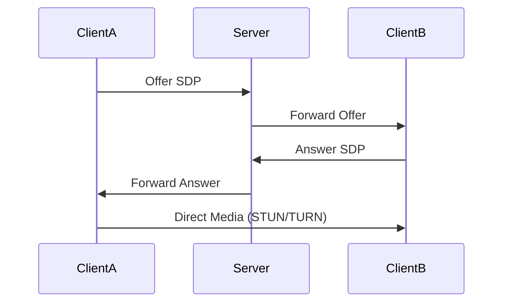

---

## Video Streaming Protocols
| Protocol  | Transport | Use Case          |
|-----------|-----------|-------------------|
| HTTP-DASH | TCP       | Adaptive streaming|
| WebRTC    | UDP       | Real-time conferencing |
| HLS       | TCP       | Apple devices     |
Here’s a structured, technical breakdown of **video transmission protocols**, expanded with deeper insights, diagrams, and comparisons:

---

## Protocols for Video Transmission  
Video streaming demands efficient handling of large files, low latency, and adaptability to network conditions. Below are key protocols and their mechanisms:

---

### **1. Challenges with HTTP for Video**  
- **Statelessness**: HTTP requires clients to explicitly request each video chunk (e.g., `chunk1.mp4`, `chunk2.mp4`), increasing overhead.  
- **TCP Limitations**:  
  - **Retransmissions**: TCP’s guaranteed delivery causes delays for live streams (outdated data is useless).  
  - **Ordering**: Unnecessary for real-time streams where newer data supersedes old.  

#### **TCP vs. UDP for Video**  
| Feature          | TCP (e.g., VoD)               | UDP (e.g., Live Streaming)     |  
|------------------|-------------------------------|--------------------------------|  
| **Delivery**      | Reliable, ordered             | Best-effort, unordered         |  
| **Latency**       | Higher (retransmissions)      | Lower                          |  
| **Use Case**      | Pre-recorded (Netflix)        | Live events (Zoom, Twitch)     |  

---

### **2. Adaptive Streaming: HTTP-DASH & HLS**  
#### **HTTP-DASH (Dynamic Adaptive Streaming over HTTP)**  
- **Mechanism**:  
  - **Manifest File**: Lists available resolutions/bitrates (e.g., `720p`, `1080p`).  
  - **Client-Driven**: Device selects optimal chunk based on network speed (e.g., switches to `480p` if bandwidth drops).  
  - **TCP-Based**: Ensures no data loss for high-quality playback.  

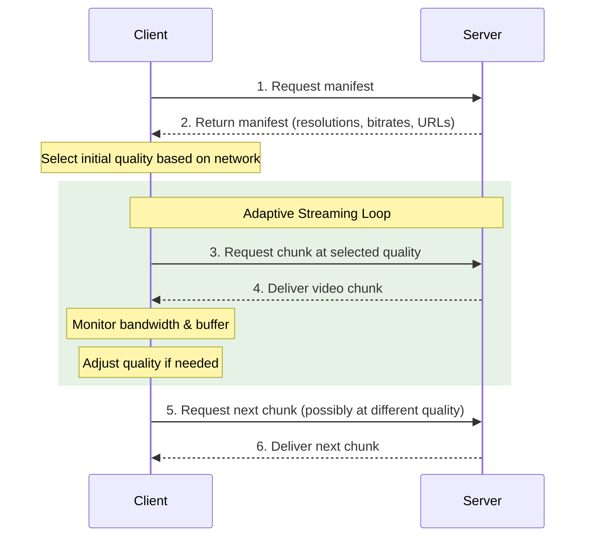
#### **HLS (HTTP Live Streaming)**  
- **Apple’s Alternative**: Similar to DASH but uses `.m3u8` playlists and `.ts` video segments.  
- **Compatibility**: Default on iOS/macOS; requires transcoding to H.264/HEVC.  

---

### **3. WebRTC (Web Real-Time Communication)**  
#### **Why Peer-to-Peer (P2P)?**  
- **Serverless**: Reduces latency and bandwidth costs.  
- **Use Case**: Video conferencing, screen sharing.  

#### **Workflow**:  
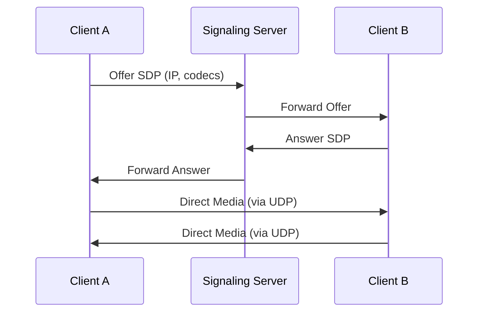

#### **Key Technologies**:  
- **STUN/TURN Servers**: Bypass NAT/firewalls to establish direct connections.  
- **SRTP (Secure RTP)**: Encrypts audio/video streams.  
- **Codecs**: VP9, AV1 for compression; Opus for audio.  

---

### **4. Protocol Comparison**  
| Protocol         | Transport  | Use Case               | Latency   | Scalability |  
|------------------|------------|------------------------|-----------|-------------|  
| **HTTP-DASH**    | TCP        | On-demand streaming    | Medium    | High         |  
| **HLS**          | TCP        | Apple ecosystems       | Medium    | High         |  
| **WebRTC**       | UDP        | Real-time communication| Low       | Moderate     |  

---

### **Why Use TCP for Adaptive Streaming?**  
- **Trade-off**: Reliability over speed. Dropped chunks degrade quality but don’t disrupt playback.  
- **Example**: YouTube buffers ahead, so minor delays are tolerable.  

---

### **WebRTC Advantages**  
- **NAT Traversal**: Uses ICE framework to connect devices behind routers.  
- **Encryption**: Mandatory DTLS for data, SRTP for media.  
- **Fallback**: TURN servers relay data if P2P fails.  

---

### **Industry Adoption**  
- **DASH/HLS**: Netflix, YouTube, Prime Video.  
- **WebRTC**: Google Meet, Discord, telehealth apps.  

---

### **Key Takeaways**  
- **Live Streaming**: Prefer UDP-based protocols (WebRTC, RTP).  
- **On-Demand**: Use TCP-based adaptive streaming (DASH, HLS).  
- **Latency vs. Quality**: Choose protocols based on use case (e.g., WebRTC for calls, DASH for movies).  

---

## Security Considerations
- **DNS Spoofing**: Mitigated via DNSSEC.
- **NAT Security**: Private IPs hidden, but vulnerable to internal attacks.
- **CDN Risks**: Cache poisoning if CDN compromised.

---

**Tags**: #networks #protocols #DNS #CDN #NAT #HTTP #WebRTC #OSI

## Suggested Related Documents
[[Content Delivery Networks (CDN) and Network Routing.md]]\|"DNS Resolution and CDNs"

This link text effectively connects the DNS resolution process described in the source document with the CDN architecture content in the target document, highlighting their interconnected relationship in web infrastructure.]]

## Backlinks
- [[Content Delivery Networks (CDN) and Network Routing.md]]\|"CDN and DNS infrastructure"

This link text effectively connects the two documents by highlighting their shared focus on core internet infrastructure components (CDNs and DNS) that work together to enable content delivery and network connectivity.]]
