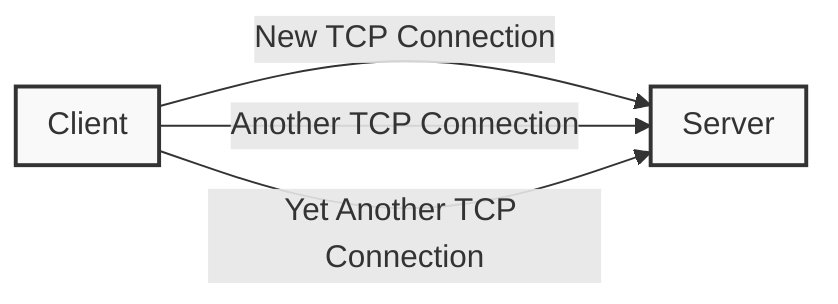
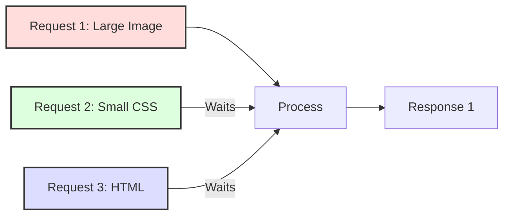
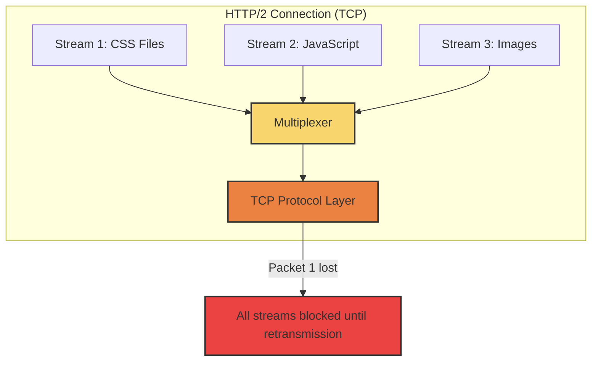
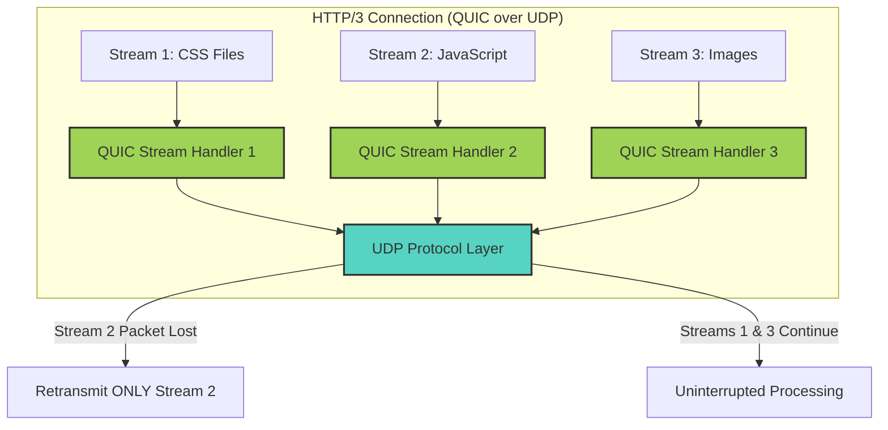

#web-protocols #http-protocols #performance-optimization #networking

#networking #performance-optimization #web-protocols #http-protocols

## Introduction: The Performance Challenge

Head-of-Line (HoL) blocking represents one of the most significant performance bottlenecks in web communications. As websites and applications grow more complex—delivering larger assets, requiring more API calls, and demanding lower latency—understanding and addressing HoL blocking becomes critical for developers and system architects.

## What is Head-of-Line Blocking?

**Head-of-Line Blocking** occurs when the processing of a sequence of packets or requests is delayed because the first packet or request in the queue is blocked. This creates a cascading delay effect where all subsequent items must wait, even if they could be processed independently.

### Real-World Analogy

Imagine a single-lane checkout at a grocery store:

- Customer A has an item with pricing issues, requiring manager assistance
- Customers B, C, and D (with simple transactions) must wait behind Customer A
- The entire line is blocked by the "head of the line" problem

In networking terms, this means resources are underutilized and user experience suffers.

## HoL Blocking Across HTTP Protocol Versions

### HTTP/1.0: The Starting Point (Pre-1997)

- **Connection Model**: One TCP connection per resource
- **HoL Issue**: Extreme - each resource request requires a new connection
- **Impact**: High latency from multiple TCP handshakes
- **Browsers' Workaround**: Open multiple connections (typically 6-8 per domain)



### HTTP/1.1: Connection Keep-Alive (1997)

- **Connection Model**: Persistent connections
- **HoL Issue**: Request-level blocking - requests handled sequentially over a single connection
- **Impact**: Fast resources wait behind slow ones
- **Key Feature**: Keep-alive connections reduced connection overhead



#### HTTP/1.1 Performance Analysis

- **Maximum Parallelism**: Limited by number of TCP connections (6-8 per domain)
- **Common Workarounds**:
    - Domain sharding: Splitting resources across multiple domains
    - Resource concatenation: Combining multiple files (JS/CSS)
    - Image sprites: Combining images into a single file
    - Inlining: Embedding small resources directly in HTML

### HTTP/2: Multiplexing Revolution (2015)

- **Connection Model**: Single TCP connection with multiple streams
- **HoL Improvement**: Request-level blocking eliminated through multiplexing
- **HoL Limitation**: TCP-level blocking persists
- **Key Features**:
    - Binary framing layer
    - Stream prioritization
    - Server push
    - Header compression (HPACK)



#### HTTP/2 Technical Deep-Dive

- **Stream Identifiers**: Each stream assigned unique ID
- **Frames**: Smallest unit of communication, containing:
    - Stream identifier
    - Frame type (DATA, HEADERS, SETTINGS, etc.)
    - Flags and length
- **Flow Control**: Per-stream and connection-level controls

### HTTP/3: The QUIC Solution (2022)

- **Connection Model**: QUIC protocol over UDP
- **HoL Improvement**: Eliminates both request-level and transport-level blocking
- **Key Features**:
    - Built on UDP instead of TCP
    - Independent stream handling
    - Integrated TLS 1.3 security
    - 0-RTT connection establishment
    - Connection migration



## Technical Comparison: Packet Loss Scenarios

### TCP (HTTP/1.1 & HTTP/2) Packet Loss Scenario

1. **Setup**: Client and server exchanging data over TCP
2. **Event**: Packet 3 in a 10-packet sequence is lost
3. **TCP Response**:
    - Receiver notices gap when packet 4 arrives (expected 3)
    - Sends duplicate ACK for packet 2 (last in-order packet received)
    - After 3 duplicate ACKs, sender triggers fast retransmission
    - All packets after the lost one remain unprocessable until retransmission completes
4. **Result**: Delay affects all data, even unrelated streams

### QUIC (HTTP/3) Packet Loss Scenario

1. **Setup**: Client and server exchanging data over QUIC
2. **Event**: Packet containing data for Stream 2 is lost
3. **QUIC Response**:
    - Receiver tracks missing packet for Stream 2
    - Continues processing packets for Streams 1 and 3
    - Missing packet is retransmitted only for Stream 2
4. **Result**: Only Stream 2 experiences delay; other streams continue unaffected

## Implementation Details: How QUIC Avoids HoL Blocking

### 1. Connection Identifiers (CIDs)

QUIC uses connection IDs rather than IP/port tuples, enabling:

- Connection migration between networks
- Resilience against NAT rebinding
- Example: User switches from WiFi to cellular without disruption

```
QUIC Packet Structure:
+------------------------------------+
| Header Form (1) | Connection ID (8)|
+------------------------------------+
| Version (4)     | Packet Number (1+)|
+------------------------------------+
| Protected Payload                  |
+------------------------------------+
```

### 2. Independent Sequencing

- Each QUIC stream maintains its own sequence space
- Packets contain a connection-level packet number
- Stream data contains offset within that specific stream
- Loss detection and recovery operate independently per stream

### 3. Encryption Integration

- Encryption at the transport layer (not as a separate TLS layer)
- Almost all packet contents encrypted (minimal cleartext headers)
- Protection against both passive monitoring and active tampering

## Performance Benchmarks & Real-World Impact

### Latency Improvements

|Scenario|HTTP/1.1|HTTP/2|HTTP/3 (QUIC)|
|---|---|---|---|
|**Clean Network**|Baseline|15-30% faster|5-10% faster than H2|
|**1% Packet Loss**|Baseline|Similar to H1|30-40% faster than H2|
|**High Latency (>100ms)**|Baseline|20-40% faster|15-30% faster than H2|
|**Network Change**|Connection reset|Connection reset|Seamless transition|

### Real-World Adoption Cases

- **Google**:
    - Reports 3% median and 8% 75th percentile improvement in search latency
    - YouTube buffering reduced by 15% on mobile networks
- **Facebook**:
    - 6-15% reduction in request times depending on network quality
    - 20% reduction in video buffering
- **Cloudflare**:
    - Page loads 12.4% faster in p99 latency scenarios
    - Connection establishment 13% faster on average

## Implementation Considerations

### Server Support

|Server|HTTP/3 Support Status|
|---|---|
|NGINX|Supported via quiche module|
|Apache|Experimental (mod_http3)|
|Caddy|Native support|
|IIS|Supported in Windows Server 2022|
|Node.js|Via third-party modules|

### Client Support

|Browser|First Version with HTTP/3|
|---|---|
|Chrome|87 (enabled by default)|
|Firefox|88 (enabled by default)|
|Safari|14 (enabled by default)|
|Edge|87 (Chromium-based)|

### Deployment Challenges

1. **UDP Blocking**: Some corporate networks block UDP traffic
2. **Middlebox Interference**: NATs and firewalls may reject or modify QUIC packets
3. **Fall-back Mechanism**: Must gracefully fall back to HTTP/2
4. **Resource Usage**: Higher CPU usage on both client and server

## Future Developments

### QUIC v2 Draft Proposals

- **Multipath QUIC**: Using multiple network paths simultaneously
- **Forward Error Correction**: Recovering from packet loss without retransmission
- **Unreliable Streams**: Optional reliability for real-time communications
- **ECN Support**: Explicit Congestion Notification integration

### Web Transport API

- Building browser APIs directly on QUIC
- Enabling new low-latency applications
- WebSockets replacement with better performance characteristics

## Practical Implementation Guide

### Enabling HTTP/3 on Common Servers

#### NGINX Configuration

```nginx
server {
    listen 443 quic reuseport;
    listen 443 ssl;
    
    http3 on;
    quic_retry on;
    
    ssl_protocols TLSv1.3;
    # Other SSL configurations...
    
    add_header Alt-Svc 'h3=":443"; ma=86400';
}
```

#### Caddy Configuration

```caddyfile
example.com {
    tls cert.pem key.pem
    # HTTP/3 enabled by default
}
```

### Performance Testing Tools

- **Chrome DevTools**: Network panel shows protocol version
- **curl**: `--http3` flag for HTTP/3 requests
- **nghttp**: Specialized tool for HTTP/2 testing
- **quiche-client**: QUIC/HTTP/3 testing tool
- **Wireshark**: Protocol analyzer with QUIC support

## Conclusion: The HoL Blocking Evolution

The journey from HTTP/1.1 to HTTP/3 represents a progressive elimination of HoL blocking:

1. **HTTP/1.1**: Addressed connection-level inefficiency but retained request-level blocking
2. **HTTP/2**: Eliminated request-level blocking but remained vulnerable to transport-level blocking
3. **HTTP/3**: Solved both issues through fundamental transport protocol redesign

As network conditions become more variable with the growth of mobile internet usage, HTTP/3's resilience to packet loss and network changes makes it increasingly valuable for delivering consistent performance across all connection types.

By understanding these protocols at a deep level, developers and architects can make informed decisions about adoption timeframes and implementation strategies to deliver the best possible user experience.


---- 
### ### **Ports and TCP in Relation to HTTP/2’s Head-of-Line (HOL) Blocking Problem**

To understand why HTTP/2 suffers from **Head-of-Line (HOL) blocking** due to TCP, we need to break it down in terms of **ports, TCP, and multiplexing**.

---

## **1. How Ports and TCP Work in HTTP/2**

1. **TCP & Ports in HTTP**
    
    - When a client (browser) connects to a server (e.g., `example.com`), it opens a **TCP connection** to **port 443** (for HTTPS).
    - HTTP/2 runs **over a single TCP connection**.
    - Multiple HTTP requests (e.g., fetching HTML, CSS, JS) are **multiplexed** over this **one TCP connection**.
2. **Multiplexing in HTTP/2**
    
    - Unlike HTTP/1.1 (which needed multiple TCP connections for parallel requests), HTTP/2 introduced **multiplexing**.
    - This means **multiple HTTP requests share a single TCP connection** but are sent as independent **streams**.

---

## **2. The Problem: TCP’s Packet Loss and HOL Blocking**

1. **How TCP Transmits Data Over a Connection**
    
    - Data is broken into **packets** and sent in order.
    - Packets are reassembled at the receiver.
    - TCP guarantees **reliable** and **ordered** delivery.
2. **What Happens if a Packet is Lost?**
    
    - TCP ensures packets arrive **in order**.
    - If a **single packet is lost**, TCP **stalls the entire connection** until the lost packet is **retransmitted** and received.
    - This affects **all multiplexed HTTP/2 streams**, even if only one request was affected.

### **Example of HOL Blocking in HTTP/2**

- Suppose a browser requests:
    1. `index.html`
    2. `style.css`
    3. `script.js`
- They are all multiplexed over **one TCP connection**.
- If a packet for `index.html` is lost, **TCP stalls the entire connection** until it is retransmitted.
- Even though `style.css` and `script.js` were not affected, their delivery is also **paused**.

---

## **3. How HTTP/3 & QUIC Solve This**

1. **Why UDP Instead of TCP?**
    
    - HTTP/3 replaces TCP with **QUIC**, which runs over **UDP**.
    - Unlike TCP, **UDP does not enforce ordered delivery**—each packet can be handled **independently**.
2. **Independent Streams in QUIC**
    
    - QUIC **multiplexes** requests at the transport layer, not just HTTP.
    - If one packet is lost, only the affected stream waits for retransmission.
    - Other streams **continue uninterrupted**.

---

## **4. Key Differences Between HTTP/2 (TCP) and HTTP/3 (QUIC) in Multiplexing**

|Feature|HTTP/2 (TCP)|HTTP/3 (QUIC)|
|---|---|---|
|**Connection Type**|Single TCP connection|Single QUIC connection (UDP)|
|**Multiplexing**|Done at HTTP layer|Done at transport (QUIC) layer|
|**HOL Blocking**|Affects all streams if one packet is lost|Only the affected stream is delayed|
|**Packet Handling**|Strict order enforced by TCP|Independent streams allow out-of-order handling|
|**Loss Recovery**|TCP stalls all streams until lost packet is retransmitted|QUIC retransmits only the needed packet without blocking others|

---

## **Summary**

- **HTTP/2 multiplexes at the HTTP layer but still relies on TCP, which enforces ordered delivery.**
- **A single lost packet in HTTP/2 blocks all multiplexed streams** due to TCP’s retransmission rules.
- **HTTP/3 (QUIC) solves this by using UDP and handling multiplexed streams independently, avoiding HOL blocking.**

🚀 **Bottom line**: QUIC ensures that if a packet is lost, only the related request is delayed, while the rest continue without interruption.

## Suggested Related Documents
[[Too much Requests.md]]\|"Web Performance Bottlenecks"

Rationale: This link text connects the performance challenges of Head-of-Line blocking from the first document with the high request volume handling from the second document, focusing on their shared theme of web performance limitations.]]

## Backlinks
- [[Too much Requests.md]]\|"Request Performance Bottlenecks"

This link text effectively connects the two documents as it captures:
1. "Requests" from the first document's focus on handling high request volumes
2. "Performance" and "Bottlenecks" from the second document's discussion of Head-of-Line blocking as a performance issue]]
