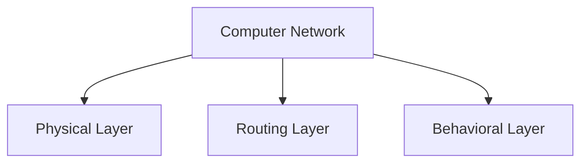
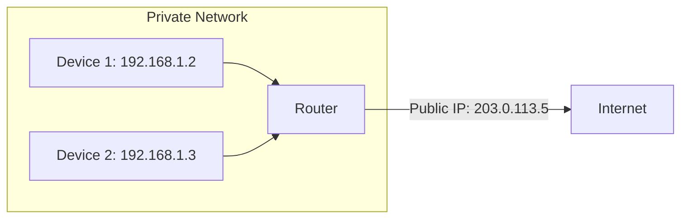
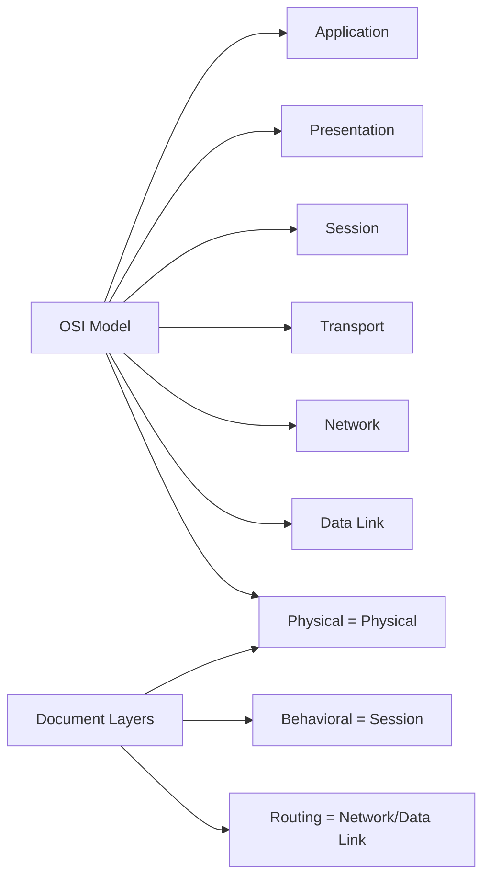
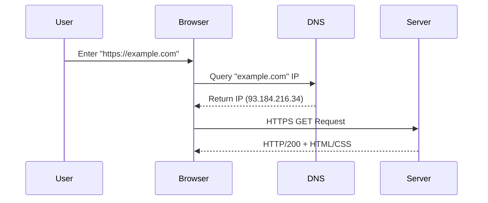
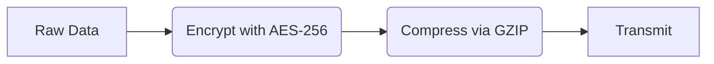
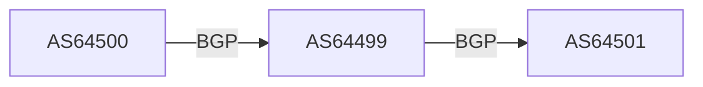
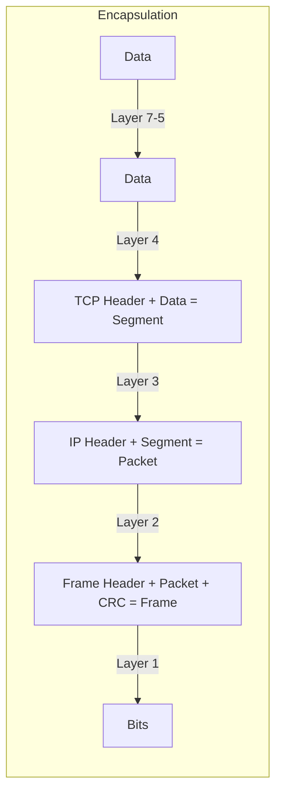
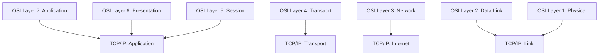

#network-protocols #networking #computer-networks #network-architecture #osi-model

#networking #computer-networks #network-protocols #network-architecture #osi-model

# OSI Model Deep Dive

A computer network connects multiple devices to share resources and communicate. This document explores layers, protocols, and advanced concepts.



---

## Network Layers & OSI Model

### Physical Layer
- **Function**: Transmits raw bits over hardware. Uses voltage levels (0V=0, peak voltage=1).
- **Enhancements**:
  - Modulation techniques (e.g., QAM for high-speed data).
  - Cable types: Fiber optics (light signals), twisted pair (copper).

### Routing Layer
- **Key Components**:
  - **MAC Address**: Unique hardware identifier (e.g., `00:1A:2B:3C:4D:5E`).
  - **IP Address**: Logical/temporary (e.g., IPv4 `192.168.1.1`).
- **NAT (Network Address Translation)**:
  - Maps private IPs (e.g., `192.168.1.2`) to a public IP for internet access.
  


### Behavioral Layer
- Defines communication rules:
  - **Frequency**: Throttling to prevent overload.
  - **Direction**: Simplex (one-way), duplex (two-way).

### OSI Model Mapping



---


## Layers Overview (Enhanced)

| Layer | Name          | Description                                                                                                                 | Key Protocols/Technologies                                                                 | Devices/Components                                                                 | Vulnerabilities                                                                 |
|-------|---------------|-----------------------------------------------------------------------------------------------------------------------------|-------------------------------------------------------------------------------------------|-----------------------------------------------------------------------------------|---------------------------------------------------------------------------------|
| **7** | Application   | **End-user services**: Direct interaction with software (e.g., browsers, email clients). Translates user actions to network requests. | HTTP/HTTPS, FTP, SMTP, DNS, SSH, REST APIs, WebSocket                                    | Postman, Chrome, Outlook, Slack                                                  | SQLi, XSS, API abuse, misconfigured permissions                                 |
| **6** | Presentation  | **Data translation**: Ensures compatibility between systems (e.g., encryption, compression, file formats).                  | SSL/TLS, JPEG, MPEG, ASCII, XML, JSON, Base64                                             | Wireshark (decryption), FFmpeg (media transcoding)                                | Weak encryption, format misinterpretation, man-in-the-middle attacks           |
| **5** | Session       | **Session management**: Controls dialogues between devices (e.g., authentication, reconnection).                            | NetBIOS, RPC, SIP, PPTP, H.245 (VoIP)                                                     | VPN gateways, Zoom/Teams (session handling)                                       | Session hijacking, brute-force attacks, timeout exploits                       |
| **4** | Transport     | **End-to-end communication**: Manages data segmentation, flow control, and reliability.                                     | TCP (3-way handshake), UDP, SCTP, QUIC (HTTP/3)                                           | Load balancers, AWS Global Accelerator                                            | SYN floods, port scanning, DDoS                                                |
| **3** | Network       | **Routing & addressing**: Moves packets across networks using logical IP addresses.                                         | IPv4/IPv6, OSPF, BGP, ICMP (ping), ARP, VPN (IPsec)                                       | Cisco routers, Juniper MX series                                                 | IP spoofing, routing table poisoning, ICMP floods                              |
| **2** | Data Link     | **Local network framing**: Manages MAC addressing, error detection, and switch-based traffic.                               | Ethernet (802.3), Wi-Fi (802.11), MAC, VLAN, STP, PPP                                     | Cisco Catalyst switches, NICs, WAPs                                              | MAC flooding, ARP spoofing, VLAN hopping                                       |
| **1** | Physical     | **Raw bit transmission**: Converts digital bits to signals (electrical/optical) over physical media.                        | DSL, USB, HDMI, Fiber (802.3), Bluetooth (RF), RS-232                                     | Cat6 cables, SFP modules, RJ45 connectors, repeaters                              | Cable damage, EMI interference, signal attenuation                             |

---

## Layer Details

### **Layer 7: Application Layer - The "User Interface"**

**Core Function**: Provides services directly to end-user applications.  
**Real-World Examples**:
- **Web Browsing**: Chrome sends an HTTP GET request to `https://example.com`
- **Email**: Outlook uses SMTP to send emails and IMAP to retrieve them
- **File Transfer**: FileZilla uses FTP to upload/download files
**Technical Workflow (HTTP Request)**:
1. User types `https://example.com` in the browser.
2. Browser performs DNS resolution (Layer 7 → Layer 3 interaction).
3. Browser initiates a TLS handshake (Layer 6).
4. Browser sends an HTTP GET request to the server.
5. Server responds with HTTP 200 OK and HTML content.
**Security Risks**:
- **SQL Injection**: Malicious input in web forms can manipulate databases.
- **XSS (Cross-Site Scripting)**: Attackers inject scripts into web pages.
- **Mitigation**: Use parameterized queries, input validation, and WAFs.

**Example Workflow (Web Request):**


---

### 6. Presentation Layer
**Data Transformation Process:**


**Common Formats:**
- **Images**: PNG (lossless), WebP (compressed)
- **Text**: UTF-8 (Unicode), EBCDIC (legacy systems)

---

### 5. Session Layer
**Session Lifecycle:**
1. **Establishment**: Authentication (e.g., OAuth2 token exchange)
2. **Maintenance**: Keep-alive packets (e.g., WebSocket pings)
3. **Termination**: FIN/ACK in TCP or explicit logout

**Tools**: `tcpdump` for session analysis, `netstat -ano` for active sessions.

---

### 4. Transport Layer
**TCP vs UDP Comparison:**

| Feature               | TCP                          | UDP                          |
|-----------------------|------------------------------|------------------------------|
| Reliability           | ✅ (Retransmits lost packets) | ❌ (Best-effort)             |
| Ordering              | ✅ (Sequenced delivery)       | ❌ (No ordering)             |
| Use Cases             | Web, Email                   | Streaming, VoIP              |

**QUIC Protocol**: Used in HTTP/3, combines TLS encryption (Layer 6) with UDP speed.

---

### 3. Network Layer
**Routing Example (BGP):**


**Key Tools**:
- `traceroute`: Map packet paths
- `ip route show`: View routing tables (Linux)

---

### 2. Data Link Layer
**Ethernet Frame Structure**:
```
| Preamble | Dest MAC | Src MAC | VLAN Tag | EtherType | Payload | CRC |
|----------|----------|---------|----------|-----------|---------|-----|
```

**Switch Behavior**:
- **Learning**: Builds MAC address table
- **Flooding**: Unknown unicast → All ports (except source)

---

### 1. Physical Layer
**Signal Types**:
- **Copper**: Electrical pulses (e.g., Cat6)
- **Fiber**: Light pulses (single/multi-mode)
- **Wireless**: Radio waves (2.4 GHz/5 GHz)

**Common Issues**:
- **Attenuation**: Solved with repeaters
- **Crosstalk**: Mitigated via STP (Shielded Twisted Pair)

---

## Data Encapsulation 



---

## Troubleshooting Cheat Sheet

| Layer    | Command/Tool               | Example Use Case                      |
|----------|----------------------------|---------------------------------------|
| **L7**   | `curl -v https://example.com` | Debug HTTP headers & TLS handshake    |
| **L4**   | `nc -zv 192.168.1.1 80`     | Test TCP port connectivity           |
| **L3**   | `ping 8.8.8.8`              | Check basic IP reachability          |
| **L2**   | `arp -a`                    | View MAC-to-IP mappings               |
| **L1**   | Cable tester                | Verify physical link integrity       |

---

## OSI vs TCP/IP Model



---

## Mnemonics
- **Layer Order**: *"All People Seem To Need Data Processing"* (L7 → L1)
- **PDUs**: *"Don't Some People Fear Birthdays?"* (Data, Segments, Packets, Frames, Bits)

#networking #osi-model #protocols #cybersecurity #devops #sysadmin

---

This expanded version includes:
1. **Real-world examples** (e.g., QUIC in HTTP/3)
2. **Security vulnerabilities** per layer
3. **Diagrams** for workflows and protocols
4. **CLI tools** for troubleshooting
5. **Comparisons** (TCP vs UDP, OSI vs TCP/IP)
6. **Cheat sheets** for quick reference