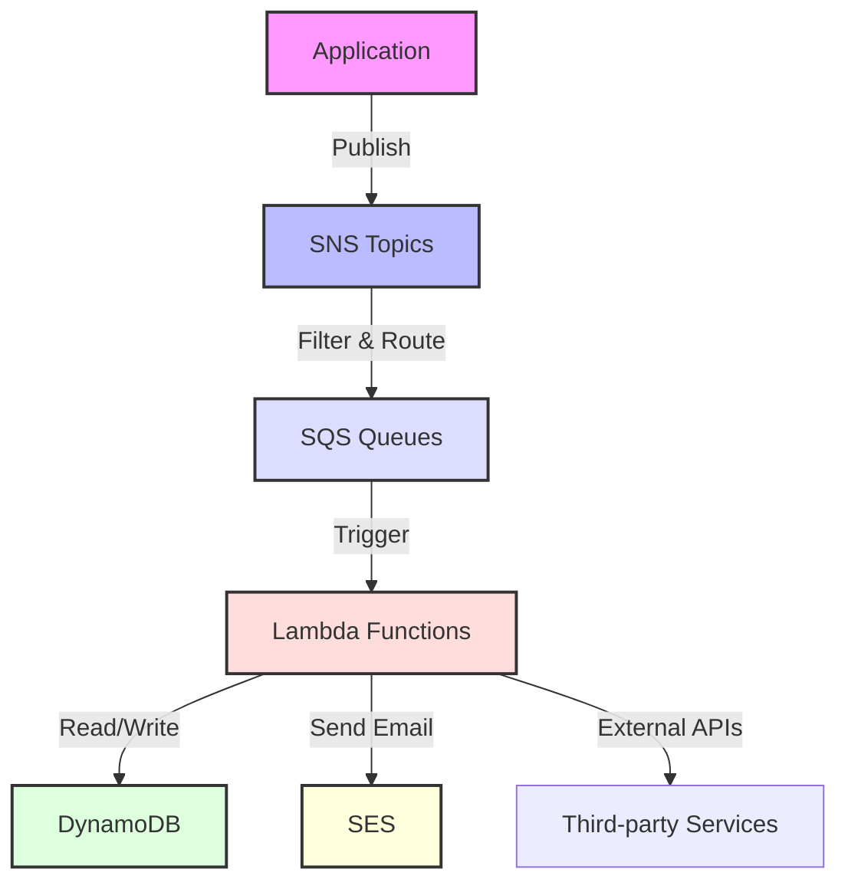
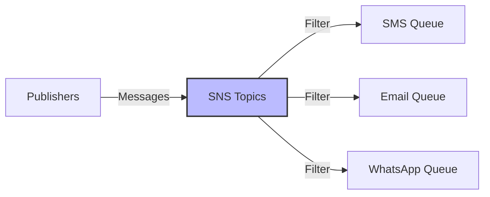
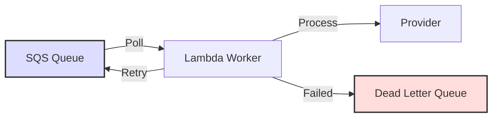
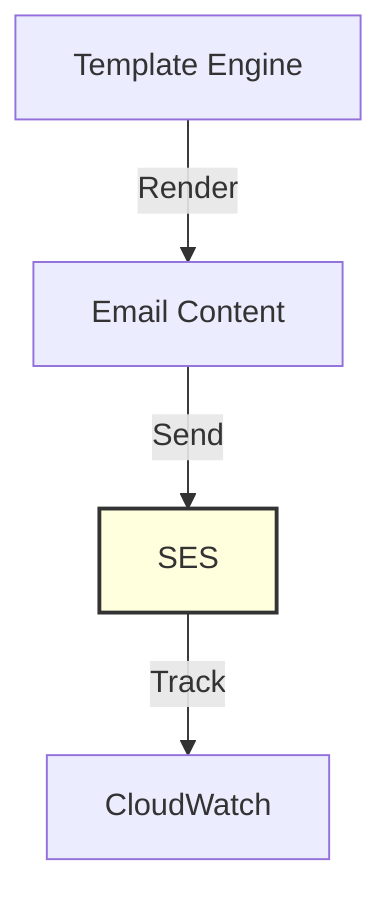
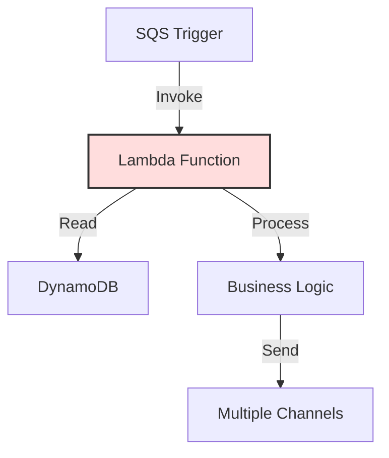
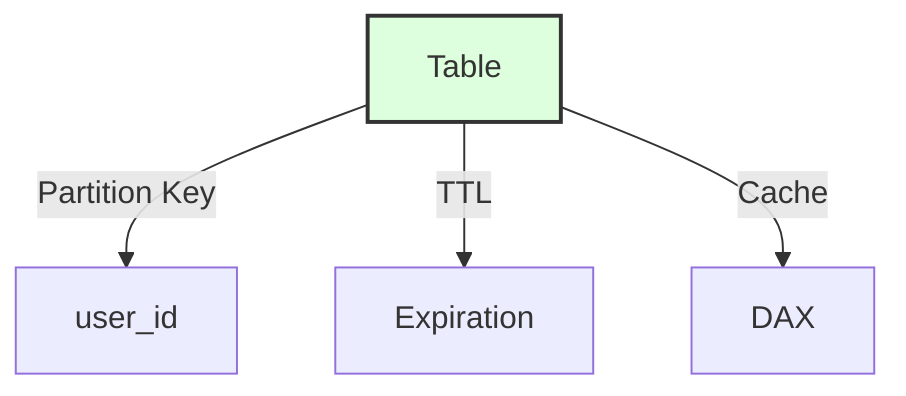
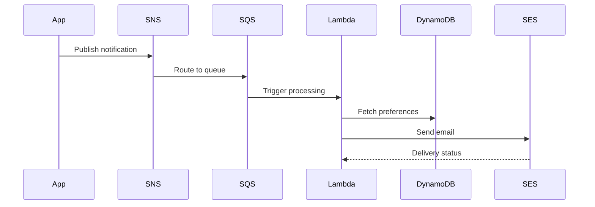

## Overview
This document covers the core AWS services used in building a scalable notification system.

## Architecture Overview

## SNS (Simple Notification Service) 
#messaging #pubsub

### Purpose
- Central pub/sub messaging backbone
- Notification distribution across channels

### Implementation Details

### Key Points
- Topic segregation by notification type
- Message filtering based on attributes
- Decoupled architecture

## SQS (Simple Queue Service)
#messaging #queue

### Purpose
- Message buffering
- Guaranteed delivery
- Handle high load scenarios

### Implementation Details

### Configuration
- Visibility timeout settings
- Dead-letter queues (DLQ)
- Retry mechanism (3 attempts)

## SES (Simple Email Service)
#email #notification

### Purpose
- High-volume email delivery
- Reputation monitoring

### Implementation

### Features
- Dynamic templating
- Configuration sets
- Throttling rules
- Deliverability analytics

## Lambda Functions
#serverless #compute

### Purpose
- Orchestration logic
- Integration handling

### Implementation Details

### Components
- Python-based functions
- Shared Lambda layers
- Auto-scaling capability
- Pay-per-use model

## DynamoDB
#database #nosql

### Purpose
- User preferences storage
- Configuration management
- Rate limiting

### Schema Design

## End-to-End Workflow
#workflow #architecture

## Key Advantages
#benefits

- Scalability: 0 → 500K+ messages/day
- Reliability: Guaranteed delivery
- Cost-Efficiency: Pay-per-use
- Security: IAM roles & KMS encryption

## Interview Tips
#career #interview

- Focus on business outcomes
- Explain service selection rationale
- Discuss trade-offs and alternatives
- Highlight real-world scenarios

## Notes and Corrections
#notes

1. SNS Filtering: Based on message attributes only
2. SQS Timeout: Match Lambda processing time
3. SES Limitations: Sandbox mode considerations
4. DynamoDB TTL: Better for data expiration
5. Lambda Layers: Optional for small systems

## Suggested Related Documents
[[Apache Kafka- Comprehensive Guide.md]]\|"Enterprise Messaging Platforms Comparison"

This link text effectively connects the two documents as they both cover enterprise-scale messaging systems (AWS SNS/SQS and Apache Kafka), making it clear that comparing these platforms is the key relationship between them.]]
[[Notification Service.md]]\|"AWS Notification System Architecture"

This link text effectively connects the documents by referencing both the AWS services context from the source and the notification system focus of the target, while remaining concise and descriptive.]]
[[Random Service or others.md]]\|Related: Random Service or others.md]]

## Backlinks
- [[Random Service or others.md]]\|"AWS Services Integration Mapping"

This link text effectively connects the documents because:
1. The source document lists AWS services and their alternatives
2. The target document provides a detailed architecture diagram of connected AWS services
3. Both documents focus on AWS service relationships and integration patterns]]
- [[Apache Kafka- Comprehensive Guide.md]]\|"Messaging Systems Comparison"

This link text effectively connects the two documents as they both deal with different messaging systems (Kafka and AWS SNS/SQS) and their architectural approaches to handling data streams and notifications.]]
- [[Notification Service.md]]\|"Notification Architecture Components"

This link text effectively connects the two documents by highlighting that one describes a notification service design while the other details the AWS services that could implement such a system, focusing on their shared architectural context.]]

## Suggested Related Documents
[[High-Scale Batch Payee Validation System.md]]]|"Cloud Messaging Architectures"

This link text connects the documents effectively because:
1. Both documents focus on messaging-based architectures
2. One covers AWS cloud services while the other describes a distributed system
3. Both deal with message processing and queue-based workflows]]
[[Distributed Rate Limiting System Design.md]]]|"Cloud Architecture Patterns" - This link text connects the AWS services document with the rate limiting design doc, as both focus on architectural patterns for distributed cloud systems.]]

## Backlinks
- [[Distributed Rate Limiting System Design.md]]]|"Distributed Cloud Scaling Systems"

This link text connects the rate limiting concepts from the first document with the AWS architecture from the second, focusing on their shared themes of distributed systems and scalable architecture.]]
- [[High-Scale Batch Payee Validation System.md]]]|"Distributed Queue Processing Architectures"

This link text connects the documents by highlighting their shared focus on distributed message processing systems, with both featuring queue-based architectures (Kafka/Redis in the first, SNS/SQS in the second) for handling high-scale operations.]]
