## System Overview

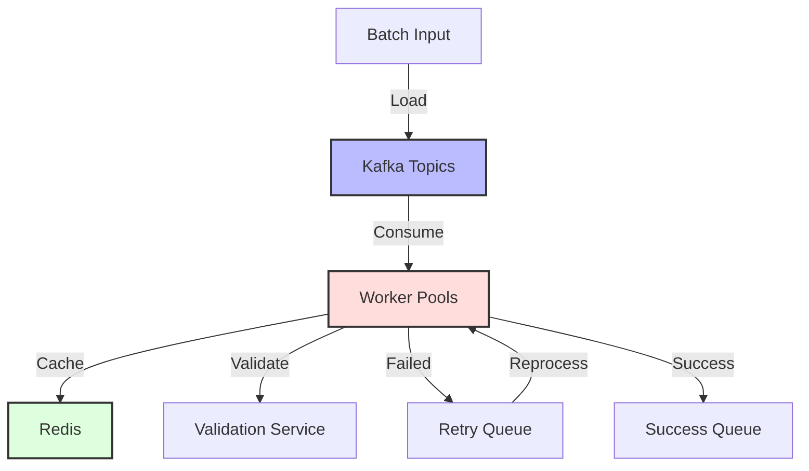

## Architecture Components
#components

### 1. Data Ingestion Layer
#ingestion

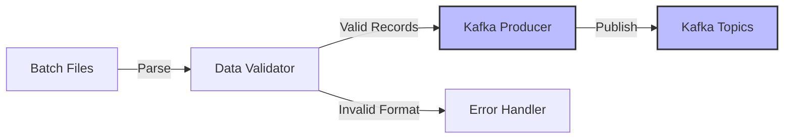

#### Key Features
- Batch file parsing
- Initial format validation
- Data partitioning
- Error logging

### 2. Message Queue System (Kafka)
#kafka #messaging

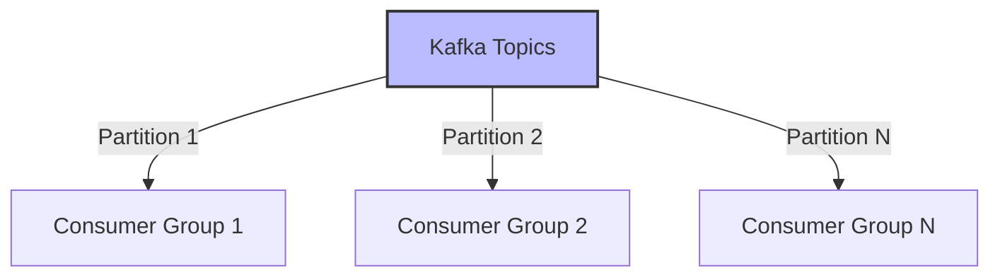

#### Configuration
- Multiple partitions for parallelism
- Consumer groups for load balancing
- Message retention policy
- Replication factor

### 3. Worker Pool Architecture
#processing

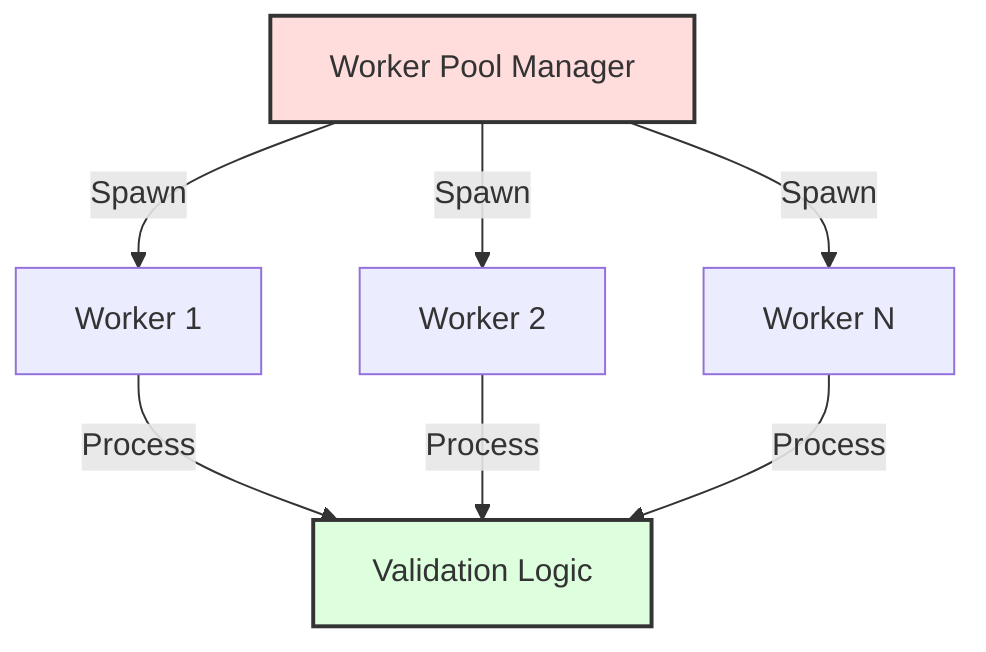

#### Features
- Dynamic scaling
- Health monitoring
- Resource optimization
- Load balancing

### 4. Redis Caching Layer
#cache #redis

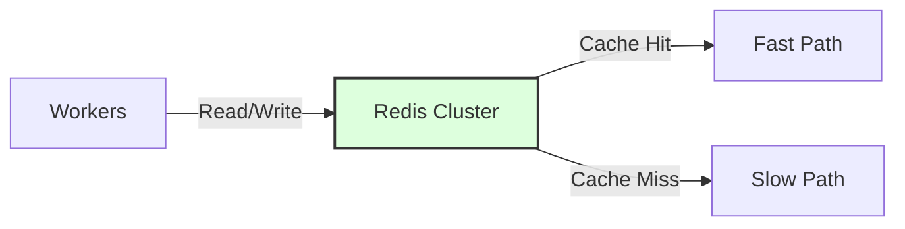

#### Implementation
- Distributed caching
- TTL management
- Cache invalidation
- Cluster configuration

### 5. Error Handling & Retry Mechanism
#reliability #error-handling

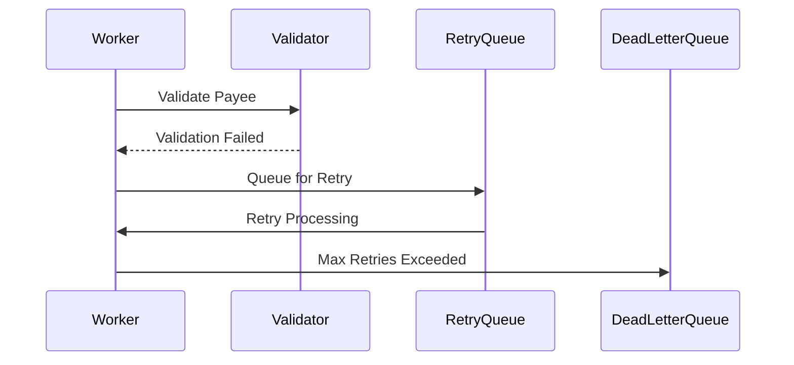

## Performance Metrics
#performance

### Throughput
- 1M+ payees per day
- Parallel processing capacity
- Optimal batch sizes

### Latency
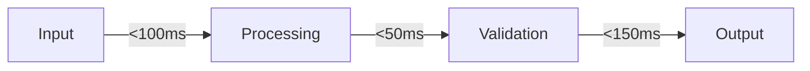

## Error Recovery Strategy
#reliability

### Automated Recovery Process
1. Immediate retry
2. Exponential backoff
3. Dead letter queue
4. Manual intervention triggers

### Monitoring & Alerts
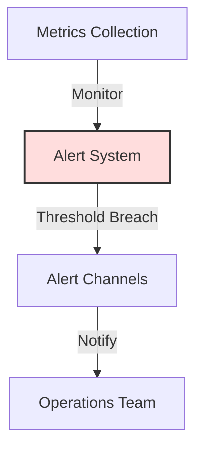

## System Optimizations
#optimization

### 1. Batch Processing
- Dynamic batch sizing
- Optimal partition count
- Consumer group balancing

### 2. Caching Strategy
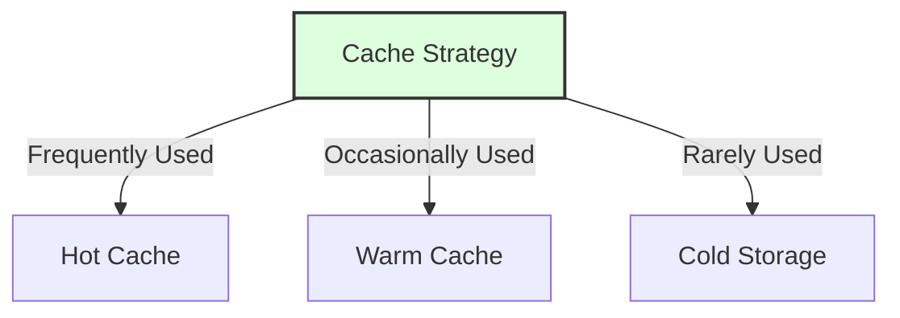

## Scalability Considerations
#scalability

### Horizontal Scaling
- Worker pool expansion
- Kafka partition management
- Redis cluster scaling

### Vertical Scaling
- Resource optimization
- Performance tuning
- Memory management

## Monitoring & Maintenance
#operations

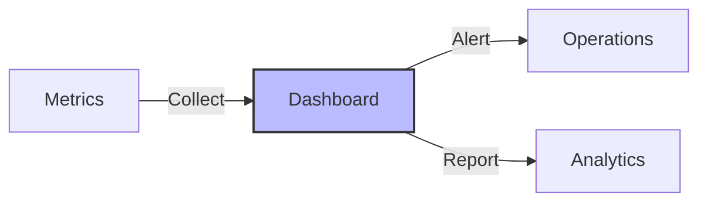

### Key Metrics
- Processing rate
- Error rates
- Retry counts
- Resource utilization

## Disaster Recovery
#disaster-recovery

### Backup Strategy
- Data replication
- Snapshot management
- Recovery procedures

### Failover Process
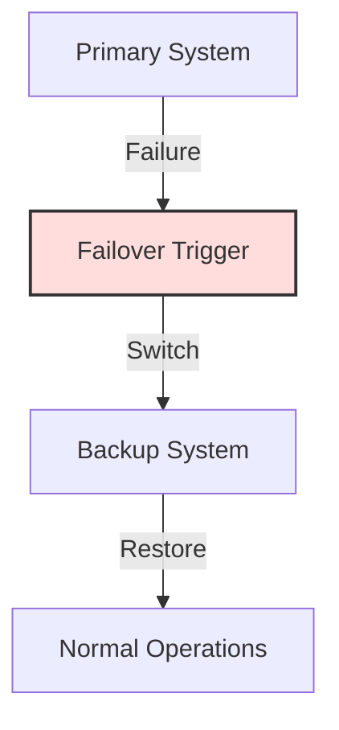

## Best Practices & Lessons Learned
#lessons-learned

1. Proper partition sizing
2. Optimal batch processing
3. Efficient error handling
4. Resource management
5. Monitoring importance

## Future Improvements
#roadmap

1. Enhanced validation rules
2. Machine learning integration
3. Real-time processing capability
4. Advanced analytics
5. Automated scaling policies

## Suggested Related Documents
[[Apache Kafka- Comprehensive Guide.md]]"Kafka streaming architecture implementation"

This link text effectively connects the batch payee validation system, which uses Kafka as a key component, to the comprehensive Kafka guide document, focusing on their shared architectural and streaming aspects.]]
[[Types of DataBases.md]]\|"Database System Architecture" - this link text concisely connects the batch validation system's architectural design with the database types overview, highlighting their shared focus on data management infrastructure.]]

## Backlinks
- [[Types of DataBases.md]]"Database System Architecture Implementation"

This link text connects the theoretical database types overview from the first document to the practical implementation of a data processing system in the second document, highlighting how database concepts are applied in a real architectural context.]]
- [[Apache Kafka- Comprehensive Guide.md]]"Kafka Streaming Implementation Example"

This link text connects the documents by showing how the theoretical concepts from the Kafka guide are practically applied in the batch validation system, focusing on their shared distributed streaming architecture.]]

## Suggested Related Documents
[[Distributed Rate Limiting System Design.md]]]|"Distributed Systems Performance Architecture"

This link text connects the documents through their shared focus on distributed systems architecture and performance optimization, as evidenced by their common tags and technical focus on high-scale processing and system control mechanisms.]]
[[AWS Services Deep Dive.md]]]|"Distributed Queue Processing Architectures"

This link text connects the documents by highlighting their shared focus on distributed message processing systems, with both featuring queue-based architectures (Kafka/Redis in the first, SNS/SQS in the second) for handling high-scale operations.]]
[[Distributed Consistency with Paxos Protocol.md]]]|"Distributed Systems Architecture Patterns"

This link text connects the documents by highlighting their shared focus on distributed systems design principles, spanning from batch processing architecture to consensus protocols.]]

## Backlinks
- [[Distributed Rate Limiting System Design.md]]]|"Distributed System Performance Patterns"

This link text connects the documents by highlighting their shared focus on distributed systems architecture and performance optimization, while being concise and descriptive.]]
- [[Distributed Consistency with Paxos Protocol.md]]]|"Distributed System Consensus Implementation" - this link text connects the Paxos consensus protocol from the source document to the distributed architecture described in the target document, highlighting how theoretical consistency principles are applied in a practical system.]]
- [[AWS Services Deep Dive.md]]]|"Cloud Messaging Architectures"

This link text connects the documents effectively because:
1. Both documents focus on messaging-based architectures
2. One covers AWS cloud services while the other describes a distributed system
3. Both deal with message processing and queue-based workflows]]
